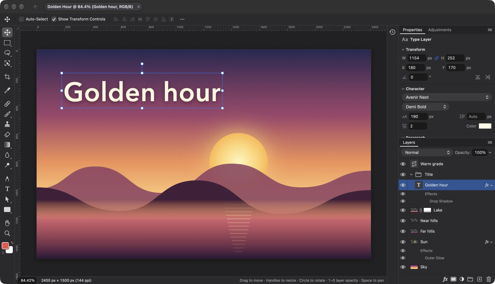
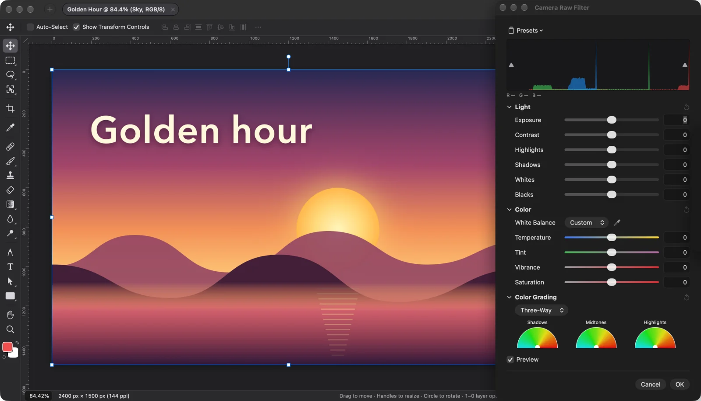
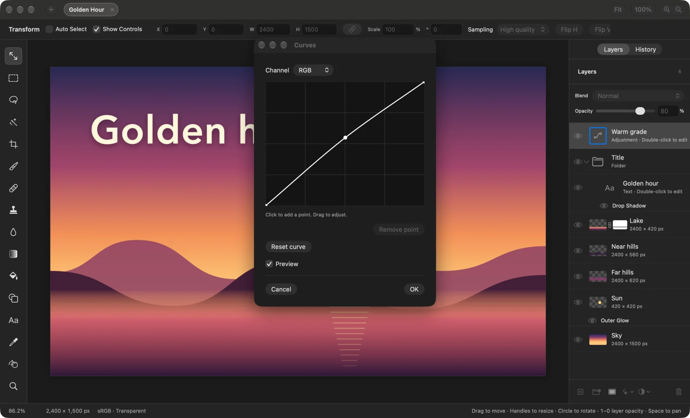

<p align="center">
  
</p>

<h1 align="center">Lamina</h1>

<p align="center">
  <strong>A simpler Photoshop and Affinity alternative for the Mac.</strong><br>
  Photo editing and compositing without the bloat, the subscription or the sign-up. Open source, ready for agents,
  and under 50 MB.
</p>

<p align="center">
  <a href="https://itsjavi.com/lamina/">Website</a> ·
  <a href="#features">Features</a> ·
  <a href="#works-with-ai-agents">AI agents</a> ·
  <a href="#building">Building</a> ·
  <a href="LICENSE">MIT License</a>
</p>



## Why Lamina

Most image work comes down to the same handful of things: retouch a photo, cut something out, put a few layers
together, add some text, export.

Lamina is built for exactly that: the tools you reach for every day, laid out like Photoshop, Affinity and similar
editors, with the names, shortcuts and layer model you already know, in a native Mac app under 50 MB, with no
subscription and no account. Projects are plain folders of PNG layers and a manifest, so nothing is locked in, and AI
agents can work on them too: through the `lamina` command-line tool, as an MCP server, or by writing a project while
you watch it update. Vector layers are next.

## Features

### A familiar workspace
- The layout you know from Photoshop, Affinity and similar editors: tools in a column at the left, the active tool's options bar above the canvas, and panels docked at the right
- Tools grouped as you'd expect, with flyouts: hold or right-click a slot for its other tools, or press Shift with the tool's key to step through them
- Commands under the names and in the menus you'd look for: Free Transform on ⌘T, Levels under Image › Adjustments, Liquify… under Filter, Layer Style under Layer
- Properties shows what's selected: the document's canvas and rulers, a layer's transform and alignment, a type layer's character and paragraph settings, an adjustment layer's controls, or a mask's
- The Adjustments panel adds an adjustment layer in one click
- Light and dark, following your Mac or set in Lamina › Settings… (⌘K), drawn with native controls
- A status bar with an editable zoom, the document's size and resolution, and a hint for the active tool
- Multiple projects in tabs, each showing its zoom, active layer and mode
- History in the panel column: every undo step by name, click one to go back or forward to it
- Familiar keyboard shortcuts throughout, remappable or removable in Edit › Keyboard Shortcuts… (⌥⇧⌘K), where any menu command can also be given one
- Drag a number's label to scrub its value

### Layers
- Layers and groups, with opacity and the full set of familiar blend modes in their usual order; a group's opacity dims everything inside it
- Layer masks: paint, fill, invert, blur and feather them anywhere on the canvas, past the layer's own pixels; link or unlink them to transform a mask on its own
- Clipping masks and group masks
- Adjustment layers, edited live in Properties: Levels, Curves, Exposure, Hue/Saturation, Color Balance, Black & White, Invert, Gradient Map and Grain, plus Gaussian Blur, Motion Blur and Add Noise as filter layers
- Layer styles in one Layer Style dialog: Blending Options, Stroke, Inner Shadow, Inner Glow, Color Overlay, Outer Glow and Drop Shadow, rendered on the GPU and editable at any time; each effect has its own row and eye in the Layers panel
- Merge Down, Merge Layers and Merge Group (⌘E), Merge Visible (⇧⌘E) and Flatten Image
- Layer Mask › Apply, Copy, Paste and Clear Layer Style, and Hide All Other Layers
- Duplicate, rename inline, reorder and nest by drag and drop; Option-drag to duplicate; a right-click menu in the Layers panel
- Copy and paste whole layers and groups (⌘C/⌘V with no selection), within a project or between projects, or drag them between projects

### Transform
- Free Transform (⌘T): move, scale, rotate and flip without losing resolution, however small you make an image
- Distort from Edit › Transform or by ⌘-dragging a handle, with Shift to lock to an axis
- Transform several layers, or a whole group, together
- Snapping to canvas and layer edges and centers, with guides
- Exact position, size and angle in the Free Transform bar, around a reference point you choose, and in Properties
- Edit › Transform › Flip Horizontal and Flip Vertical, and Image › Image Rotation › Flip Canvas
- Align and Distribute layers by the pixels they show, to each other, the selection or the canvas, from the Move tool's options bar, Properties or the Layer menu

### Selections
- Rectangular and Elliptical Marquee (M), Lasso and Polygonal Lasso (L), Object Selection, which traces whatever you click, and Magic Wand, which selects by color (W)
- Select › Subject and Color Range…, and Expand, Contract and Feather under Select › Modify
- Add to and subtract from selections, move the outline, or move and duplicate the pixels inside
- Edit › Stroke…: a line along the selection's outline, inside, centered or outside, in the foreground or background color, on pixels or masks
- Edit › Fill…: the foreground or background color, any color, black, white, 50% gray or Content-Aware, with an opacity
- Select › Load Selection…: a layer's pixels or a mask as a new selection, or added to or subtracted from the one there is
- Content-Aware Fill…, which can also extend an image past its edges

### Painting and retouching
- Brush (B) and Eraser (E) with size, hardness, opacity, flow and smoothing, and Shift for straight lines
- Dodge and Burn (O) lighten or darken the shadows, midtones or highlights by an exposure
- Pen pressure for size and opacity, on a graphics tablet
- Brush settings and colors carry over to new documents and later launches
- Spot Healing Brush (J), content-aware
- Clone Stamp (S), aligned or not, sampling one layer or all of them
- Blur (on pixels or masks) and Smudge (R), and Filter › Liquify… (⇧⌘X), whose strokes you commit or cancel
- Gradient and Paint Bucket (G): the bucket fills similar colors by tolerance, contiguous or not, from one layer or all of them, anti-aliased, on pixels or masks
- Rectangle (rounded too), Ellipse and Line tools (U), which stay editable rather than being rasterized
- Horizontal Type Tool (T): inline multiline editing in draggable, resizable paragraph boxes, with per-letter colors and faces; family, style, size, alignment and color in the options bar, leading and tracking in Properties; transform text and use it as a clipping mask
- Eyedropper (I) and a full color picker

### Adjustments and filters
- Filter › Camera Raw Filter… (⇧⌘A): light, color, curves, color mixer, color grading, detail, optics and geometry, in a panel beside the canvas; each section resets to its defaults from its header, and settings can be saved as named presets
- Image › Adjustments: Levels (with Auto), Curves, Exposure, Hue/Saturation, Color Balance, Black & White, Invert, Gradient Map and Grain
- Gaussian Blur and Motion Blur that spread past a layer's edges
- Add Noise, Dither, Vignette, Bloom / Glow, Tonal Contrast, Lens Correction and Layer › Remove Background…
- Unsharp Mask (Amount, Radius, Threshold) and High Pass
- Filter dialogs with a zoomable preview, and live previews on the canvas, limited to the selection when there is one
- Last Filter (⌃⌘F) runs the last filter again with the same settings

### Canvas and files
- File › New from Clipboard (⌥⌘N) opens the copied image, or image files copied in Finder, as a new project
- Rulers (⌘R), guides dragged from them, a layout grid with adjustable spacing and subdivisions, and Snap To for guides, grid, layers and document bounds
- Crop with snapping, ratios including 3:4, 9:16 and any you type in (they are remembered), and Option for symmetric cropping; with a selection, the crop starts at it
- Canvas Size, Image Size and Trim; Image Rotation (90° either way and 180°), which turns layer pixels losslessly
- Sharp high-quality downsampling when zoomed out, and a pixel grid when zoomed in
- Open or place JPEG, PNG, HEIC, WebP, TIFF, SVG, camera RAW (with a develop step first) and Photoshop PSD and PSB (8-bit RGB; not CMYK). Photoshop groups, masks, blend modes, fill rectangles/ellipses, and simple horizontal text stay editable; other vectors and vertical text become pixels. A conversion report is shown before anything is applied.
- Large documents: the memory budget scales with your Mac, and a Photoshop file too big to open has its layers cropped to the canvas instead
- File › Export › Quick Export as PNG, or Export As… (⌥⇧⌘W) to PNG, JPEG, HEIC, AVIF, WebP, TIFF or PDF with a preview and each format's settings (only the formats your Mac can write are listed); Edit › Copy Merged
- Keep working while a project saves
- Automatic updates for signed releases

### Works with AI agents
- AI agents and scripts can build and edit projects directly: a `.lam` project is a folder of PNG layers and a manifest, and an open project updates live as it's written. See [Writing Lamina projects](docs/writing-lamina-projects.md)
- They can also drive the running app with the `lamina` command-line tool: list open projects and their layers, select layers, apply filters and adjustment layers with settings, undo, export and render previews. See [The lamina command-line tool](#the-lamina-command-line-tool)

<table>
  <tr>
    <td width="50%"></td>
    <td width="50%"></td>
  </tr>
  <tr>
    <td align="center">Camera Raw Filter, in dark</td>
    <td align="center">Adjustment layers in Properties, in light</td>
  </tr>
</table>

## The lamina command-line tool

The app ships `lamina` in its bundle. Put it on your PATH with a symlink:

```bash
ln -s /Applications/Lamina.app/Contents/Helpers/lamina ~/.local/bin/lamina   # any folder on your PATH
```

It controls the app while it's running (it never starts it):

```bash
lamina list-documents                                     # open projects and their layers, with short ids
lamina apply-filter --document 3f2a --layer 9c1b --kind gaussian-blur --settings radius=4
lamina add-adjustment-layer --document 3f2a --kind exposure --settings exposure=0.5,gamma=1.1
lamina export-document --document 3f2a --output ~/Desktop/poster.jpg --quality 0.9
lamina undo --document 3f2a
lamina --help                                             # every command; lamina help <command> for its options
```

Each edit is one undo step in the app, and edits are refused while you're in the middle of something there (typing
text, a transform, an open dialog). Output is text, or JSON with `--json`. `lamina` sends the app Apple Events, so the
first command asks whether the app you run it from (Terminal, your editor, an agent) may control Lamina; that
choice is in System Settings › Privacy & Security › Automation. Only your own processes on this Mac can send commands,
and the app's sandbox entitlements are unchanged: `lamina` itself writes the exported files. With the Dev build
running, use `lamina --dev …` (or the copy inside `build/Lamina Dev.app`).

### As an MCP server

`lamina mcp` offers the same commands as MCP tools over stdio, one tool per command. Register it with your MCP host:

```bash
claude mcp add lamina -- /Applications/Lamina.app/Contents/Helpers/lamina mcp    # Claude Code
codex mcp add lamina -- /Applications/Lamina.app/Contents/Helpers/lamina mcp     # Codex
```

For Claude's desktop app, add `"lamina": {"command": "/Applications/Lamina.app/Contents/Helpers/lamina", "args":
["mcp"]}` under `mcpServers` in its `claude_desktop_config.json`. Add `--dev` after `mcp` to drive the Dev build.

It speaks MCP 2026-07-28 (stateless, with `server/discover`) and, for hosts that still open with `initialize`,
2025-11-25 and earlier. Checked with Claude Code 2.1.288 (2025-11-25 by default, 2026-07-28 with
`MCP_PROTOCOL_NEGOTIATION=auto`) and Codex 0.160.0 (2025-11-25 by default, 2026-07-28 with `--enable mcp_2026_07_28`
and `CODEX_MCP_PROTOCOL_VERSION=2026-07-28` in the server's environment).

## Requirements

- macOS 26 or later on Apple silicon
- Xcode 26 or later to build (Swift 6.2, and actool for the icon)

## Building

There's no release yet; build it from source. Releases will be published on
[GitHub Releases](https://github.com/itsjavi/lamina/releases).

```bash
git clone https://github.com/itsjavi/lamina.git
cd lamina
make install  # builds build/Lamina.app and copies it to /Applications
```

Other targets: `make app` (release build only), `make dev` (a debug build with its own id, sandbox container and
preferences, and no updater), `make test` (unit tests; `make test-ui` also runs the ones that show windows).

The app is App Sandboxed: its preferences and recent projects live in `~/Library/Containers/com.itsjavi.lamina`
(`….dev` for the Dev build). See [AGENTS.md](AGENTS.md) for the project layout, build variants and tests, and
[docs/releasing.md](docs/releasing.md) for publishing a release.

## License

[MIT](LICENSE). Lamina began as a fork of Robbie Tilton's [Compositor](https://github.com/robbietilton/Compositor)
(MIT), and keeps its own project format, identity and update feed.
