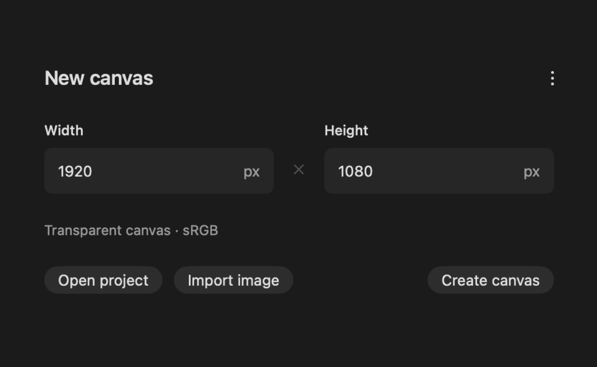
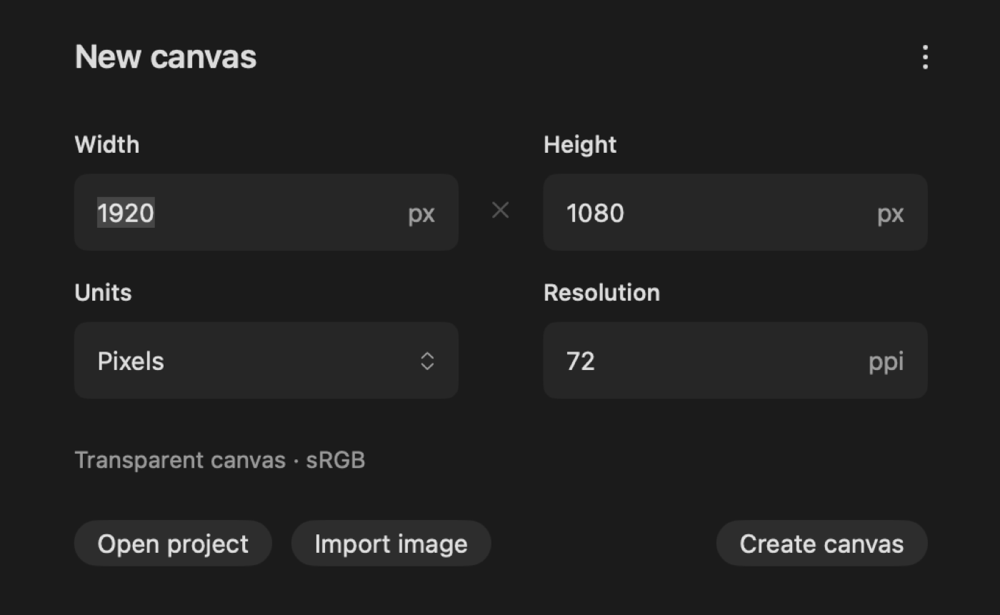

## Description

<!-- SECTION:DESCRIPTION:BEGIN -->
New Canvas doesn't focus or select the Width field when it opens (upstream issue #184), and it only takes pixels at 72 ppi, while Image Size already converts units and resolution (issues #185, #151).
<!-- SECTION:DESCRIPTION:END -->

## Acceptance Criteria
<!-- AC:BEGIN -->
- [x] #1 Opening New Canvas focuses the Width field with its text selected
- [x] #2 Width and height can be entered in px, in, cm or mm with a resolution in ppi, reusing Image Size's conversions, and the new document keeps that resolution
- [x] #3 Tests cover the conversions
<!-- AC:END -->

## Implementation Plan

<!-- SECTION:PLAN:BEGIN -->
1. Move Image Size's unit conversions into SizeUnit (pixels, percent, inches, centimeters, millimeters at a resolution in ppi) and use it in Image Size, unchanged apart from gaining Millimeters.
2. New Canvas: NewCanvasSize holds width, height, unit (px, in, cm, mm) and resolution as typed, turns them into pixels with SizeUnit and converts the fields when the unit changes; a Units menu and a Resolution field join the dialog, and the summary shows the pixel size for print units.
3. createNewProject/createDocument take the resolution, so the new document keeps it.
4. Focus: re-ask for Width's focus once the window has set up its first responder (the onAppear request was being lost at launch).
5. Tests for the conversions, limits, unit changes and the resolution reaching the document; before/after capture of New Canvas at launch.
<!-- SECTION:PLAN:END -->

## Implementation Notes

<!-- SECTION:NOTES:BEGIN -->
Focus at launch (issue #184): in the app the Width request made in onAppear was lost as the window set up its first responder; a test window hosting the view alone focused fine, so this is checked in the app. With the onAppear request only (retry disabled by a temporary switch) the field had no selection, as on main; with the retry after a Task.yield, Width holds the focus with 1920 selected (inactive-window highlight in the background launch).

Captures: open -g -n of the baseline app and of make dev's build, no document, window captured with screencapture -l.
swift test --disable-keychain --filter 'NewCanvasTests|ImageSizeTests|CanvasEntryTests|ProjectWorkspaceTests' -> 23 tests in 4 suites passed.
Image Size gains Millimeters as a side effect of sharing the units. Choosing a preset switches New Canvas back to pixels.

Dropped the window-focus unit test (dda7f7e): it passed on main too, since the launch problem only shows in the app's own window, and SwiftUI applies focus to the key window, which other suites' windows take when tests run side by side. Rerun: swift test --disable-keychain --filter 'NewCanvasTests|...' -> NewCanvasTests' 5 conversion and resolution tests pass.
<!-- SECTION:NOTES:END -->

## Final Summary

<!-- SECTION:FINAL_SUMMARY:BEGIN -->
New Canvas opens with Width focused and its number selected (it asks again once the window has set up its first responder; verified in the app at launch against main, and that the retry is what fixes it). Width and height take px, in, cm or mm with a resolution in ppi through SizeUnit, the conversions moved out of Image Size and shared (Image Size gains millimeters); changing units converts the fields and the new document keeps the resolution. NewCanvasTests cover the conversions, limits, unit changes and the resolution reaching the document; before/after captures attached. A foreground launch and a New Canvas opened from a new tab still deserve a manual look.
<!-- SECTION:FINAL_SUMMARY:END -->
