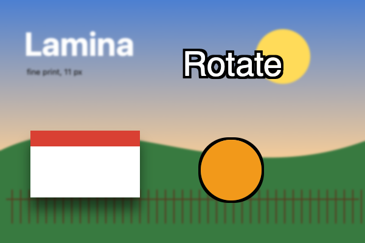
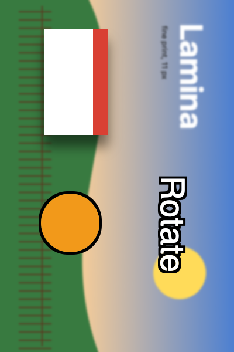

## Description

<!-- SECTION:DESCRIPTION:BEGIN -->
Lamina can flip the canvas but not rotate it (upstream issue #212). Upstream PR #195 turns the whole document losslessly with vImage, keeping text and shapes editable. Port it after the effects fix, so rotation doesn't drop effects.
<!-- SECTION:DESCRIPTION:END -->

## Acceptance Criteria
<!-- AC:BEGIN -->
- [x] #1 Image › Image Rotation turns the document 90° clockwise, 90° counter-clockwise or 180°, losslessly, as one undo step
- [x] #2 Layers, masks, the selection and guides turn with it; live text and shapes stay editable and effects are kept
- [x] #3 Tests cover each rotation
<!-- AC:END -->

## Implementation Plan

<!-- SECTION:PLAN:BEGIN -->
1. Port upstream PR #195: CanvasRotation (vImage quarter/half turns of layer and mask pixels off the main thread), placements, guides and selection turned, live text and shapes turned by angle, one undo step; Image › Image Rotation submenu; restore() refits the view when the size changes.
2. Keep effects, shapes and live text in rotation's own path (it copies the layers as they are, not a project snapshot), so it doesn't depend on TASK-8's fix to applyDocumentSize.
3. Port CanvasRotationTests and add a test that effects, live text and shapes survive a turn and undo.
<!-- SECTION:PLAN:END -->

## Implementation Notes

<!-- SECTION:NOTES:BEGIN -->
Rotation builds the turned CanvasDocument from document.layers directly, so effects, text and shape settings carry over; effects keep their angle (as Photoshop's Global Light does). swift test --filter CanvasRotationTests: 5 passed (4 ported + effectsLiveTextAndShapesSurviveATurn). CanvasSizeTests|ImageSizeTests|HistoryTests (restore change): 14 passed. The PR should merge after the upstream-fixes PR (TASK-8).

Screenshots (fixture: soft landscape, a card layer with Drop Shadow, an ellipse shape with Stroke and live text 'Rotate' with Stroke; rendered offscreen through the export path). Before: 
After Image › Image Rotation › 90° Clockwise: the canvas is 400 × 600, the shadow still falls downward, and the text and shape keep their strokes and stay live: 

Manual check: the Image › Image Rotation submenu. Merge after the upstream-fixes PR (TASK-8); rotation itself doesn't use the snapshot rebuild TASK-8 fixes.
<!-- SECTION:NOTES:END -->

## Final Summary

<!-- SECTION:FINAL_SUMMARY:BEGIN -->
Added Image › Image Rotation (90° clockwise, 90° counter clockwise, 180°), ported from upstream PR #195: layer and mask pixels turned losslessly with vImage off the main thread, selection and guides turned, live text and shapes turned by their angle so they stay editable, effects kept, one undo step, and undo/redo of a size change refits the view. Verified with swift test --filter CanvasRotationTests (5 passed, including a new test that effects, live text and shapes survive a turn and its undo), size and history suites, and before/after renders.
<!-- SECTION:FINAL_SUMMARY:END -->
