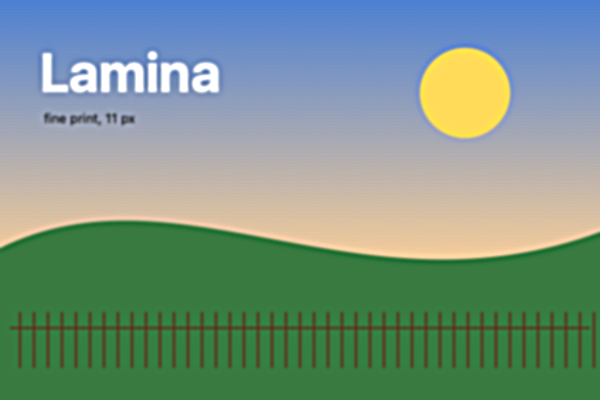
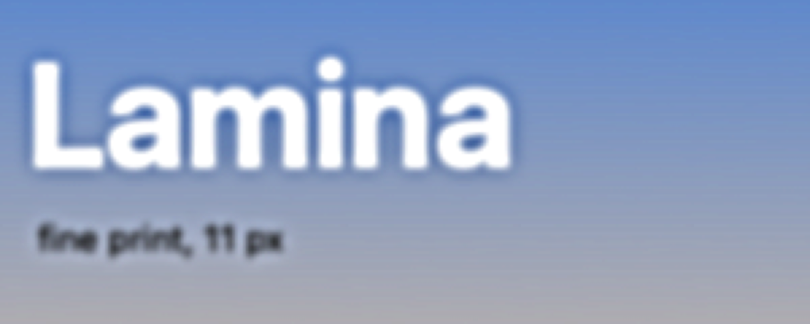
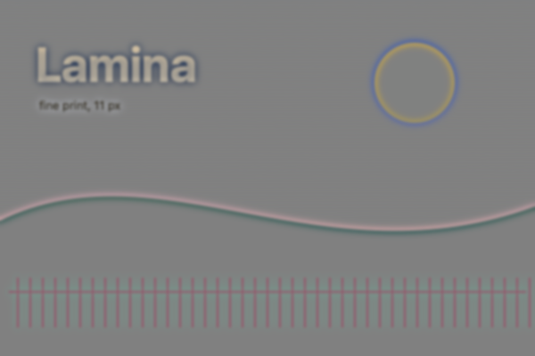
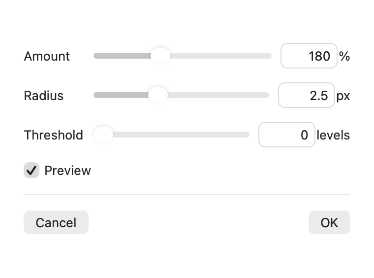

## Description

<!-- SECTION:DESCRIPTION:BEGIN -->
Lamina has no sharpening filter; Unsharp Mask and High Pass are Photoshop's standard ones. Upstream PR #196 adds both with live preview and C kernels in AdjustPixels.c.
<!-- SECTION:DESCRIPTION:END -->

## Acceptance Criteria
<!-- AC:BEGIN -->
- [x] #1 Filter › Unsharp Mask (amount, radius, threshold) and Filter › High Pass (radius) preview live and apply as one undo step
- [x] #2 Both are limited to the selection when there is one and keep the layer's size
- [x] #3 Tests cover both filters
<!-- AC:END -->

## Implementation Plan

<!-- SECTION:PLAN:BEGIN -->
1. Port upstream PR #196: FilterKind.unsharpMask/.highPass with settings and clamping, the blur-with-held-edge path in PixelFilter.run, C kernels adjust_unsharp_mask/adjust_high_pass in Sources/CPixels/AdjustPixels.c.
2. FilterSheet controls (Amount/Radius/Threshold; Radius); the Filter menu lists them through FilterKind.allCases.
3. Port SharpenFilterTests; add a test that the selection limits them and the layer keeps its size.
4. README feature list; visual before/after of a photo with the filter sheet if reachable.
<!-- SECTION:PLAN:END -->

## Implementation Notes

<!-- SECTION:NOTES:BEGIN -->
Ported PR #196 as-is (paths remapped); the Filter menu picks both up from FilterKind.allCases. Added SharpenFilterTests.bothKeepToTheSelectionAndTheLayersSize: through beginFilter/commitFilter with a selection over half the layer, one undo step, same size and transform, pixels outside the selection unchanged. swift test --filter SharpenFilterTests: 5 passed.

Screenshots (synthetic soft landscape fixture, 600 × 400, rendered offscreen through the export path after beginFilter/updateFilter/commitFilter; the panel is FilterSheet rendered offscreen with a live filter edit):

Before: 
After Unsharp Mask (180%, 2.5 px, 0 levels): 
Detail, 3× crop, before: 
Detail, 3× crop, after Unsharp Mask: 
After High Pass (4 px): 
Unsharp Mask panel (new): 

Manual check: the Filter menu entries themselves (menus can't be captured).
<!-- SECTION:NOTES:END -->

## Final Summary

<!-- SECTION:FINAL_SUMMARY:BEGIN -->
Added Filter › Unsharp Mask (Amount, Radius, Threshold) and Filter › High Pass (Radius), ported from upstream PR #196: C kernels in AdjustPixels.c over a blur with the layer's edge held, live preview and one undo step through the existing filter panel, limited to the selection and keeping the layer's size. Verified with swift test --filter SharpenFilterTests (5 passed, including a new session-level test for selection, size and undo) and before/after renders.
<!-- SECTION:FINAL_SUMMARY:END -->
