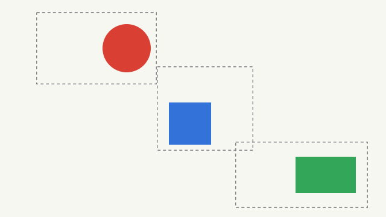
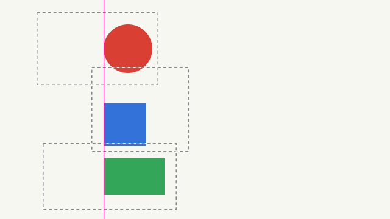
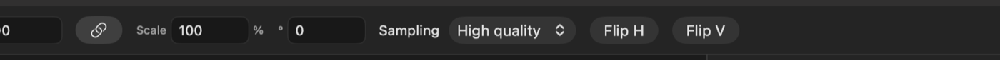
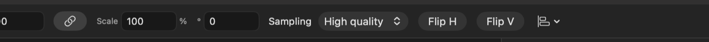

## Description

<!-- SECTION:DESCRIPTION:BEGIN -->
Aligning and distributing layers is a compositing staple Lamina lacks. Upstream PR #191 adds it but measures each layer's transform box; Photoshop measures visible pixels, so layers with transparent padding would misalign. Adapt that.
<!-- SECTION:DESCRIPTION:END -->

## Acceptance Criteria
<!-- AC:BEGIN -->
- [x] #1 Selected layers align by edges or centers to the selection, the canvas or each other, and distribute by centers or spacing
- [x] #2 Alignment uses each layer's visible pixels, folders move as one, and moves are whole pixels in one undo step
- [x] #3 Tests cover alignment with transparent padding
<!-- AC:END -->

## Implementation Plan

<!-- SECTION:PLAN:BEGIN -->
1. Port upstream PR #191: LayerAlignment/LayerDistribution, Layer menu Align/Distribute submenus, buttons in the Move tool's bar (TransformInspector), whole-pixel moves in one undo step, folders as one.
2. Adapt: measure each layer by its non-transparent pixels (brush_alpha_bounds on the layer image, mapped through its transform) instead of the transform box; skip layers showing nothing; hidden layers in a selected folder move with it but aren't measured.
3. Port LayerAlignTests and add tests for transparent padding, flips, empty and hidden layers.

4. Revised: one Align and Distribute pull-down in the Move tool's bar instead of ten buttons, which overflowed a laptop-width window.
<!-- SECTION:PLAN:END -->

## Implementation Notes

<!-- SECTION:NOTES:BEGIN -->
Implemented in Sources/Compositor/Document/LayerAlign.swift: LayerBounds.visible(_:placed:) measures alpha bounds (opaque images skip the read-back; an image too large to read back falls back to its transform box). Masks and effects aren't measured, matching Photoshop's Align for pixel masks. swift test --filter LayerAlignTests: 8 passed (5 ported, 3 new: layersAlignByTheirVisiblePixels, aLayerShowingNothingIsLeftAlone, aHiddenLayerMovesWithItsFolderButIsNotMeasured).

The Move tool's bar first got upstream's ten icon buttons; at a 1512 pt window all but two were scrolled out of sight past the bar's edge, so they became one Align and Distribute pull-down (commit 'fix: fit Align and Distribute in the Move tool's bar as one pull-down'). The Layer menu has Align and Distribute submenus.

Screenshots:
Align Left Edges, fixture: three layers, each clear but for one shape off-center in its box (dashed: each layer's bounds; pink: the aligned edge), rendered offscreen through the export path. Before: 
After: the shapes' left edges meet at x = 170 while their boxes don't: 
Move tool bar, real window of the baseline app (main) with landscape.png open. Before: 
After, the dev build: the Align and Distribute pull-down after Flip V: 

Manual check: the pull-down's and the Layer menu's contents (menus can't be captured).
<!-- SECTION:NOTES:END -->

## Final Summary

<!-- SECTION:FINAL_SUMMARY:BEGIN -->
Added Align (edges or centers, to the selection, the canvas with one thing selected, or each other) and Distribute (centers or spacing, three or more) from the Layer menu and a pull-down in the Move tool's bar, ported from upstream PR #191 and adapted to measure each layer's non-transparent pixels through its transform rather than its box, as Photoshop does. Folders move as one (hidden members too), moves are whole pixels in one undo step. Verified with swift test --filter LayerAlignTests (8 passed, 3 new for padding, flips, empty and hidden layers), before/after renders and real window captures.
<!-- SECTION:FINAL_SUMMARY:END -->
