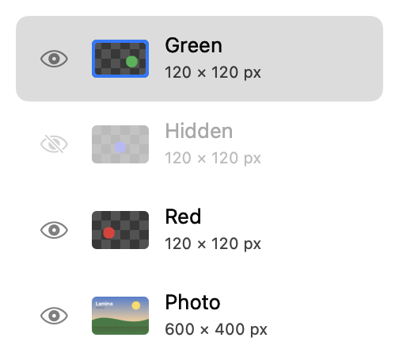
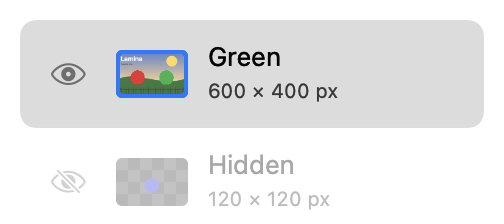

## Description

<!-- SECTION:DESCRIPTION:BEGIN -->
Upstream took the masks, Auto Select, tabs and Ungroup parts of PR #163 but left out its layer commands to keep menus short. They are core compositing commands, and natural commands for TASK-4. Port them from commit aea6e20f (ApplyLayerMask, LayerStyleClipboard, LayerMerge).
<!-- SECTION:DESCRIPTION:END -->

## Acceptance Criteria
<!-- AC:BEGIN -->
- [x] #1 Layer menu commands Apply Layer Mask, Merge Visible, Flatten Image, Copy Layer Style, Paste Layer Style and Show/Hide All Other Layers, each one undo step, also in the Layers panel's right-click menu where Photoshop has them
- [x] #2 Selections can be intersected, as well as added to and subtracted from
- [x] #3 Tests cover each command
<!-- AC:END -->

## Implementation Plan

<!-- SECTION:PLAN:BEGIN -->
1. Port from upstream commit aea6e20f (closed PR #163) only the layer commands: ApplyLayerMask.swift, LayerStyleClipboard.swift, Merge Visible/Flatten Image in LayerMerge.swift, Show/Hide All Other Layers in EditorSession.swift, intersect with layer pixels or mask in MaskTracing.swift.
2. Layer menu items; add them to the fork's existing single row right-click menu (not the per-part menus), plus a thumbnail section with Select/Add/Subtract/Intersect and Cmd-Shift-Option-click to intersect.
3. Port the commit's tests (LayerCommandTests, LayerMaskTests apply tests, LayerTests merge/flatten/style/solo) and add context-menu and mask-intersect tests.
<!-- SECTION:PLAN:END -->

## Implementation Notes

<!-- SECTION:NOTES:BEGIN -->
Ungroup Layers from the same commit was already in the fork. Per-part right-click menus (thumbnail/mask/eye) of the original commit were not ported; the fork keeps one row menu, which now has Apply Layer Mask, Merge Visible, Flatten Image, Copy/Paste/Clear Layer Style and Hide/Show All Other Layers, and a selection section when the right-click lands on a thumbnail. swift test --filter 'LayerCommandTests|LayerTests|LayerMaskTests' (also matched TiledLayerTests, AdjustmentEditorTests, AdjustmentLayerTests): 58 passed; LayerCommandTests rerun after adding the mask-intersect test: 6 passed.

Screenshots: Layers panel (NativeLayerList's table rendered offscreen) with a photo, Red, a hidden layer and Green. Before: 
After Merge Visible: one layer named after the topmost visible one, the hidden layer left alone: 
After Flatten Image (from the same start): one Background layer, the hidden layer dropped: 

Manual checks: the Layer menu entries and the right-click menu as shown on screen (menus can't be captured; their titles, order and enabled states are covered by LayerTests), and Cmd-Shift-Option-click on a thumbnail to intersect.
<!-- SECTION:NOTES:END -->

## Final Summary

<!-- SECTION:FINAL_SUMMARY:BEGIN -->
Ported from commit aea6e20f of closed upstream PR #163 only its layer commands: Apply Layer Mask, Merge Visible, Flatten Image, Copy/Paste/Clear Layer Style, Show/Hide All Other Layers, each one undo step, in the Layer menu and the Layers panel's right-click menu; and intersecting a layer's pixels or mask with the selection (right-click on a thumbnail, or Cmd-Shift-Option-click). Verified with swift test --filter 'LayerCommandTests|LayerTests|LayerMaskTests' (all passed: ported tests plus new context-menu and mask-intersect tests) and before/after renders of the Layers panel.
<!-- SECTION:FINAL_SUMMARY:END -->
