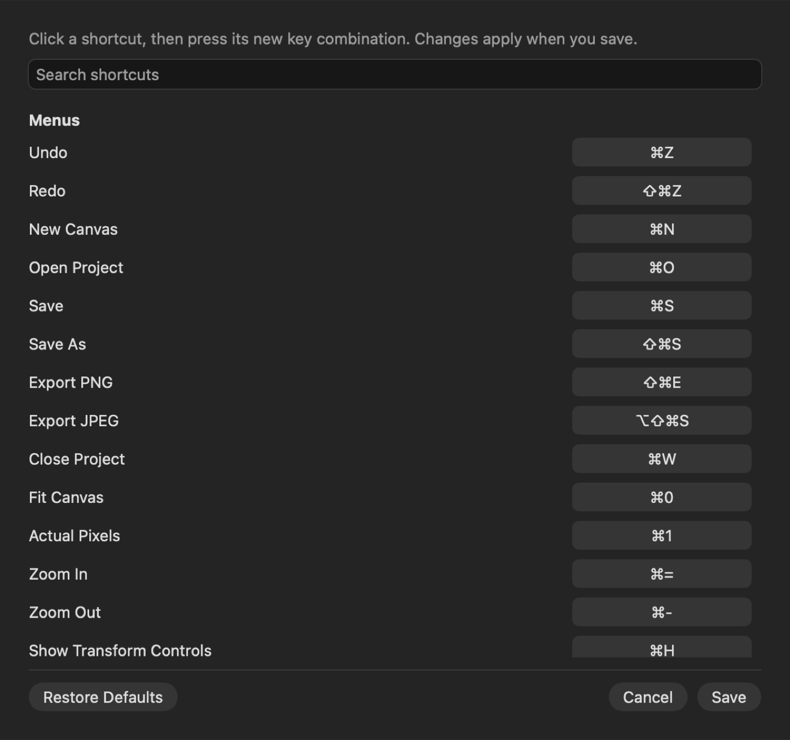
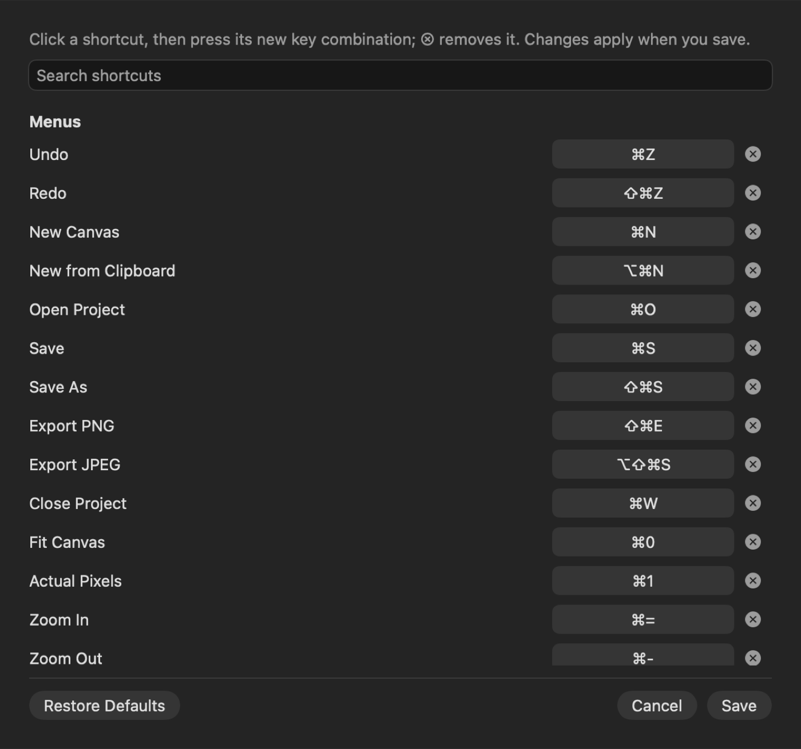
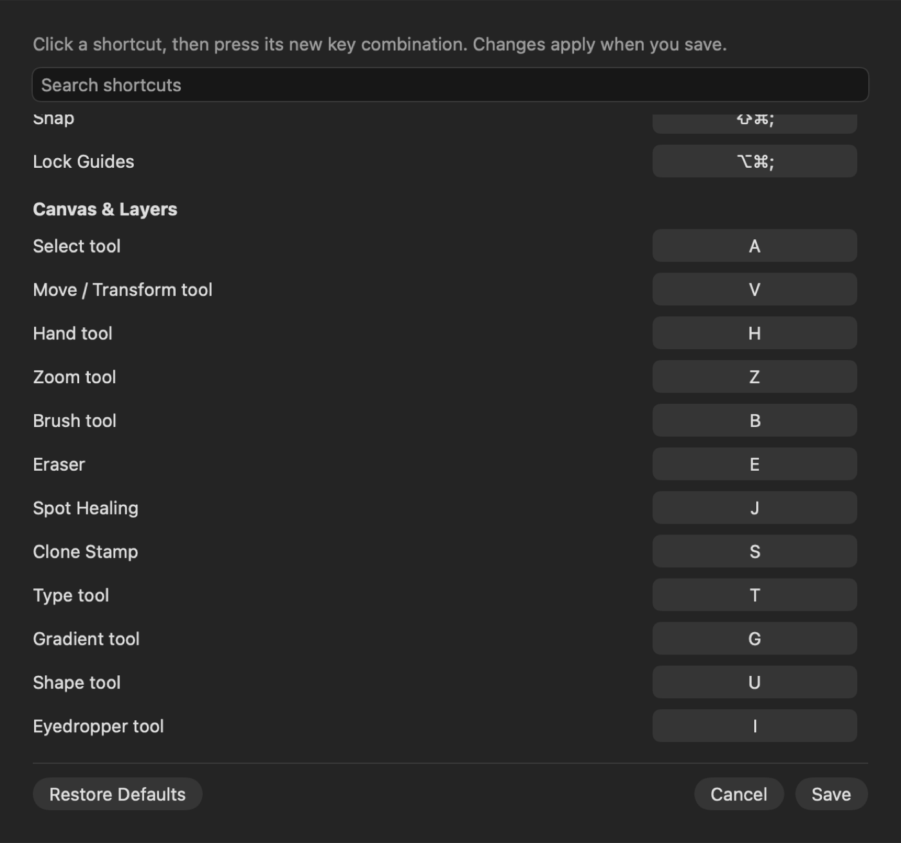
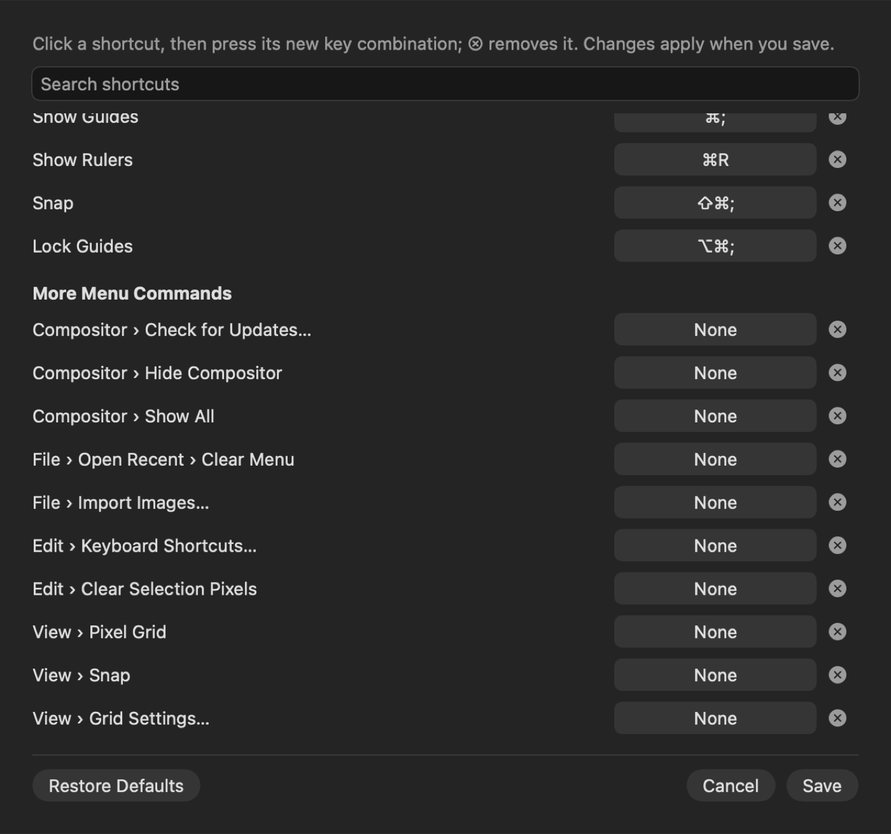

## Description

<!-- SECTION:DESCRIPTION:BEGIN -->
Only some commands can be given a key, a saved key can't be cleared, and one unreadable saved entry resets all of them (upstream PR #186, which also fixes how Delete is stored). Its 'Menu › Item' names also suit TASK-4's command names. Upstream PR #192 adds Last Filter on ⌘F on top of it.
<!-- SECTION:DESCRIPTION:END -->

## Acceptance Criteria
<!-- AC:BEGIN -->
- [x] #1 Any menu command can get a shortcut in Edit › Keyboard Shortcuts, and any shortcut can be cleared
- [x] #2 An unreadable saved shortcut is skipped without resetting the others, and Delete is stored correctly
- [x] #3 Filter › Last Filter (⌘F) re-runs the last filter with the same settings as one undo step
- [x] #4 Tests cover both
<!-- AC:END -->

## Implementation Plan

<!-- SECTION:PLAN:BEGIN -->
1. Port upstream PR #186: a More Menu Commands section in Edit › Keyboard Shortcuts for menu commands without a default key (assignableShortcut), a clear (⊗) button per row, a loader that drops an unreadable or now-refused saved entry alone, and Delete recorded as U+007F so the Fill/Content-Aware Fill entries are found.
2. Cover the menu commands #186 left out (Check for Updates, Hide Compositor, Show All, Open Recent › Clear Menu), and fix the Menus entry mislabeled Hide Compositor (it is Hide Others, ⌥⌘H).
3. Port PR #192 on top: Filter › Last Filter (⌘F) re-runs the last Filter-menu filter with its settings, no panel, one undo step.
4. Tests: KeyboardShortcutTests (from #186) and LastFilterTests (from #192, minus its real-menu-bar test, which can't run under CompositorTestHost).
5. Before/after capture of the Keyboard Shortcuts window rendered offscreen.
<!-- SECTION:PLAN:END -->

## Implementation Notes

<!-- SECTION:NOTES:BEGIN -->
Ported upstream PR #186 (More Menu Commands section, a clear button per row, per-entry loading, Delete stored as U+007F) and PR #192 (Filter › Last Filter, ⌘F). Additions: the app-menu and Open Recent commands #186 missed (Check for Updates, Hide Compositor, Show All, Clear Menu) are assignable; the Menus entry for ⌥⌘H was titled Hide Compositor but is Hide Others, renamed (an override saved under the old id drops on load); a saved value that doesn't decode at all now drops alone too (upstream still reset everything for that case). Upstream's test reading ⌘F from the real menu bar can't run under CompositorTestHost; replaced by a test of the shortcut entry, the real menu bar stays a manual check.

Verification: swift test --disable-keychain --filter 'KeyboardShortcutTests|LastFilterTests' (19 tests passed). The Dev app launches with every menu shortcut resolving (Debug assertions for unknown menu keys/titles didn't fire).

Keyboard Shortcuts, rendered offscreen (Edit › Keyboard Shortcuts…), top of the list. Before:

After (clear buttons, New from Clipboard and Last Filter entries):

Scrolled to the end of Menus. Before:

After (More Menu Commands):

<!-- SECTION:NOTES:END -->

## Final Summary

<!-- SECTION:FINAL_SUMMARY:BEGIN -->
Any menu command can now be given a shortcut in Edit › Keyboard Shortcuts (More Menu Commands), any shortcut can be cleared, saved overrides load one at a time so a bad or undecodable one drops alone, Delete-key menu entries are found again, and Filter › Last Filter (⌘F) re-runs the last Filter-menu filter with its settings as one undo step. Ports upstream #186 and #192. Verified with KeyboardShortcutTests and LastFilterTests; ⌘F in the real menu bar is a manual check.
<!-- SECTION:FINAL_SUMMARY:END -->
