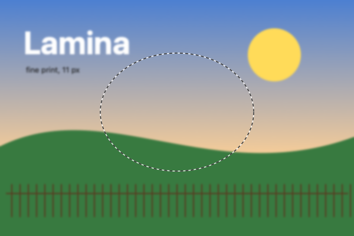
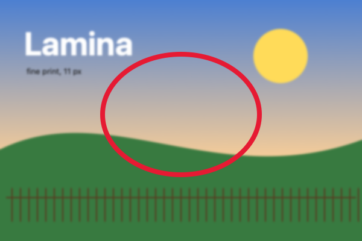
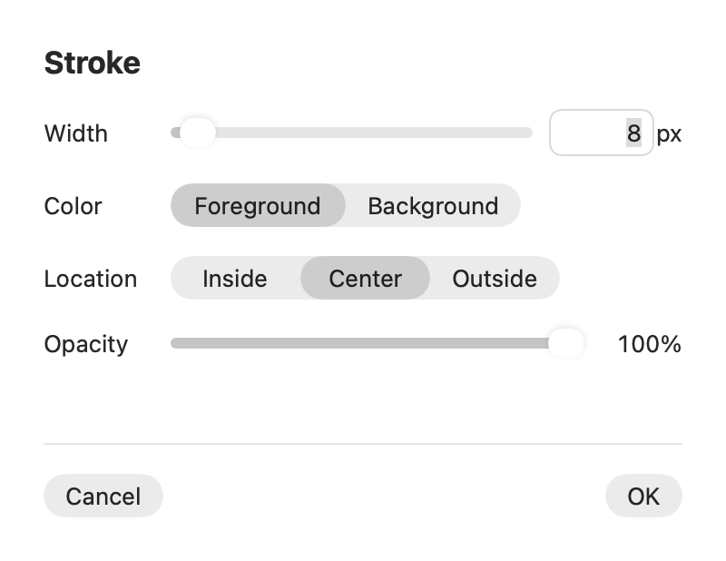

## Description

<!-- SECTION:DESCRIPTION:BEGIN -->
Stroking a selection's outline is a standard Photoshop command (upstream issue #177). Upstream PR #190 implements it; on masks it uses the red channel where it should use luminance.
<!-- SECTION:DESCRIPTION:END -->

## Acceptance Criteria
<!-- AC:BEGIN -->
- [x] #1 Edit › Stroke draws along the selection's outline with width, color, opacity and Inside, Center or Outside, as one undo step
- [x] #2 It works on pixels and on masks (by luminance)
- [x] #3 Tests cover the three positions
<!-- AC:END -->

## Implementation Plan

<!-- SECTION:PLAN:BEGIN -->
1. Port upstream PR #190: StrokeOptions/StrokeLocation and strokeSelection (SelectionStroke.swift), BrushStroke.stroke with tile-limited paintCanvas, makeRasterEdit(clipsToSelection:), StrokeSheet and ProjectController.stroke(), Edit menu item.
2. Use the palette color's luminance (Rec. 709) on masks instead of its red channel.
3. Port SelectionStrokeTests (three positions, opacity/undo, tiles) and add a mask stroke test and a luminance test.
<!-- SECTION:PLAN:END -->

## Implementation Notes

<!-- SECTION:NOTES:BEGIN -->
Added PaletteColor.luminance in SelectionStroke.swift. swift test --filter SelectionStrokeTests: 5 passed (3 ported, onAMaskItRevealsAlongTheOutline, aColorPaintsAMaskByItsLuminance). SelectionEditTests (shares paintCanvas): 19 passed.

Also dropped the Width slider's per-pixel ticks (a stepped slider on macOS draws one per step; the binding already rounds), in commit 'fix: drop the Stroke sheet's per-pixel slider ticks'.

Screenshots (soft landscape fixture, rendered offscreen through the export path; the sheet is StrokeSheet rendered offscreen):
Before, with the elliptical selection drawn dashed: 
After Edit › Stroke, 8 px, Center, foreground red: 
The Stroke sheet (new): 

Manual check: the Edit menu entry and the sheet opening over the window.
<!-- SECTION:NOTES:END -->

## Final Summary

<!-- SECTION:FINAL_SUMMARY:BEGIN -->
Added Edit › Stroke…, ported from upstream PR #190: a sheet for width, foreground or background color, opacity and Inside/Center/Outside, then a line along the selection's outline on the layer or its mask as one undo step, touching only the tiles it crosses. Masks take the color's luminance (Rec. 709) instead of its red channel. Verified with swift test --filter SelectionStrokeTests (5 passed: three positions, opacity and undo, tiles, a mask stroke, luminance), SelectionEditTests (19 passed) and before/after renders.
<!-- SECTION:FINAL_SUMMARY:END -->
