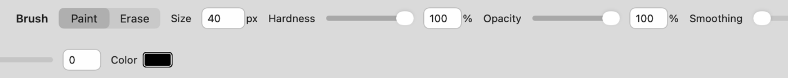
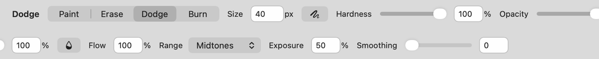
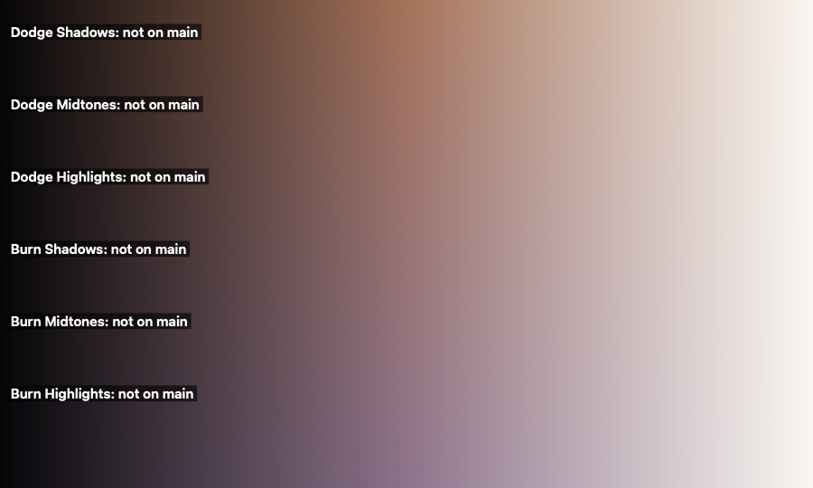
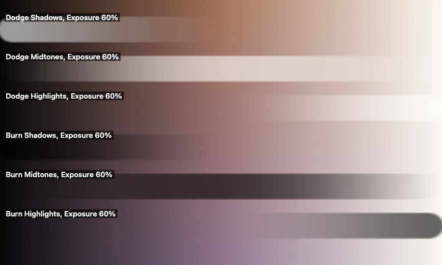

## Description

<!-- SECTION:DESCRIPTION:BEGIN -->
Brush settings reset with every new document (upstream issue #2 is only partly done; PR #166 keeps them in ToolDefaults). Dodge and Burn are core retouching tools (issue #169; PR #193, as Brush modes with a new C kernel). Upstream keeps the brush simple on purpose; Lamina decided otherwise (doc-1).
<!-- SECTION:DESCRIPTION:END -->

## Acceptance Criteria
<!-- AC:BEGIN -->
- [x] #1 Brush tip, size, hardness, opacity, smoothing, mode and colors carry over to new documents and later launches
- [x] #2 Dodge and Burn modes with Range (shadows, midtones, highlights) and Exposure behave as Photoshop's, refuse masks and apply one undo step per stroke
- [x] #3 Tests cover both
<!-- AC:END -->

## Implementation Plan

<!-- SECTION:PLAN:BEGIN -->
1. Port upstream PR #166: BrushDefaults (tips per family, smoothing, mode, colors) loaded into each new ProjectTab and written to ToolDefaults on change (only what changed); add ToolDefaults.double. Tests get compiled defaults (ToolDefaults returns them outside an .app).
2. Port upstream PR #193: Dodge and Burn as Brush modes (BrushToolMode.dodge/.burn), ToneRange + Exposure, brush_tone C kernel in CPixels, toned tiles brought in through the stroke coverage (one undo step per stroke, no step when nothing changes), refuse masks, options bar Range/Exposure, status-bar hint.
3. Also keep Dodge and Burn's Range and Exposure in BrushDefaults, since the mode itself carries over.
4. Tests: BrushDefaultsTests and DodgeBurnTests (from the PRs, adapted); run BrushTests/BrushIntersectionTests/LargeCanvasBrushTests and the new suites.
5. Evidence: offscreen options bar before/after; Dodge and Burn on a gradient.
<!-- SECTION:PLAN:END -->

## Implementation Notes

<!-- SECTION:NOTES:BEGIN -->
Ported upstream PR #166 (commit "feat: keep brush settings across documents and launches"): `BrushDefaults` holds the three tip families (Brush/Spot Healing, Clone Stamp, Smear), smoothing, the Brush's mode and both colors; every change writes only what differs to `ToolDefaults`, and each new `ProjectTab` applies `BrushDefaults.load()`. Deviation from the PR: `ToolDefaults` reads and writes through a small `ToolDefaultsStore` protocol (UserDefaults conforms), so a test can save and load in memory; under `swift test` the store is still nil and the compiled defaults apply.

Ported upstream PR #193 (commit "feat: add Dodge and Burn as Brush modes"): Dodge and Burn are Brush modes (Tab steps through all four), with Range and Exposure in the options bar, the `brush_tone` C kernel in `Sources/CPixels/BrushPixels.c`, toned tiles brought in through the stroke coverage (a stroke goes as far as its exposure however often it passes, the next stroke builds on it: Photoshop with the airbrush off), undo steps named Dodge/Burn and none when nothing changes, masks refused with an explanation. Added: Range and Exposure carry over with the mode in `BrushDefaults`. Not included: Photoshop's Protect Tones option (not in the criteria).

Later in the PR (TASK-21) Exposure lost its slider and the bar gained a compact fallback, so the options bar fits narrower windows.

Validation: `swift test --disable-keychain --filter 'BrushDefaultsTests|DodgeBurnTests|BrushFlowTests|PenPressureTests|BrushTests|BrushIntersectionTests|LargeCanvasBrushTests|CloneStampTests|SpotHealingTests|BlurBrushTests|NativeResolutionPaintTests'` → 65 tests in 11 suites passed. Also `RasterSnapshotTests|LayerAppearanceTests|CursorTests|HistoryTests` → 24 passed. `make dev` builds and the Dev app launches.

Evidence (rendered offscreen through the app's own views and stroke code in throwaway test runs; before = main caf0627):

Options bar with the Brush selected, 1800 pt wide, shown as two halves. Before (main: Paint and Erase only):

After, in Dodge mode (Range and Exposure, no color swatch):

A photo-like gradient (dark to light, warm to cool), before any stroke (main has no Dodge or Burn):

After one stroke per row at Exposure 60%, soft 56 px tip: each range moves its own tones most.

<!-- SECTION:NOTES:END -->

## Final Summary

<!-- SECTION:FINAL_SUMMARY:BEGIN -->
Brush tips (per family), smoothing, the Brush's mode with Dodge and Burn's Range and Exposure, and both colors now carry over to new documents and later launches through ToolDefaults (port of upstream PR #166; ToolDefaults gained a store protocol so a save and later load are tested in memory). Dodge and Burn are Brush modes with Photoshop's Range and Exposure, a new brush_tone C kernel, one undo step per stroke (none when nothing changes) and masks refused (port of upstream PR #193). Verified with BrushDefaultsTests and DodgeBurnTests (and the existing brush suites, 65 tests in 11 suites passing) plus offscreen before/after renders of the options bar and of Dodge and Burn on a gradient. Not included: Photoshop's Protect Tones.
<!-- SECTION:FINAL_SUMMARY:END -->
