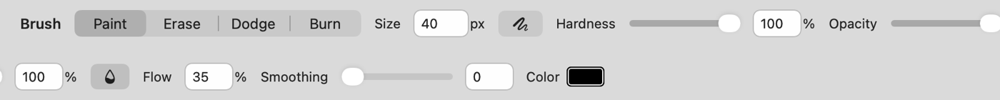
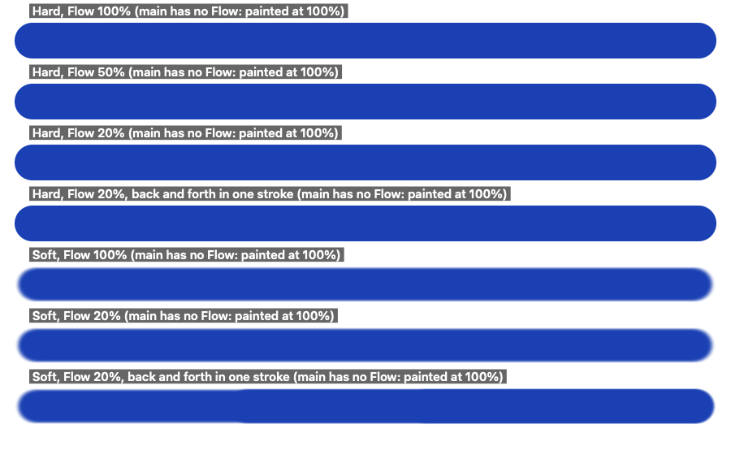
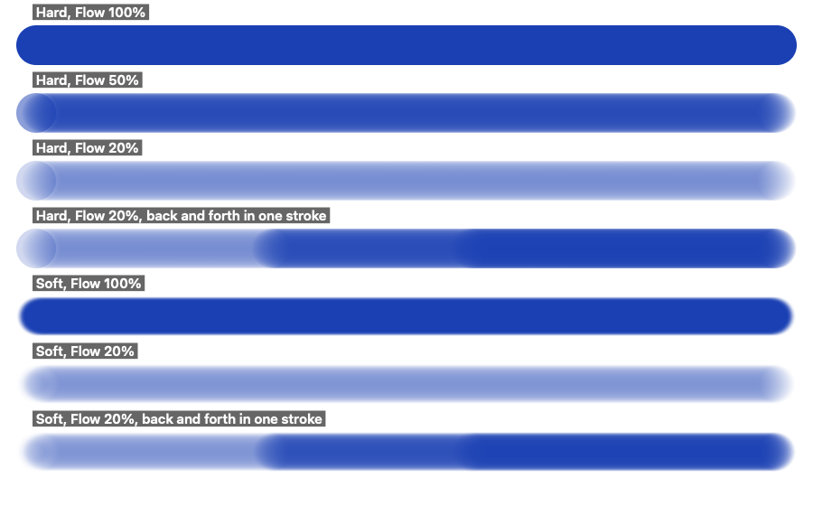

## Description

<!-- SECTION:DESCRIPTION:BEGIN -->
Decided in doc-1: add Flow and pen pressure the way Photoshop does, so they're familiar to people coming from it. Sources: closed PR #106 (flow), open PR #194 (pressure; only tested with simulated events), upstream issue #63.
<!-- SECTION:DESCRIPTION:END -->

## Acceptance Criteria
<!-- AC:BEGIN -->
- [x] #1 Flow sits next to Opacity: each dab lays down that share of paint, building up within a stroke up to the stroke's opacity
- [x] #2 Two options-bar toggles apply pen pressure to size and to opacity; mouse and trackpad strokes are unchanged
- [ ] #3 Checked by hand with a real pen tablet, and tests cover flow and simulated pressure
<!-- AC:END -->

## Implementation Plan

<!-- SECTION:PLAN:BEGIN -->
1. Flow (BrushSettings.flow, Brush tool only) next to Opacity. Photoshop semantics: each dab lays flow x tip, dabs build up in the stroke, Opacity caps the stroke (multiplies). Reimplemented, not PR #106 as is: the app deposits at 1.5-2.5% spacing, so flow per internal dab would saturate in one pass. Deposit instead as Photoshop's 25%-spacing dabs (density -log(1 - f + f q^k) per Photoshop dab, q = 1 - tip, k = spacing ratio for soft tips, 1 for hard), which equals today's brush exactly at 100% flow; a click lays one dab of flow x tip. GPU kernel and CPU fallback (remapped tip).
2. Pen pressure (port PR #194, adapted to flow): BrushSettings.pressureSize / pressureOpacity, two options-bar toggles; CanvasView reads pressure only from tablet events (subtype tabletPoint), so mouse and trackpad strokes are unchanged; size scales the tip radius along segments; opacity caps the stroke at the firmest press that reached each pixel (GPU density + cap buffers; CPU cap tiles).
3. Keep flow and the two toggles in BrushDefaults with the other brush settings.
4. Tests: flow (click share, build-up within a stroke, opacity cap, 100% unchanged, GPU/CPU agree), simulated pressure (size, opacity cap, mouse unchanged, tablet-only reading, CPU path).
5. Evidence: options bar before/after; low-flow build-up vs full flow. Real tablet check left to the user.

6. Found while rendering the evidence: the options bar no longer fit common window widths. Flow and Exposure became fields without sliders, a compact variant drops the sliders where the full bar doesn't fit, and each field keeps its unit whole.
<!-- SECTION:PLAN:END -->

## Implementation Notes

<!-- SECTION:NOTES:BEGIN -->
Flow (commit "feat: add brush flow and pen pressure, as in Photoshop"), reimplemented rather than ported from closed PR #106: the app deposits paint every 1.5–2.5% of the diameter, so a flow share per fine step (PR #106) covers fully in one pass at any flow; a 20% flow line would look nearly solid. Flow is laid per Photoshop dab instead, one every 25% of the diameter (Photoshop's default spacing), each laying flow × the tip; a pass builds up over the ~4 dabs covering a point (1 − (1 − flow)⁴ at the middle of a hard line), going over the same place in the stroke builds further, and Opacity still caps (multiplies) the whole stroke. A click lays one dab, flow × the tip. GPU: the kernel integrates the dab density over distance (`BrushFlow`, `tipDensity`, `clickDensity`), starting half a dab after the click so the start gets no extra dab. A soft tip's dab is the coverage its fine steps build over one dab's distance, so 100% flow is exactly the old brush and 99% hardly differs. Software fallback: stamps those dabs at 25% spacing through remapped tips (`coverage_remap`). Flow belongs to the Brush (all four modes); other brush tools lay their full tip. Shift+digit flow keys (PR #106) are not included: not in the criteria, and Shift changes the digit characters on most layouts.

Pen pressure, ported from open PR #194 and adapted to flow: two options-bar toggles (pressure for size beside Size, pressure for opacity beside Opacity, as in Photoshop). `CanvasView.penPressure` reads pressure only from tablet events (subtype tabletPoint); a mouse or a Force Touch trackpad paints at full pressure. Size scales the tip radius along each segment (spacing follows the pressed size); opacity keeps a second float per pixel with the firmest press that reached it, which caps the coverage (GPU), or cap tiles multiplied in by `coverage_multiply` (software). The release event keeps the last pressure. Flow, both toggles carry over in `BrushDefaults`.

Options bar: with Flow, the toggles and Dodge and Burn's options the bar (which spans the window and has no overflow handling) needed ~1480 pt for Paint and ~1700 pt for Dodge, against ~1130 on main; a 1512 pt window clipped it. Flow and Exposure are fields without sliders, like Size, and where the full bar doesn't fit a compact variant drops the sliders (fields stay scrubbable by their labels). A separate commit keeps each field's unit whole: SwiftUI squeezed "px"/"%" onto two lines even with room to spare.

Mouse strokes unchanged, checked against main: a throwaway test rendered 36 strokes through `BrushStroke` (GPU and software; hardness 1, 0.5, 0; 9, 40, 130 px; opacity 1 and 0.6) plus 3 session strokes (smoothing, erase) on main and on this branch and compared the bytes. Software and session strokes are byte-identical; 6 of the 18 GPU strokes differ by 1 level in at most 1 pixel of 120,000 (shader float rounding after restructuring), the rest are identical.

Validation: `swift test --disable-keychain --filter 'BrushDefaultsTests|DodgeBurnTests|BrushFlowTests|PenPressureTests|BrushTests|BrushIntersectionTests|LargeCanvasBrushTests|CloneStampTests|SpotHealingTests|BlurBrushTests|NativeResolutionPaintTests'` → 65 tests in 11 suites passed (BrushFlowTests: click share on GPU and CPU, Photoshop dab build-up, building to the opacity cap, 99% ≈ 100%, erase and mask, Brush only; PenPressureTests: size, opacity cap with and without flow, mouse and buttons-off unchanged, release keeps pressure, tablet-only reading via synthetic CGEvents, software path, buttons belong to the Brush). Not done: a real pen tablet (manual check for the user).

Evidence (rendered offscreen; before = main caf0627):

Options bar with the Brush selected, 1800 pt wide, shown as two halves. Before:

After, Flow 35% and pressure for opacity on (the pressure buttons sit beside Size and Opacity):

At 1220 pt, before (main, cramped) and after (compact variant, no sliders):

Strokes through the session (mouse-like events every 6 px), 44 px tips, on white. Before (main has no Flow, every row paints at 100%):

After: one pass at 100%, 50% and 20% flow, and 20% going back and forth in one stroke (1, 3 and 5 passes), hard and soft.

<!-- SECTION:NOTES:END -->

## Final Summary

<!-- SECTION:FINAL_SUMMARY:BEGIN -->
Flow sits next to Opacity with Photoshop's semantics: each dab (every 25% of the diameter) lays flow x the tip, a pass builds up over the dabs covering a point, going over it again in the stroke builds further, and Opacity caps the stroke; 100% flow is exactly the old brush (reimplemented, not PR #106's per-fine-step flow, which saturated in one pass). Pen pressure for size and for opacity are two options-bar toggles (port of upstream PR #194, adapted to flow); only tablet events carry pressure, and mouse strokes were compared byte for byte with main (software and session strokes identical, GPU strokes within 1 level in at most 1 pixel). The options bar got a compact fallback so it fits narrower windows. Verified with BrushFlowTests and PenPressureTests (simulated pressure) and the existing brush suites (65 tests in 11 suites passing), plus offscreen before/after renders. Still to do by hand: a real pen tablet (criterion 3 stays unchecked).
<!-- SECTION:FINAL_SUMMARY:END -->
