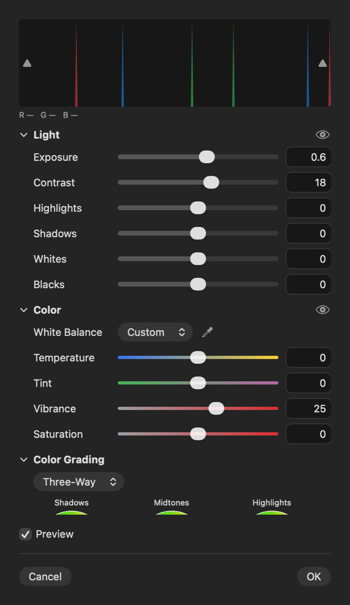
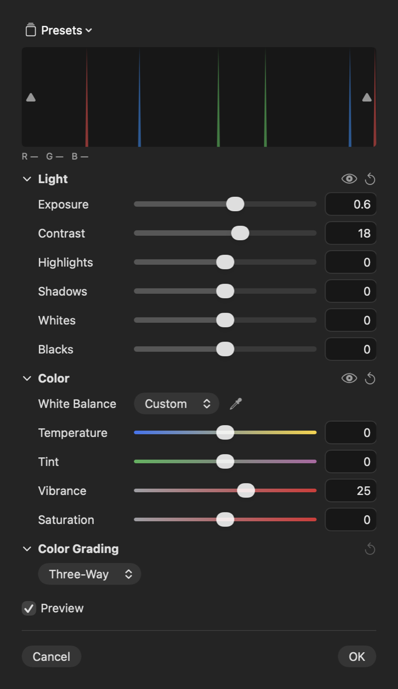

## Description

<!-- SECTION:DESCRIPTION:BEGIN -->
Camera Raw can only be reset as a whole and its settings can't be saved. Upstream PR #187 adds a reset per section and PR #198 named presets (stored in Application Support, no project format change; it also makes the settings Codable, which helps TASK-2 and TASK-4).
<!-- SECTION:DESCRIPTION:END -->

## Acceptance Criteria
<!-- AC:BEGIN -->
- [x] #1 Each Camera Raw section has a reset button that restores its defaults
- [x] #2 Settings can be saved and applied as named presets; an unreadable presets file is kept aside, not overwritten
- [x] #3 Tests cover resets and presets
<!-- AC:END -->

## Implementation Plan

<!-- SECTION:PLAN:BEGIN -->
1. Port PR #187: CameraRawGroup with resetting/keeping/isDefault on CameraRawSettings, EditorSession.resetCameraRaw, and a reset button in each section header (dimmed at defaults).
2. Port PR #198: CameraRawSettings and its parts Codable; CameraRawPresetStore (JSON in Application Support, unreadable entries kept, an unreadable file moved aside to .bak before it is replaced); a Presets menu at the top of the panel (apply, save, rename, delete).
3. Tests: CameraRawResetTests and CameraRawPresetTests from upstream, presets in temp files.
4. Offscreen before/after render of the Camera Raw panel's top.
<!-- SECTION:PLAN:END -->

## Implementation Notes

<!-- SECTION:NOTES:BEGIN -->
Ported PR #187 (CameraRawGroup, resetting/keeping/isDefault, EditorSession.resetCameraRaw, a reset button in each section header, dimmed at defaults; a reset section shows again if its eye was off) and PR #198 (settings types Codable, CameraRawPresetStore writing CameraRawPresets.json in Application Support, i.e. the sandbox container; Presets menu at the top of the panel to apply, save, rename and delete). No project format change. Two #198 hunks needed reduced context because the fork's Camera Raw files import CPixels; the README lines of both PRs were merged into one. Independent of TASK-10's Camera Raw speed work (different code); the PR should merge after the upstream-fixes PR.

Verification: swift test --disable-keychain --filter 'CameraRawResetTests|CameraRawPresetTests' (18 tests passed, presets in temp files).

Camera Raw panel rendered offscreen (Light and Color edited). Before:

After (Presets menu, reset buttons; dimmed for Color Grading, which is at its defaults):

Manual checks: the Presets menu's name, replace and delete alerts inside the floating panel.
<!-- SECTION:NOTES:END -->

## Final Summary

<!-- SECTION:FINAL_SUMMARY:BEGIN -->
Each Camera Raw section resets to its defaults from its header, and the panel's settings can be saved, applied, renamed and deleted as named presets stored in Application Support; an unreadable presets file is moved aside to .bak before it is replaced and unreadable entries are kept. Ports upstream #187 and #198. Verified with CameraRawResetTests and CameraRawPresetTests plus before/after renders.
<!-- SECTION:FINAL_SUMMARY:END -->
