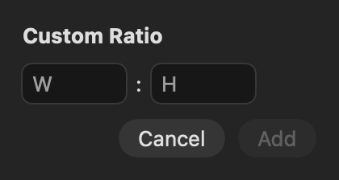

## Description

<!-- SECTION:DESCRIPTION:BEGIN -->
Crop offers a fixed list of ratios (upstream issue #165 asks for 9:20 and custom ones; #92 only added 3:4 and 9:16), and its Cancel and Apply buttons sit far from the ratio picker (issue #202).
<!-- SECTION:DESCRIPTION:END -->

## Acceptance Criteria
<!-- AC:BEGIN -->
- [x] #1 Any W:H ratio can be entered and is remembered with the others
- [x] #2 Cancel and Apply sit next to the ratio controls
<!-- AC:END -->

## Implementation Plan

<!-- SECTION:PLAN:BEGIN -->
1. Crop ratio choices become data: built-ins plus custom W:H ratios remembered in ToolDefaults (recent first, capped), parsed generically instead of a switch.
2. A Custom… choice in the ratio picker opens a small W:H popover; adding selects the ratio and applies it to the crop frame.
3. Move Cancel and Apply Crop next to the ratio controls (issue #202), the size readout after them.
4. Tests for parsing, remembering and applying; offscreen before/after render of the crop bar.
<!-- SECTION:PLAN:END -->

## Implementation Notes

<!-- SECTION:NOTES:BEGIN -->
No upstream code. Crop ratios became data: CropRatio parses any W:H (cropRatio no longer switches over a fixed list), and CustomCropRatios keeps typed ratios newest first (8 at most; a built-in one is chosen, not added) in UserDefaults under tool.cropRatios, shared across tabs and launches; tests get an in-memory list. The ratio picker ends with Custom…, which keeps the current ratio and opens a W:H popover (text fields, so Add enables while typing); Add chooses the ratio and applies it to the frame. Cancel and Apply Crop now follow the ratio picker, with the size readout after them so its width never moves them.

Verification: swift test --disable-keychain --filter 'CropRatioTests|CropTests' (parsing, remembering across a reopen, applying to the frame, and a hosted crop bar showing Custom… keeps the ratio; all passed).

Crop bar rendered offscreen. Before:

After:

After, with a typed 9:20 chosen:

The Custom… form:

Manual check: opening the popover from the picker, typing, Return to add, and the list on the next launch.
<!-- SECTION:NOTES:END -->

## Final Summary

<!-- SECTION:FINAL_SUMMARY:BEGIN -->
Any W:H crop ratio can be typed in via the picker's Custom… entry; it is applied and remembered after the built-in ratios across tabs and launches. Cancel and Apply Crop sit right after the ratio picker. Verified with CropRatioTests and CropTests plus before/after renders of the crop bar; the popover interaction is a manual check.
<!-- SECTION:FINAL_SUMMARY:END -->
