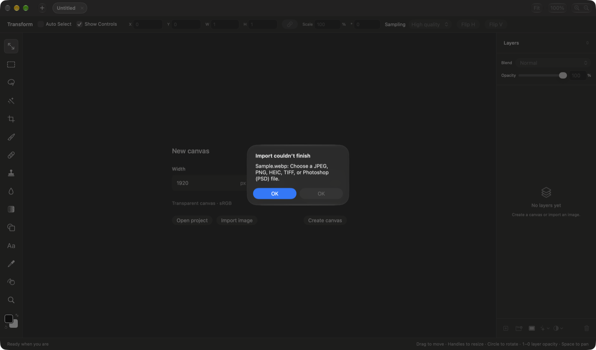
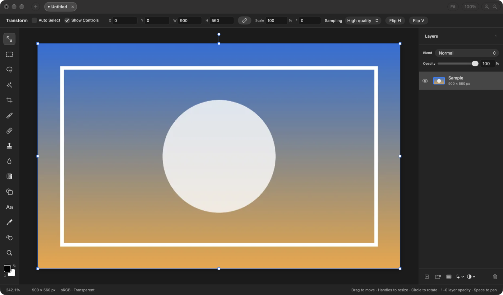
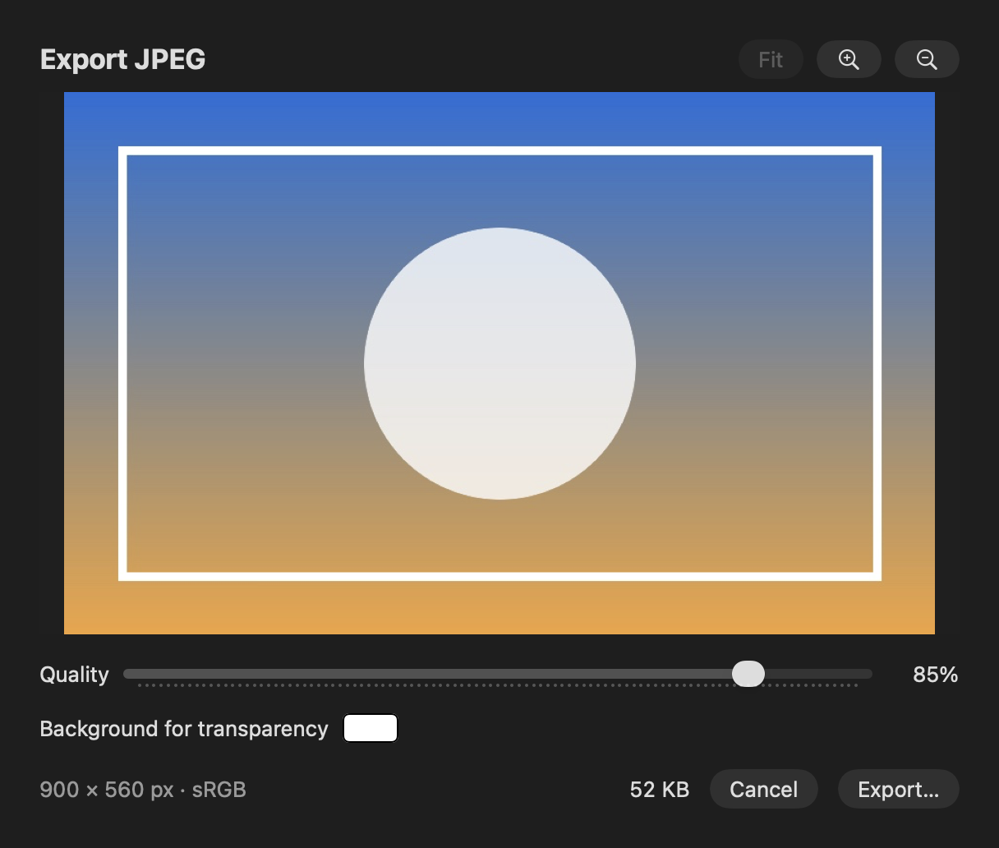
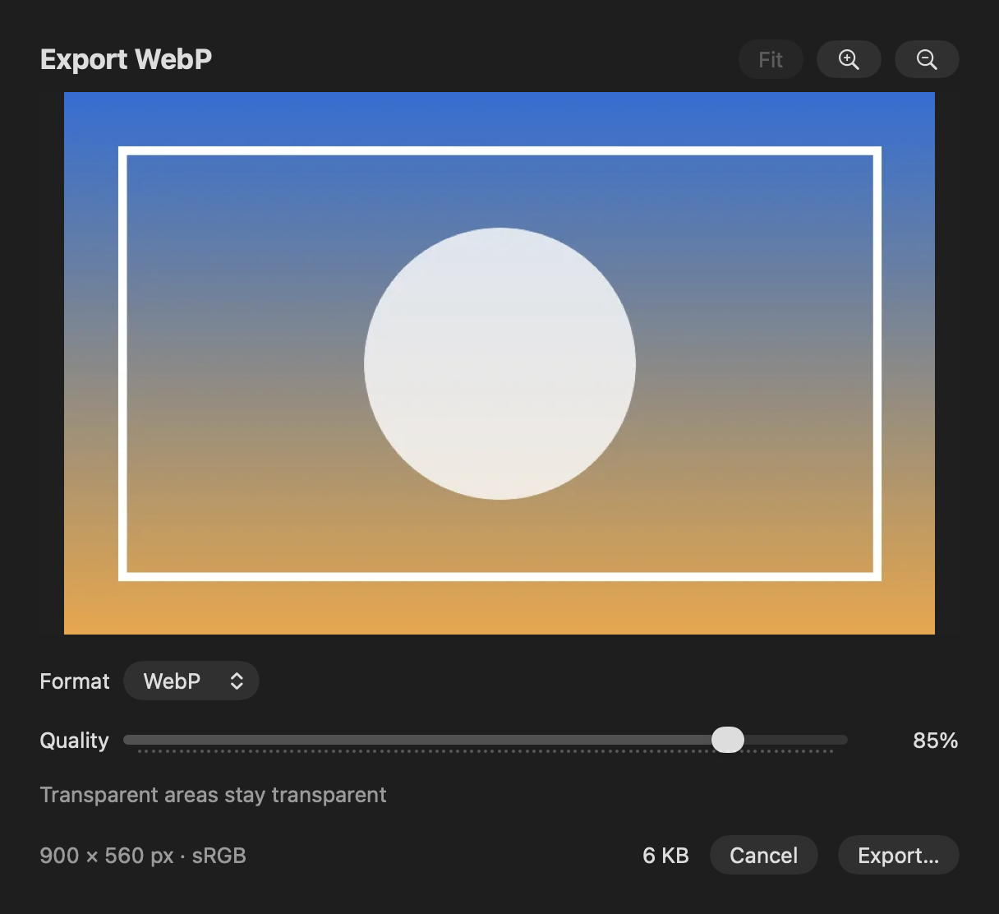
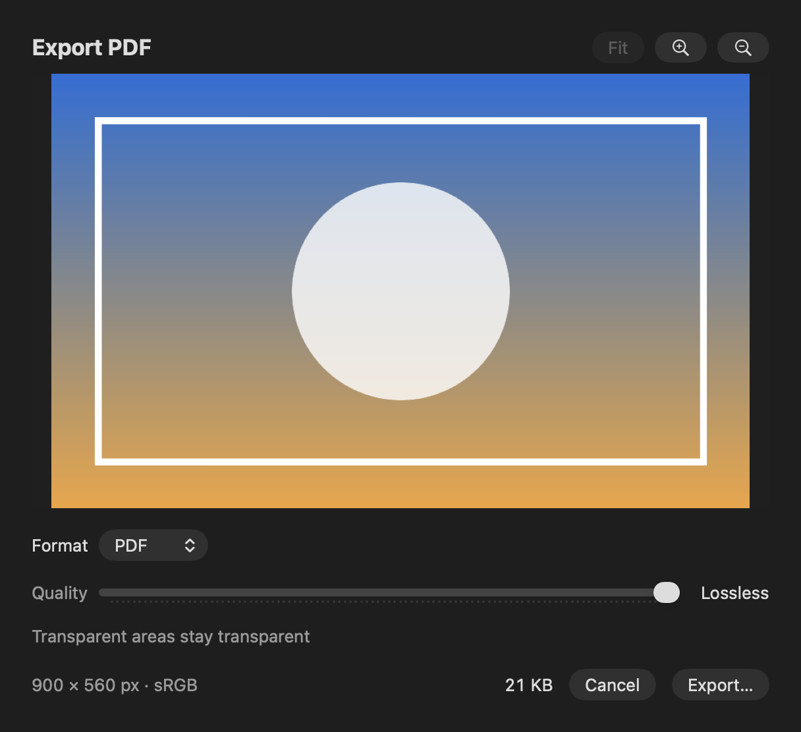

## Description

<!-- SECTION:DESCRIPTION:BEGIN -->
Decided in doc-1: more export formats, at least WebP and AVIF, and PDF if simple. ImageIO decodes WebP but the importer leaves it out (upstream issue #168). ImageIO encodes AVIF, HEIC, TIFF and PDF (checked on macOS 27; AVIF still to check on macOS 26), but not WebP, which needs libwebp (BSD-3-Clause) as a vendored C target. References: closed PR #149 (export sheet), PR #208 (PDF).
<!-- SECTION:DESCRIPTION:END -->

## Acceptance Criteria
<!-- AC:BEGIN -->
- [x] #1 WebP images open, drop and place like other images
- [x] #2 Export offers AVIF, HEIC, TIFF and PDF through ImageIO, listing only formats the running macOS can encode, with quality settings where the format has them
- [x] #3 WebP export works through a vendored libwebp with its license in Credits.html, or the task notes record why it was left out
- [x] #4 Tests round-trip each format
<!-- AC:END -->

## Implementation Plan

<!-- SECTION:PLAN:BEGIN -->
1. WebP import: add UTType.webP to the decoder's accepted types, the Import panel's types, the drop fallback's types and the error texts, and org.webmproject.webp to Info.plist's viewer document types. Test with a tiny lossless WebP fixture (made once with cwebp) for decode, alpha, file drops, image-data drops and placing into an open document.
2. Export formats: an ExportFormat list (PNG, JPEG, HEIC, AVIF, WebP, TIFF, PDF); ImageIO formats listed only when CGImageDestinationCopyTypeIdentifiers() has them at run time. Generalize the Export JPEG sheet into an export sheet with a Format picker, quality for JPEG/HEIC/AVIF/WebP (remembered per format), the transparency background only for JPEG. File > Export As… opens it with every format; Export PNG… and Export JPEG… stay as they are. Export stays 8 bits per channel. TIFF uses LZW. PDF is drawn by a Core Graphics PDF context (as upstream PR #208 does), because ImageIO's PDF writer stores a JPEG and drops alpha.
3. WebP export: add SDWebImage/libwebp-Xcode (SwiftPM package of Google's libwebp, BSD-3-Clause) pinned at 1.6.0, with a thin encoder wrapper (WebPEncodeRGBA, unpremultiplied RGBA, 16,383 px side limit). Check the tests and make dev (Credits.html lists it).
4. Tests: round-trip every format (pixels, alpha, size, DPI where kept, quality changes bytes), WebP import, availability filter. Run only ImageImportTests, ExportTests, JPEGExportTests and the new suite.
5. README import/export lists, AGENTS.md dependency note; before/after screenshots (WebP opened in the app; export sheet rendered offscreen); PR.
<!-- SECTION:PLAN:END -->

## Implementation Notes

<!-- SECTION:NOTES:BEGIN -->
WebP import (3fca579): UTType.webP added to the decoder's accepted types, the Import panel, the drop fallback and the error texts; org.webmproject.webp added to Info.plist's viewer types. ImageImportTests.webPOpensDropsAndPlaces uses a 38-byte lossless WebP made with cwebp 1.6.0 (ImageIO can't write WebP).
Export formats (24e8222): File > Export As… opens the Export JPEG sheet with a Format picker; Export PNG… and Export JPEG… are unchanged. Formats are filtered at run time by CGImageDestinationCopyTypeIdentifiers() (ExportFormat.available(encoders:) is tested with a list that lacks AVIF/HEIC). Findings: ImageIO's AVIF encoder fails at quality exactly 1.0 and gives identical files from 0.99 up, so AVIF quality is capped at 0.99. ImageIO's PDF writer (com.adobe.pdf) stores the image as DCT (JPEG) at a fixed quality with no SMask, so transparency is lost; PDF is drawn with a Core Graphics PDF context instead (upstream PR #208's approach): Flate, transparent, page at the printed size. This is the one deviation from 'through ImageIO' in AC #2. TIFF uses LZW.

WebP export (bf4304f): SDWebImage/libwebp-Xcode 1.6.0 (Google's libwebp 1.6.0, BSD-3-Clause; SwiftPM target built from source, statically linked), pinned in Package.resolved. IO/WebPEncoder.swift draws into sRGB RGBA, unpremultiplies with vImage and calls WebPEncodeRGBA (lossy, alpha kept losslessly); sides over 16,383 px throw ExportError.webPTooLarge. make dev builds the bundle and Credits.html lists 'libwebp-Xcode 1.6.0' with Google's license; nm shows _WebPEncodeRGBA linked into the executable.

Validation: swift test --disable-keychain --filter 'ExportFormatTests|ExportTests|JPEGExportTests|ImageImportTests' passed (19 tests in 4 suites; roundTrips ran for PNG, JPEG, HEIC, AVIF, WebP, TIFF and PDF). make dev succeeded. Not run: make app (release configuration), the full test suite.

Not verifiable here: AVIF encoding on macOS 26 (this Mac runs macOS 27); the code only lists AVIF when ImageIO reports an encoder, which listsOnlyFormatsThisMacCanWrite checks with an encoder list lacking AVIF and HEIC. Manual checks: File > Export As… in the running app (menu, sheet, save panel), and opening each exported format in Preview and Photoshop.

Screenshots:

Opening a .webp, before (main): rejected as unsupported.

Opening the same .webp, after: it becomes the canvas.

Export sheet before (main's Export JPEG, rendered offscreen):

Export As… after, with WebP chosen (rendered offscreen):

Export As… after, with a lossless format (PDF): quality disabled.

AC #3 says 'vendored libwebp': libwebp comes as a pinned SwiftPM package of Google's source rather than files copied into this repo, as decided for this PR (smaller diff, upstream updates through Package.resolved).

Follow-up from review (2026-10-08): dragging a WebP from Brave failed with 'Some dropped items couldn’t be read'. A diagnostic drop window showed Brave hands images over as file promises of their type (org.webmproject.webp, like public.png/public.jpeg for web images), which the existing code loads; the failing case was a local file shown in the browser (file:// page): the promise points at the original file and the sandbox log showed 'deny(1) file-read-data …/0000.webp'. Images from websites read fine. ImageFileDrop now finds that file in the drag's public.url (matched by the item's name), offers an Open panel pointed at it so one click grants access, and says to drag it from Finder when the panel is cancelled. Tests: ImageFileDropTests (3) and ImageImportTests pass. Manual check: drag a local WebP shown in Brave onto the canvas, choose Open in the panel.
<!-- SECTION:NOTES:END -->

## Final Summary

<!-- SECTION:FINAL_SUMMARY:BEGIN -->
WebP now opens, drops and places like other images (importer, Import panel, drop fallback, Info.plist). File > Export As… opens the export sheet with a Format picker: PNG, JPEG, HEIC, AVIF, WebP, TIFF and PDF, the ImageIO ones listed only when this Mac's ImageIO reports an encoder; quality for JPEG, HEIC, AVIF and WebP; 8 bits per channel. WebP is encoded by libwebp (SDWebImage/libwebp-Xcode 1.6.0, BSD-3-Clause, credited in Credits.html). PDF is drawn by Core Graphics rather than ImageIO, whose PDF is a JPEG without alpha. Verified with ImageImportTests, ExportTests, JPEGExportTests and the new ExportFormatTests (19 tests, every format round-tripped), make dev, and before/after screenshots. AVIF on macOS 26 and opening exports in other apps remain manual checks.
<!-- SECTION:FINAL_SUMMARY:END -->
