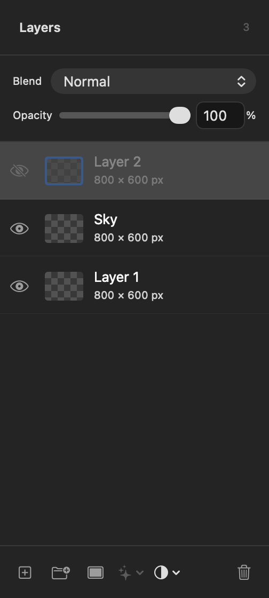
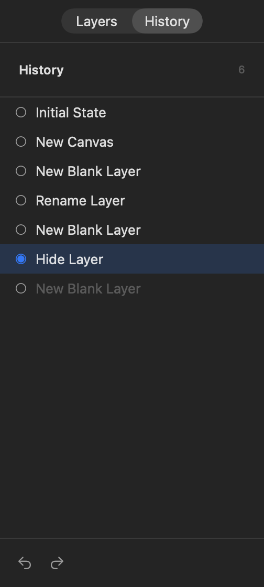
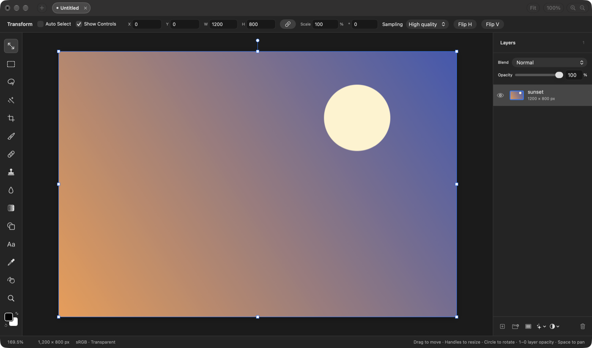
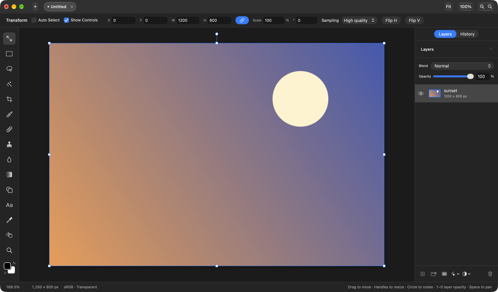
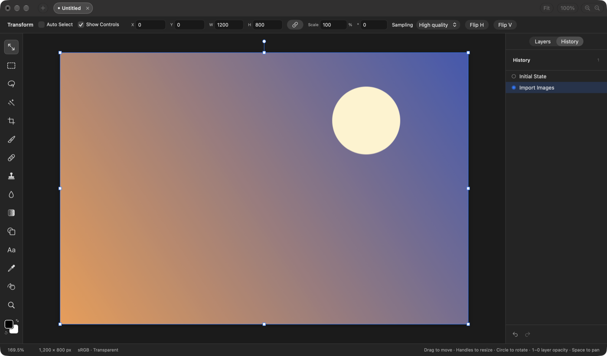

## Description

<!-- SECTION:DESCRIPTION:BEGIN -->
Undo steps can only be walked one at a time. Closed upstream PR #146 included a History panel built on the existing undo stacks (its selection tools aren't worth taking).
<!-- SECTION:DESCRIPTION:END -->

## Acceptance Criteria
<!-- AC:BEGIN -->
- [x] #1 A History panel lists the undo steps by name, and clicking one goes back or forward to it
- [x] #2 A new edit after going back drops the later steps, as in Photoshop
- [x] #3 Tests cover jumping and editing after a jump
<!-- AC:END -->

## Implementation Plan

<!-- SECTION:PLAN:BEGIN -->
1. DocumentHistory: chronological step list (past, then redo steps) and the current position; jump(to:) moves entries between the undo and redo stacks and trims once, returning one snapshot to restore.
2. EditorSession.jumpToHistory(_:) with the same guard as Undo/Redo; a new edit after a jump drops the later steps (existing end() behavior).
3. HistoryPanel (from closed PR #146, without its Quick Selection and Magnetic Lasso) shown via a Layers | History switch above the side panel.
4. Tests for listing, jumping both ways, and editing after a jump; offscreen render of the panel.
<!-- SECTION:PLAN:END -->

## Implementation Notes

<!-- SECTION:NOTES:BEGIN -->
Reimplemented only the History panel of closed PR #146 (no Quick Selection, Magnetic Lasso or wand changes). DocumentHistory gained stepNames (undo steps, then redo steps, oldest first), position, and jump(to:), which moves entries between the undo and redo stacks in one go and trims once, so a jump restores the document once instead of replaying every Undo. EditorSession.jumpToHistory uses the same guard as Undo/Redo. A new edit after a jump drops the later steps through DocumentHistory.end's existing behavior. The panel is switched to with a Layers | History control above the side panel (remembered in UserDefaults); the first row is the state before the oldest step kept, later steps are dimmed. Renaming a layer or editing an adjustment switches back to Layers, since both happen there.

Verification: swift test --disable-keychain --filter HistoryTests (11 tests passed, 4 new: jumping both ways, editing after a jump, waiting while history is busy, the entry limit after jumps). The Dev app shows the switch and the panel with a fixture image opened (captures below).

Side panel rendered offscreen after five edits and one Undo. Before (no History):

After:

Dev app with a 1200x800 fixture PNG opened. Before:

After, Layers selected:

After, History selected:

Manual check: clicking rows in the running app.
<!-- SECTION:NOTES:END -->

## Final Summary

<!-- SECTION:FINAL_SUMMARY:BEGIN -->
A History panel, switched to from above the Layers panel, lists every undo step by name; clicking one goes back or forward to it in one restore, and a new edit after going back drops the later steps. Built on DocumentHistory (stepNames, position, jump(to:)); reimplements the panel from closed upstream #146. Verified with HistoryTests and offscreen and Dev-app captures.
<!-- SECTION:FINAL_SUMMARY:END -->
