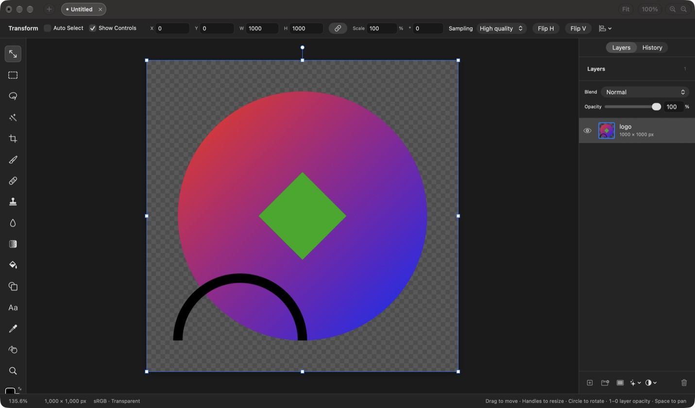
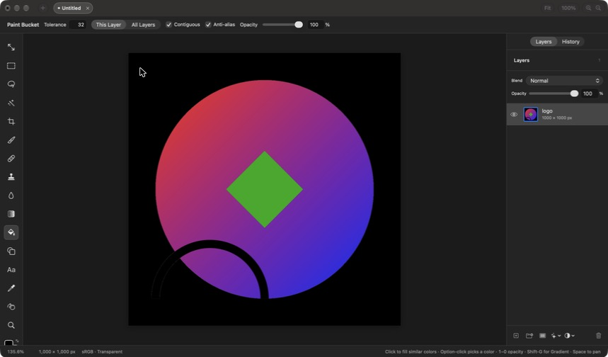

## Description

<!-- SECTION:DESCRIPTION:BEGIN -->
Filling an area of similar color takes two steps today (Magic Wand, then Edit › Fill), which is why doc-1 deferred upstream issue #144. It is still a basic tool people reach for first, and its parts already exist: the Magic Wand's flood fill (`wand_mask` in WandPixels.c) and Edit › Fill's undoable raster edit. Closed upstream PR #96 is reference only. Prior art and pitfalls (PhotoCraft) are in doc-2.
<!-- SECTION:DESCRIPTION:END -->

## Acceptance Criteria
<!-- AC:BEGIN -->
- [x] #1 A Paint Bucket tool fills the clicked area with the foreground color as one undo step; it shares G with the Gradient tool and Shift-G switches between them
- [x] #2 The options bar has Tolerance, Contiguous, Sample All Layers, Anti-alias and Opacity, remembered like other tool settings
- [x] #3 With a selection, only selected pixels are filled
- [x] #4 Fully transparent pixels count as one color whatever their hidden RGB, so clicking an empty area fills it, and a blank layer fills like a transparent one
- [x] #5 It works on moved, scaled and rotated layers, and on masks (filling with the foreground gray, as Edit › Fill does)
- [x] #6 Clicking a text layer that is still text recolors its letters instead of rasterizing them, as Edit › Fill does
- [x] #7 Tests cover tolerance, contiguous and global fills, anti-aliased edges, selection-limited fills, transformed layers and masks
<!-- AC:END -->

## Implementation Plan

<!-- SECTION:PLAN:BEGIN -->
1. C (WandPixels.c): `bucket_bounds` (bounding box of a flood mask) and `bucket_coverage` (copies the box out, with an optional anti-aliased edge: PhotoCraft's 3×3 post-pass). The flood itself reuses `wand_mask` (point sample), on premultiplied pixels so transparent pixels all match.
2. Document/PaintBucket.swift: `BucketSettings` (tolerance, contiguous, sample all layers, anti-alias, opacity; session-only like the wand's), `PaintBucket.coverage(in:at:settings:)` → coverage image + document rect, and `EditorSession.paintBucket(at:)`: live text recolors (as Edit › Fill); otherwise sample the active layer, its mask when the mask is targeted, or the composite; flood off the main thread; paint through `applyPixelEdit` (selection clip, masks, undo) with a new `BrushStroke.fill(_:coverage:in:opacity:)` that draws in document space, so transformed layers work.
3. Tool: `NavigationTool.paintBucket` next to Gradient (own rail button, custom icon); G picks whichever of the two was used last, Shift-G switches; Option-click picks a color; opacity digits; options bar `PaintBucketControls`; shortcuts list and layer-list keys.
4. Tests (PaintBucketTests): tolerance, contiguous vs global, anti-aliased edge, selection-limited, transparent/blank layer, scaled layer, mask, live text, undo name, keys.
<!-- SECTION:PLAN:END -->

## Implementation Notes

<!-- SECTION:NOTES:BEGIN -->
Implemented as planned. Choices beyond the plan:
- The Paint Bucket has its own rail button (custom icon, no SF Symbol exists) rather than hiding behind the Gradient's, so it can be found with the mouse; G and Shift-G behave as Photoshop's shared key.
- Settings are session-only, like the Magic Wand's and the Gradient's (none of those are persisted in ToolDefaults).
- Masks fill with the foreground's luminance, as Edit › Stroke does; with the mask palette (black/white) it is the same as Edit › Fill.
- `applyPixelEdit` became internal so the bucket shares Edit › Fill's undoable raster edit.
- README lists the tool.

Validation:
- `swift test --filter PaintBucketTests`: 11 tests (area and undo, tolerance and contiguous, transparent pixels with hidden RGB, blank layer at 50% opacity, anti-aliased edge, selection-limited fill, scaled layer at its own resolution, rotated layer, mask read and filled, live text recolored, G/Shift-G and opacity keys).
- Full `swift test`: 709 tests in 100 suites passed (117.8 s wall clock).
- Dev build (`make dev`): picked the tool from the rail and filled the transparent area around a logo; options bar and fill shown below.

<!-- SECTION:NOTES:END -->

## Final Summary

<!-- SECTION:FINAL_SUMMARY:BEGIN -->
Added the Paint Bucket: a tool next to the Gradient (G, Shift-G switches) that fills the area of similar color with the foreground color as one undo step, with Tolerance, Contiguous, Sample All Layers, Anti-alias and Opacity. It reuses the Magic Wand's flood fill (`wand_mask`) plus two new C helpers for the area's bounds and its anti-aliased edge, and paints through Edit › Fill's raster edit in document space, so selections, masks, blank and transformed layers work; live text is recolored instead. Verified by 11 new tests, the full suite (709 passing) and a fill in the Dev build.
<!-- SECTION:FINAL_SUMMARY:END -->
