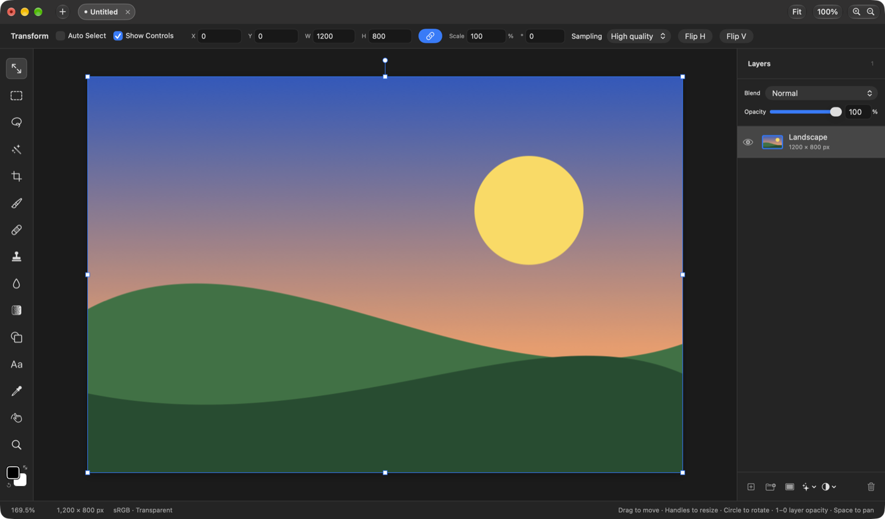
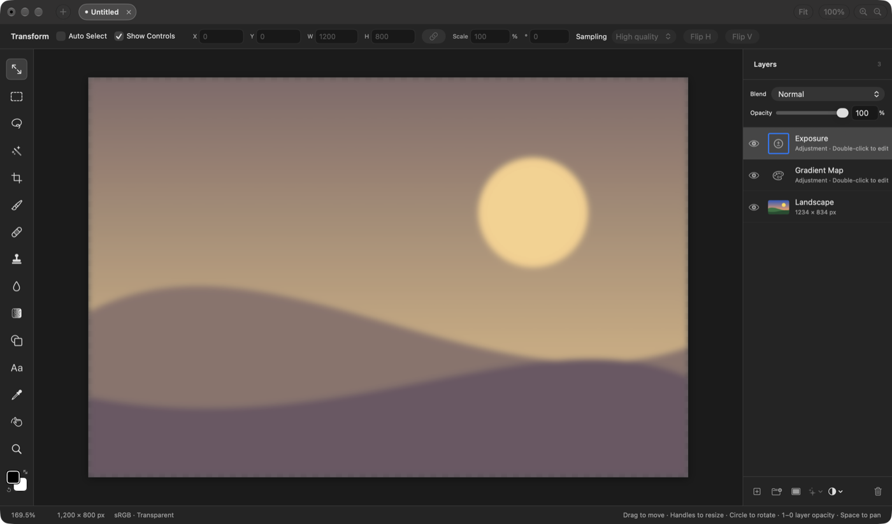
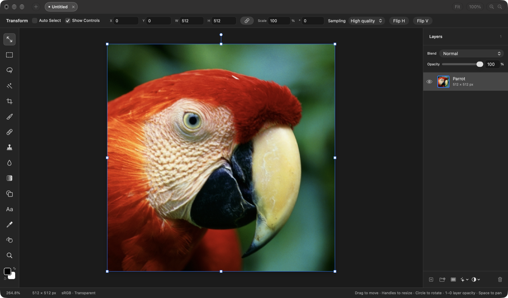
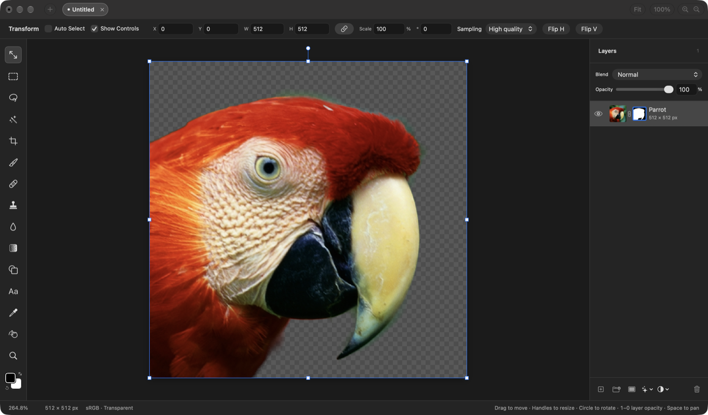

## Description

<!-- SECTION:DESCRIPTION:BEGIN -->
Agents and scripts can already change a project by writing its `.comp` files, and the open app reloads them (docs/writing-comp-files.md). They can't drive the running app itself: ask what's open, select layers, apply adjustments or filters, export, or read results back.

A command-line tool comes first, not an MCP server. The agents that would use it run locally with a shell (Claude Code, Codex): a CLI is discoverable with --help, costs no context until it's used, composes with scripts and pipes, is usable by people too, and needs no server per client. MCP pays off for clients without a shell (Claude's desktop or web chat, other hosted assistants); TASK-5 adds it as a thin wrapper over these commands.

Both need the same two pieces in the app: a command layer that calls the same EditorSession methods the menus and panels call, and a local transport that returns results. The transport is an open decision because the app is sandboxed: Apple Events (macOS's native app automation; the sender gets a one-time Automation prompt), a Unix socket in an app group container (an app group entitlement, so Developer ID signing), or the URL scheme (one-way, no results). Record the choice as a decision. Define each command once (name, parameters, result shape) so TASK-5 can expose the same definitions as MCP tools.

Independent of TASK-2. Once TASK-2 lands, the same tool can also offer offline `.comp` commands (inspect, validate, create) through CompositorCore.
<!-- SECTION:DESCRIPTION:END -->

## Acceptance Criteria
<!-- AC:BEGIN -->
- [x] #1 A command-line tool shipped with the app lists open projects and their layers, selects a layer, applies an adjustment or filter with parameters, and exports, against the running app
- [x] #2 Each command runs through the same model methods the UI uses, is one undo step in the app, and reports its result or error as text or JSON
- [x] #3 Only processes of the same user on this Mac can send commands; any entitlement added is documented with its reason
- [x] #4 --help documents every command, the command layer has tests that don't need the transport, and AGENTS.md describes the tool
- [x] #5 The transport choice is recorded as a decision
<!-- AC:END -->

## Implementation Plan

<!-- SECTION:PLAN:BEGIN -->
1. Shared LaminaAutomation library (Foundation only, nonisolated): JSON value type, command and parameter definitions (the catalog: list-documents, describe-document, select-layer, apply-filter, add-adjustment-layer, export-document, render-preview, undo, redo), filter and adjustment parameter catalogs, argument validation, JSON Schema generation, the request/reply envelope, Apple Event codes and the bundle ids in one place.
2. App command layer (Sources/Compositor/Automation): a main-actor dispatcher that validates a JSON request against the catalog and runs one handler per command through the same EditorSession/ProjectWorkspace methods the menus call; refuses with a named reason while the user is mid-edit; one undo step per edit; short unique id prefixes; change summaries; optional expected revision.
3. Apple Event transport: a custom event class/ID registered with NSAppleEventManager in the app delegate, suspended while the command runs and answered with a JSON reply; rejects remote senders and other users.
4. lamina CLI (Swift executable, no new dependency): subcommands, flags and --help generated from the catalog; text output by default, --json; resolves the app by bundle id (the one it ships in, --dev or LAMINA_APP), or --pid; writes export and preview bytes to files.
5. Ship it: build-app.sh copies it to Contents/Helpers/lamina and signs it first (automation.apple-events entitlement for the hardened runtime); README and AGENTS.md document it and the PATH symlink.
6. Tests: dispatcher tests with JSON requests (no Apple Events) in CompositorTests; catalog/CLI parsing tests in a light test target. One scripted end-to-end run against a Dev build.
7. Decision record for Apple Events.
<!-- SECTION:PLAN:END -->

## Implementation Notes

<!-- SECTION:NOTES:BEGIN -->
Transport: Apple Events (decision-4). The app's entitlements are unchanged; lamina is signed with Resources/lamina.entitlements (com.apple.security.automation.apple-events, required by the hardened runtime to send Apple Events).

Design: commands are defined once in Sources/LaminaAutomation (CommandCatalog, EffectCatalog); the app runs them in Sources/Compositor/Automation through the menus' own methods (beginFilter/updateFilter/commitFilter, addAdjustment, ImageExporter.pngData/jpeg, undo/redo, selectLayerTarget). One command at a time; edits refused with a named reason while the person is mid-edit; change summaries and short unique id prefixes (upstream #91), expect_revision (#89). lamina builds its flags and help from the catalog and writes export/preview bytes itself (the sandboxed app can't write arbitrary paths).

Not built (follow-ups, upstream issue #119): Magic Wand / object selection and other selection commands, Content-Aware Fill (needs a selection), Spot Healing, Clone Stamp, painting, gradients; Curves, Levels, Camera Raw and Dither settings; filtering a mask; size commands (wait for TASK-8).

Verification:
- swift test --filter 'AutomationTests|LaminaTests': 32 tests pass (dispatcher with JSON requests, no Apple Events; every result checked against the catalog's schema; catalog defaults equal the app's; CLI parsing, help, file writing with a stub transport).
- Live, against build/Compositor Dev.app (lamina from Contents/Helpers, --pid): list-documents, describe-document, apply-filter gaussian-blur, add-adjustment-layer gradient-map and exposure, select-layer, export-document (JPEG and PNG written by lamina), render-preview, undo/redo, expect_revision conflict, invalid settings (exit 2), unknown layer, remove-background (error on a subject-less image; success on a photo). Before the first event macOS reported the Automation consent as pending (AEDeterminePermissionToAutomateTarget -1744); after it, allowed (0).

AC notes: #2 — select-layer makes no undo step, as selecting in the app doesn't; read-only commands make none. #3 — consent is macOS's Automation prompt per calling app; the refusal of events from other Macs and other users is tested on its decision function (the Apple Event attributes it reads can't be faked in a test), not from a real second Mac or user.
<!-- SECTION:NOTES:END -->

## Final Summary

<!-- SECTION:FINAL_SUMMARY:BEGIN -->
Added lamina, a command-line tool shipped in the app (Contents/Helpers/lamina) that drives the running app over Apple Events (decision-4): list-documents, describe-document, select-layer, apply-filter (13 filters with typed settings), add-adjustment-layer (10 kinds), export-document, render-preview, undo, redo. Commands are defined once in LaminaAutomation and run in the app through the same EditorSession/ProjectWorkspace methods the menus call, one undo step per edit, refused while the person is mid-edit; output is text or JSON. Verified with 32 tests (AutomationTests, LaminaTests) and a live session against the Dev build with window captures.
<!-- SECTION:FINAL_SUMMARY:END -->
