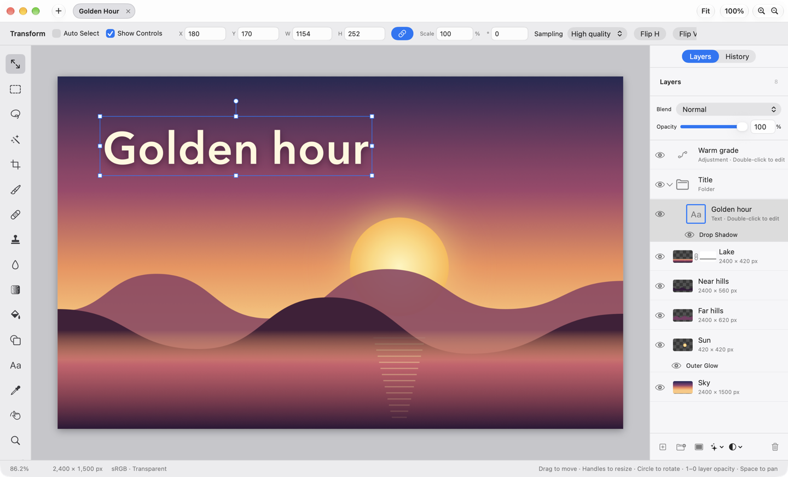
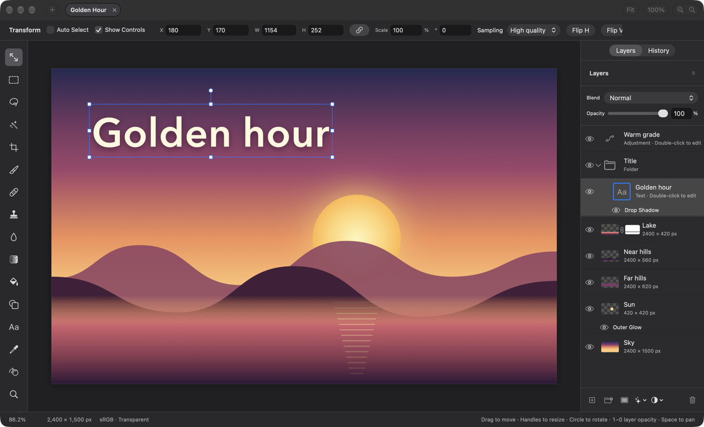
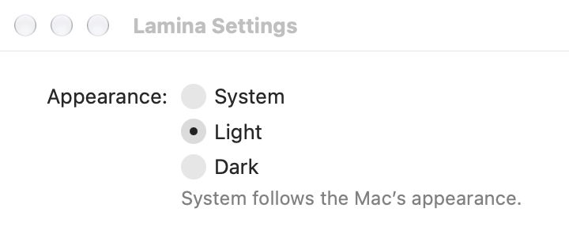
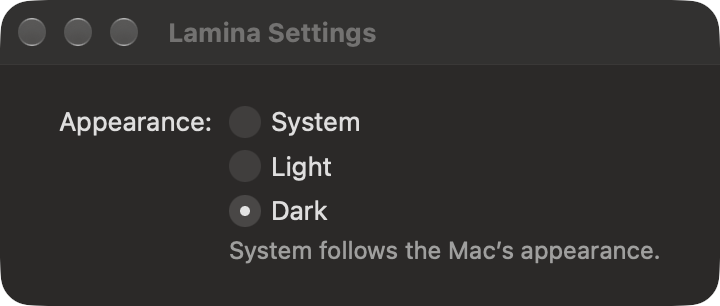
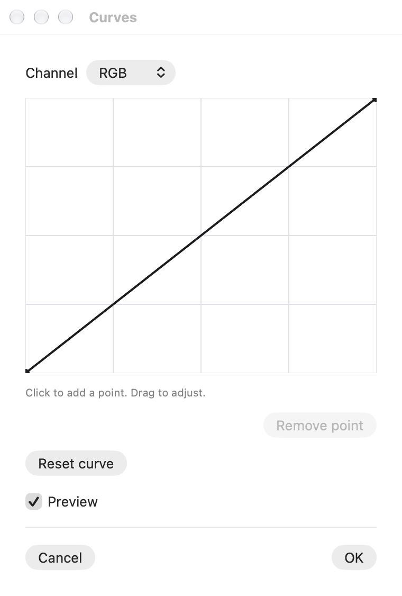
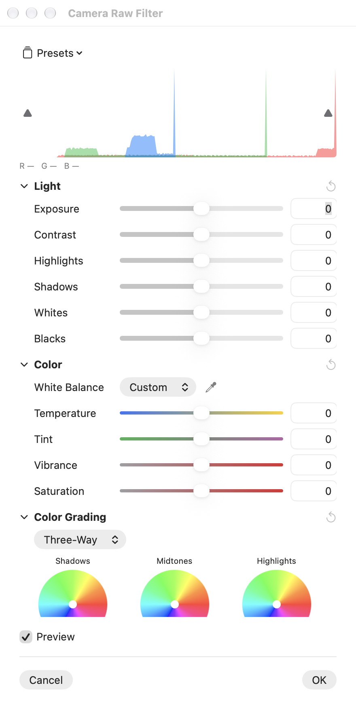

## Description

<!-- SECTION:DESCRIPTION:BEGIN -->
Lamina forces dark mode (`.preferredColorScheme(.dark)` in ContentView) and paints its chrome with literal grays such as `Color(white: 0.14)`. People who run macOS in light mode get a dark island, and every view picks its own shade, so nothing lines up once the redesign adds panels. docs/DESIGN.md defines the color roles (window, chrome, panel, field, control, separator, selection, pasteboard and text levels) with light and dark values (decision-9).
<!-- SECTION:DESCRIPTION:END -->

## Acceptance Criteria
<!-- AC:BEGIN -->
- [x] #1 The app follows the macOS appearance and switches live when it changes
- [x] #2 Lamina ▸ Settings… (⌘K) opens a Settings window whose Appearance setting (System, Light, Dark) overrides it, remembered across launches
- [x] #3 Every interface color comes from the roles in docs/DESIGN.md, defined once with light and dark values; no literal grays remain in interface code (document content and canvas overlays excepted)
- [x] #4 Floating panels, sheets, alerts and the Camera Raw panel follow the same appearance
- [x] #5 The pasteboard around the canvas uses its role, and canvas overlays (transform box, handles, selection outline, guides, grid) stay legible in both appearances
- [x] #6 Screenshots of the editor in both appearances are attached to the task
<!-- AC:END -->

## Definition of Done
<!-- DOD:BEGIN -->
- [x] #1 docs/DESIGN.md matches what shipped
<!-- DOD:END -->

## Implementation Plan

<!-- SECTION:PLAN:BEGIN -->
1. Add Sources/LaminaApp/UI/ColorRoles.swift: a ColorRole enum with DESIGN.md's light/dark values as dynamic NSColors (NSColor(name:dynamicProvider:)), bridged to SwiftUI Color, plus a resolver for CGColor/CIColor users (Metal frame).
2. Appearance setting: AppearanceSetting (System, Light, Dark) persisted in UserDefaults, applied app-wide through NSApp.appearance (nil for System) at launch and on change; drop the forced darkAqua and .preferredColorScheme(.dark).
3. Settings scene with an Appearance picker; replace the app-settings command group with Settings… on ⌘K, registered in ShortcutDefinition.all.
4. Replace literal grays in interface code with roles: editor background, tool rail selection, rulers, project tabs, export/raw previews, histogram and curve wells, swatch borders, layer list rows, mask badge, selection highlights. Canvas overlays and document content stay fixed.
5. Pasteboard (Core Graphics and Metal paths) takes the pasteboard role resolved for the canvas's effective appearance and redraws on appearance change.
6. Tests: roles resolve to the spec values in both appearances; the setting maps to the right NSAppearance and persists; ⌘K is registered.
7. Build, swift test, make dev, screenshots in light and dark with the demo project into backlog/assets/task-51/; update DESIGN.md (roles file, decisions).

8. Revised step 3: the Settings window is an AppKit window (SettingsWindow), not a SwiftUI scene (a Settings scene kept its own ⌘, item; a Window scene opened with the editor on file launch).
<!-- SECTION:PLAN:END -->

## Implementation Notes

<!-- SECTION:NOTES:BEGIN -->
Roles in Sources/LaminaApp/UI/ColorRoles.swift (ColorRole: .color, .nsColor, resolved(for:)); AppearanceSetting there too, applied through NSApp.appearance at launch (LaminaApplicationDelegate) and from the Settings window (UI/SettingsView.swift, SwiftUI Settings scene, CommandGroup(replacing: .appSettings) with SettingsLink on ⌘K registered in ShortcutDefinition.all as "Settings").
Decisions: every role uses DESIGN.md's table values (system equivalents don't keep the hierarchy on this macOS: windowBackgroundColor is pure white in light); accent is controlAccentColor. Until TASK-52/55/58 rebuild the frame, the editor stack sits on chrome and the side panels on panel. Canvas overlays, checkerboard, document shadow/edge, Levels' tone sliders, color wheels/fields and Camera Raw's colored tracks stay fixed (document content/overlays). Layer colors (CGColor) are re-resolved in viewDidChangeEffectiveAppearance; the canvas redraws there so the Metal pasteboard updates live. KeyboardShortcutTests used ⌘K as a free chord; it now uses ⌃⌘K and checks ⌘K is taken.

Settings window: a SwiftUI Settings scene kept its own Settings… ⌘, item beside the ⌘K replacement (checked through the menu's accessibility tree), and a Window scene opened along with the editor when the app was launched to open a file, so Settings is an AppKit window (SettingsWindow in UI/SettingsView.swift) opened by a Button in CommandGroup(replacing: .appSettings).

Verification (Dev build, demo project, captured by pid; system appearance is Dark):
- Launch with no saved setting (System): editor dark, matching the Mac.
- App menu reads About · Check for Updates… · Settings… (⌘K, the only Settings item) via System Events; pressing it opens Lamina Settings.
- Pressing Light in Settings (AXPress) switched the open editor to light live, Metal pasteboard included, and wrote appearance=light; relaunching kept Light. Dev defaults restored afterwards (key deleted).
- Curves floating panel and the docked Camera Raw panel drawn light, with field wells and text-colored curves.
- swift test: 685 tests in 101 suites passed (plus 22 and 47 in the other targets). New ColorRoleTests check every role against DESIGN.md's table in both appearances, the setting's mapping and fallback, ⌘K registration, and that the canvas redraws and paints the pasteboard role when its appearance changes.
- Not exercised by hand: flipping the Mac's own appearance (a system setting) and an alert on screen; both go through NSApp.appearance = nil and the same effective-appearance path.

Editor, light:

Editor, dark:

Settings:
 

Panels in light:
 

README/website: no update here; TASK-66 retakes every screenshot after the m-5 frame lands (the shipped screenshots stay dark, which the app still shows in dark mode).
<!-- SECTION:NOTES:END -->

## Final Summary

<!-- SECTION:FINAL_SUMMARY:BEGIN -->
Lamina follows the Mac's appearance (no more forced dark) with an override in Lamina ▸ Settings… (⌘K): System, Light, Dark, saved in UserDefaults and applied through NSApp.appearance. Interface colors come from ColorRole (Sources/LaminaApp/UI/ColorRoles.swift) with DESIGN.md's light and dark values: editor chrome, side panel, tool rail selection, rulers, tabs, wells, swatch borders, selection highlights, mask badge, dialog previews; the canvas pasteboard uses its role on both the Core Graphics and Metal paths and redraws on appearance change. Canvas overlays and document content stay fixed. Verified with ColorRoleTests (roles vs DESIGN.md table, setting, ⌘K, pasteboard redraw), the full swift test run, and Dev-build screenshots in both appearances including a live switch from Settings and a relaunch.
<!-- SECTION:FINAL_SUMMARY:END -->
