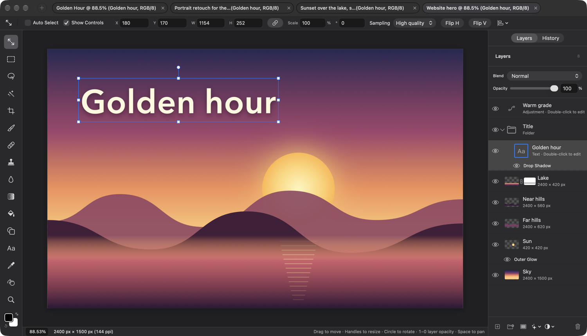
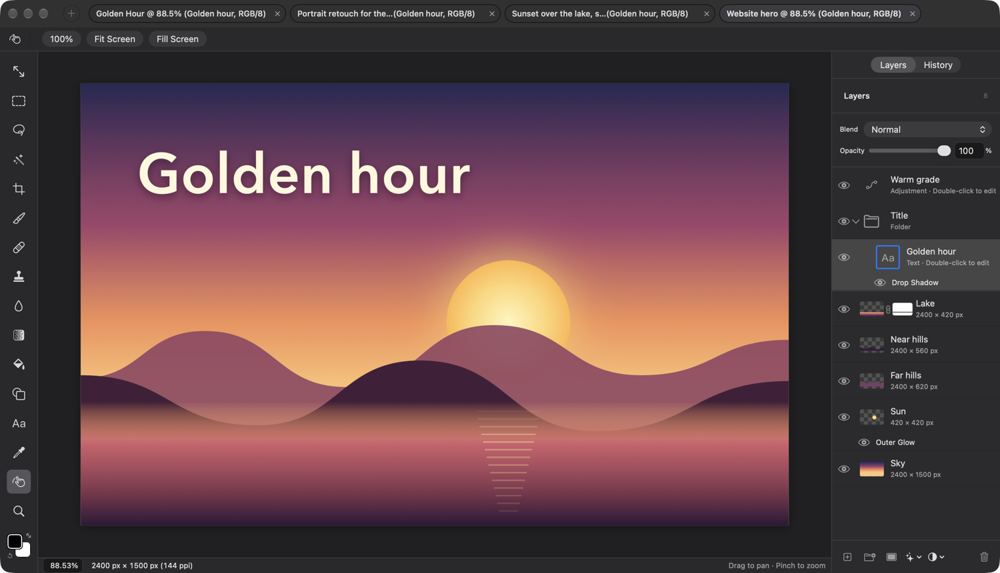
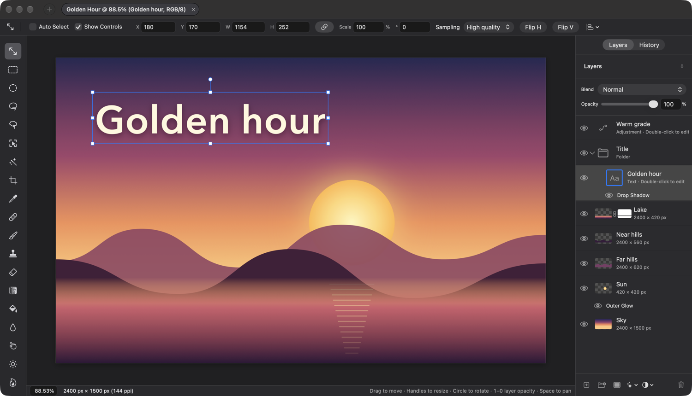

## Description

<!-- SECTION:DESCRIPTION:BEGIN -->
The window's frame is the first thing a switcher scans. Today a 42 pt tool header with the tool's name sits over the canvas, the title bar carries Fit, 100% and zoom buttons, and a 30 pt status bar spans the whole window. Familiar editors put a compact context bar above the canvas that starts with the tool's icon, keep zoom and document size in a status bar under the canvas, and name document tabs "Name @ zoom% (Layer, RGB/8)". The frame also has to leave room for the dock inside 1500 × 860 pt.
<!-- SECTION:DESCRIPTION:END -->

## Acceptance Criteria
<!-- AC:BEGIN -->
- [x] #1 The tool header becomes a 36 pt options bar that starts with the active tool's icon; tool names no longer appear as titles
- [x] #2 The title bar keeps New and the document tabs only; Fit, 100% and the zoom buttons move to View and to the Hand and Zoom tool bars
- [x] #3 Document tabs read "Name @ 44.5% (Layer name, RGB/8)" and truncate in the middle when crowded
- [x] #4 A 22 pt status bar under the canvas only (not under the panels) shows an editable zoom field and the document's size and resolution, with the tool hints at its right
- [x] #5 Metrics match docs/DESIGN.md, and in a 1500 × 860 pt window no control is clipped
- [x] #6 Accessibility identifiers that tests use (zoomStatus, canvasDimensions, fitCanvas, actualPixels) keep working, or the tests are updated
<!-- AC:END -->

## Definition of Done
<!-- DOD:BEGIN -->
- [x] #1 docs/DESIGN.md matches what shipped
<!-- DOD:END -->

## Implementation Plan

<!-- SECTION:PLAN:BEGIN -->
1. ToolHeaderStyle.height 42 -> 36. New UI/ToolIcon.swift: one view for a tool's icon (custom shapes, mode-following symbols), used by the tool rail and the options bar.
2. New UI/OptionsBar.swift: container drawing the active tool's icon in a leading slot, a 1 x 20 separator, then the tool's existing controls; fixed 36 pt so switching tools never moves the canvas. Drop the title Text from every *Controls header (title lines only), TransformInspector, the Eyedropper and no-tool headers, and the per-header Dividers in ContentView.toolHeaders.
3. Title bar: remove Fit, 100% and the zoom buttons; the tab strip takes the freed width (window width read on the editor stack, not the status bar). Hand and Zoom bars get 100% (actualPixels), Fit Screen (fitCanvas) and Fill Screen (new CanvasViewport.fill / EditorSession.fillScreen). The zoom field moves to a reusable ZoomField (UI/ZoomField.swift).
4. Tabs: label 'Name @ 44.5% (Layer, RGB/8)' from a pure projectTabLabel function; crowded tabs narrow (widest first, to a minimum) before overflowing, and truncate in the middle.
5. Status bar: 22 pt, moved into the canvas column (side panels and rail run full height), ZoomField (zoomStatus), '2400 px x 1500 px (72 ppi)' (canvasDimensions), hints right-aligned and truncating; hint expression left in place.
6. Tests for projectTabLabel, the width fitting and CanvasViewport.fill; swift build, swift test; screenshot at 1500 x 860; update DESIGN.md.
<!-- SECTION:PLAN:END -->

## Implementation Notes

<!-- SECTION:NOTES:BEGIN -->
Implemented (commit 54ece81):
- OptionsBar (UI/OptionsBar.swift): 16 pt tool icon in a 44 pt slot, a 1 x 20 separator, then the tool's existing controls; fixed at ToolHeaderStyle.height = 36. ToolIcon (UI/ToolIcon.swift) is the one tool -> icon mapping, used by the rail and the bar (No tool shows cursorarrow.slash). Title Texts removed from every *Controls file, TransformInspector ('Transform'/'Transform Mask': which part is targeted still shows in the Layers panel), the Eyedropper and no-tool headers; ToolHeaderStyle.titleFont removed.
- Title bar: New and tabs only. ProjectTabStrip.titleBarInset = 250: wider and macOS slides the strip left over New (measured at 150 and 200). A trailing flexible ToolbarSpacer is kept.
- Hand and Zoom bars: 100% (actualPixels), Fit Screen (fitCanvas), Fill Screen (fillScreen, new CanvasViewport.fill / EditorSession.fillScreen). Zoom In/Out and Scrubby Zoom left to TASK-57. The zoom field moved from the Zoom bar to the status bar (ZoomField, UI/StatusBar.swift, id zoomStatus), per the spec's Zoom bar.
- Tabs: projectTabLabel (ProjectTabLayout.swift) -> 'Name @ 44.5% (Layer, RGB/8)' for every tab (each tab keeps its own session, so zoom and active layer are cheap and correct). projectTabFittedWidths narrows the widest tabs to a common width, down to 140 pt, before projectTabOverflow hides any; labels truncate in the middle; help tag shows the full label.
- Status bar: 22 pt, inside the canvas column (rail and side panels run to the window's foot); zoom field, document.sizeDescription '2400 px × 1500 px (72 ppi)' (canvasDimensions), hints right-aligned, one line, cut at the end; 'sRGB · Transparent' dropped (the tab now shows RGB/8). The hint expression is untouched. The window width for the tab strip is now read on editorStack.
- Rail spacing 10 -> 8 and top padding 16 -> 12 so every tool and the colors fit at 1500 x 860 without scrolling (they scrolled before); TASK-55 replaces the rail.
- No tests referenced zoomStatus, canvasDimensions, fitCanvas, actualPixels or newCanvasToolbar; all ids kept.
Verification: swift build; swift test (688 app tests, 47 and 22 in the other targets) all pass, including new tabLabelsReadNameZoomLayerAndMode, crowdedTabsNarrowTheWidestFirstBeforeOverflowing and fillScreenCoversTheView. Visual check of the Dev build at 1500 x 860 with four documents open: Move and Hand tools (selected through AX presses), canvas at the same position for both, Fill Screen and Fit Screen pressed, nothing clipped, canvas area about 1190 x 760 pt.

Rebased onto main with TASK-54 (357b736, 1e37f3e). One ToolIcon: TASK-54's (tool model from NavigationTool) plus the size parameter, used by the rail (18 pt) and OptionsBar (16 pt); OptionsBar's help/label now use tool.label (No Tool (A) from the model). Title lines that TASK-54 had changed to Text(session.tool.title) are removed in Brush, Lasso and Shape controls; the Liquify bar (in BrushControls) shows inside OptionsBar. The status bar shows session.tool.hint. My rail spacing tweak is dropped in favor of TASK-54's rail (25 tools, scrolls at 1500 x 860 until TASK-55). DESIGN.md merged. swift build and full swift test pass (701 app tests, 47, 22). Re-checked at 1500 x 860: bars and canvas in place, nothing clipped except the scrolling rail.

<!-- SECTION:NOTES:END -->

## Final Summary

<!-- SECTION:FINAL_SUMMARY:BEGIN -->
Rebuilt the window frame: a 36 pt options bar that starts with the active tool's icon (OptionsBar, with ToolIcon shared by the tool rail) and no tool-name titles; a title bar with only New and the document tabs, which read 'Name @ 44.5% (Layer, RGB/8)', narrow when crowded and truncate in the middle; Fit, 100% and zoom moved to View (unchanged) and to the Hand and Zoom bars as 100%, Fit Screen and new Fill Screen; and a 22 pt status bar under the canvas only with an editable zoom field (ZoomField), the size and resolution, and right-aligned hints. DESIGN.md records the shipped details. Verified with swift build, the full swift test (all pass, three new tests) and a 1500 x 860 Dev-build check with four documents across the Move and Hand tools (screenshots in the notes).
<!-- SECTION:FINAL_SUMMARY:END -->
