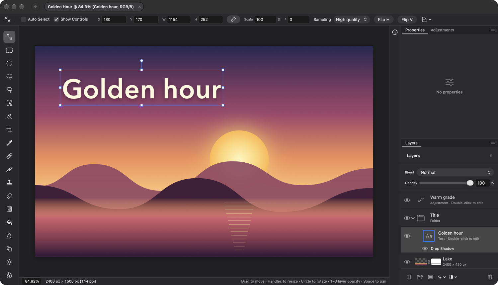
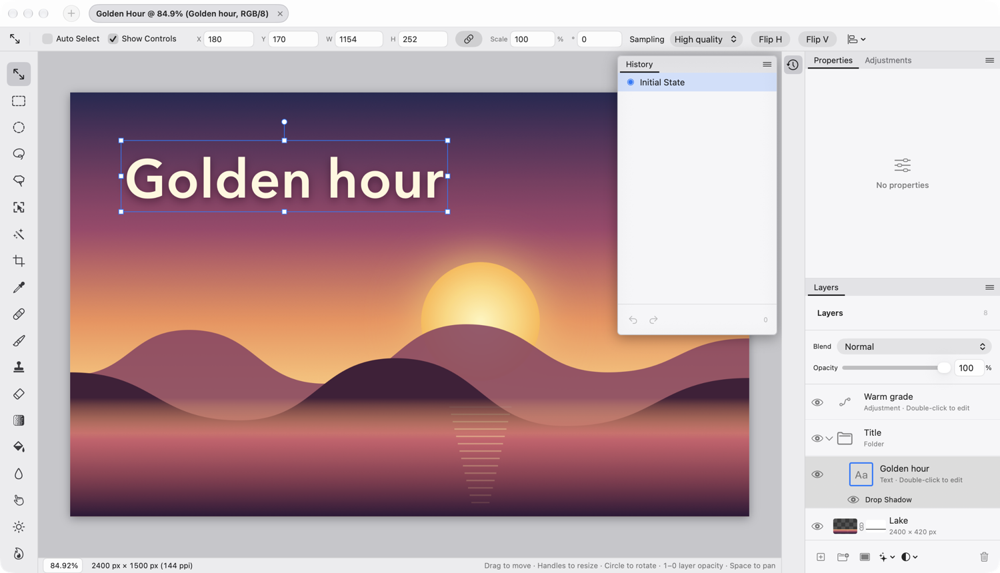
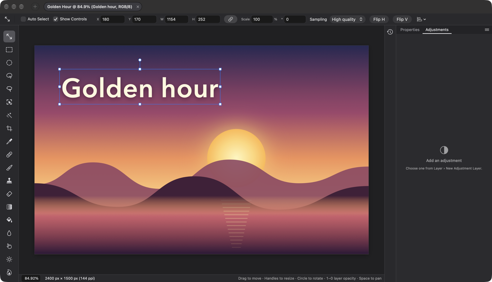
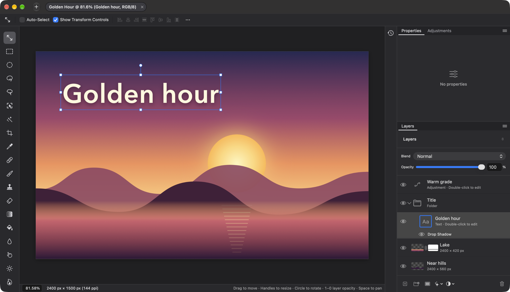

## Description

<!-- SECTION:DESCRIPTION:BEGIN -->
Today one 252 pt side panel switches between Layers and History. Familiar editors dock tab groups at the right (Properties and Adjustments above Layers) with less-used panels such as History collapsed to icons beside them. The dock is the frame the Properties, Adjustments and Layers panel tasks build in.
<!-- SECTION:DESCRIPTION:END -->

## Acceptance Criteria
<!-- AC:BEGIN -->
- [x] #1 The right side holds a column of panel icons (History) and a dock of two tab groups, Properties | Adjustments above Layers, sized as in docs/DESIGN.md
- [x] #2 The dock can be resized within its range and the split between groups dragged, and both are remembered
- [x] #3 Clicking the History icon opens the History panel beside the dock and clicking it again closes it; History keeps today's behavior
- [x] #4 Window lists Adjustments, History, Layers and Properties to show or hide them, and Window ▸ Workspace ▸ Reset Essentials restores the layout
- [x] #5 In a 1500 × 860 pt window the canvas keeps at least 1100 × 740 pt
<!-- AC:END -->

## Definition of Done
<!-- DOD:BEGIN -->
- [x] #1 docs/DESIGN.md matches what shipped
<!-- DOD:END -->

## Implementation Plan

<!-- SECTION:PLAN:BEGIN -->
1. DockLayout (UI/DockLayout.swift): an @Observable model shared by the window and the Window menu, persisted in UserDefaults: dock width (292, 240...360), top group height (340, clamped so Layers keeps room), closed panels, the top group's front tab, History open (not persisted). show/close/toggle with Photoshop's Window-menu semantics (checked = visible on screen), Reset Essentials.
2. Dock views (UI/Dock.swift): DockGroup (26 pt tab row on panelHeader, underline on the active tab, ≡ menu with Close and Close Tab Group) taking tabs and a content builder; Dock composing Properties | Adjustments over Layers with a draggable split; PanelIconColumn (34 pt, History icon); DockResizeEdge for the dock's left edge and the split; History opens as a floating panel at the canvas column's top right, beside the icon column; clicking the icon again closes it.
3. Empty Properties and Adjustments panels (UI/PropertiesPanel.swift, UI/AdjustmentsPanel.swift) as slots for TASK-59/60; Layers moves in unchanged; HistoryPanel loses the shared SidePanels switcher and its own header.
4. ContentView: replace PanelResizeEdge + SidePanels with the icon column and dock; Layers comes back when renaming or editing an adjustment.
5. Window menu (DockCommands): Workspace ▸ Essentials (Default) │ Reset Essentials │ Adjustments · History · Layers · Properties, assignable shortcuts registered in KeyboardShortcuts.
6. DockLayoutTests (defaults, clamping, visibility semantics, reset, persistence, 1500 × 860 canvas budget); swift build, swift test; make dev and capture 1500 × 860 screenshots (dock, History open); update DESIGN.md.
<!-- SECTION:PLAN:END -->

## Implementation Notes

<!-- SECTION:NOTES:BEGIN -->
Implemented (193e28d, c5f5438):
- DockLayout (UI/DockLayout.swift): @Observable, DockLayout.shared used by ContentView and the Window menu; width 292 (240...360), top group height 340 (min 120, Layers min 160, clamped at layout time by DockLayout.topHeight(_:in:)), closed panels and the top group's front tab in UserDefaults (dockWidth, dockTopHeight, dockClosedPanels, dockTopTab). History's open state is not remembered: it floats over the canvas, so it starts closed. Old keys layersPanelWidth and sidePanel are no longer read.
- Dock views (UI/Dock.swift): DockArea (icon column + resize edge + dock; reopens Layers for renaming or adjustment editing, since LayersPanel starts adjustment editing), Dock (Properties | Adjustments over Layers, split edge), DockGroup<Content>(tabs:selection:layout:content:) with a 26 pt tab row (panelHeader, 12 pt tabs, active in text with a 2 pt underline, ≡ menu: Close, Close Tab Group), PanelIconColumn (34 pt, History button 28 pt, 16 pt icon), HistoryFlyout (modifier on the canvas column), DockResizeEdge(axis:value:range:) replacing ContentView's PanelResizeEdge.
- Decision: History opens as an in-window floating panel at the canvas column's top right, against the icon column (as the mockup draws it), not an NSPopover: a transient popover closes on the click that should toggle it, and it stays open while undoing or painting. Closes from its icon, its panel menu or Window > History.
- Decision: Window menu checks follow familiar editors: checked = on screen (open and frontmost in its group); choosing a checked panel closes it, any other opens it and brings it forward. Items listed alphabetically after Bring All to Front (DockCommands, CommandGroup(after: .windowArrangement)); all assignable in Keyboard Shortcuts, no default keys (F7 for Layers not added: not in DESIGN.md's shortcut table).
- PropertiesPanel and AdjustmentsPanel are empty-state slots (No properties / Add an adjustment, pointing to Layer > New Adjustment Layer) for TASK-59/60. Layers moved in unchanged (its own title row too) for TASK-61. HistoryPanel lost the shared SidePanels switcher and its header (the tab names it); the step count moved to its footer. LayersPanel.widths removed (DockLayout.widths).

Verification: swift build clean; DockLayoutTests (9 tests: defaults, width clamp, split clamp, Window-menu semantics, collapse, History toggle, Reset Essentials, persistence, shortcut registration); full swift test passes (710 app tests in 104 suites, 47, 22). Dev build at 1500 x 860 driven through Accessibility and lamina --pid: History icon opens the panel and closes it again; two adjustment layers + undo listed as states, clicking Initial State jumped there (describe-document: undo null, redo 'New Invert Adjustment'); Window menu checks read History/Layers/Properties checked, Adjustments not; Window > Adjustments brought it forward and Window > Layers collapsed the bottom group (top group took the height); Reset Essentials restored 292/340, all panels, Properties in front. Persistence: relaunched with dockWidth 340, dockTopHeight 260, dockTopTab adjustments: dock measured 340 pt, split 260 pt, Adjustments checked. Canvas at 1500 x 860 with the default dock: about 1115 x 761 pt (AX positions and screenshot). Window menu order: Minimize ... Bring All to Front, Arrange in Front, Remove Window from Set │ Workspace │ Adjustments, History, Layers, Properties.
Not verified automatically: dragging the dock edge and the split. Synthetic drags posted to the background Dev app (CGEvent postToPid) were not delivered, and driving the real pointer would take over the Mac; the gesture is the shipped PanelResizeEdge's, generalized to both axes. Needs a manual drag check.
Dev-app defaults restored (window frame, appearance, dock keys).

README, website and screenshots: none changed here; TASK-66 updates them for the whole familiar workspace once the dock's panels are filled.

Rebased onto main with TASK-63 and TASK-56 (one conflict in LaminaMain.swift around the app-visibility group: DockCommands kept before TASK-56's new ⌘H comment). swift build clean; full swift test passes (719 app tests in 105 suites, 47, 22).
AC #2 verified with real input (approved focus-taking check): the Dev build at 1500 x 860 brought to the front, real CGEvent mouse down / drags / up through the HID tap (pointer put back afterwards). The dock's left edge dragged 40 pt left: dock 292 -> 332 pt (tabs moved from x 1218 to 1178, dockWidth 332). The split dragged 60 pt up: Layers' tab row from y 458 to 398 (dockTopHeight 280). Killed and relaunched: tabs at the same positions, so both were remembered. Dev-app defaults restored (window frame; dock keys removed).
Fix found on the way (commit 'fix: the dock's resize edges…'): the first split drag, grabbed 1 pt below the line, went to the Layers tab row, which sits above the edge's overhanging grab area; DockResizeEdge now has zIndex(1), and the final check grabbed the split 1.5 pt below the line successfully. DESIGN.md notes the 8 pt grab band.

<!-- SECTION:NOTES:END -->

## Final Summary

<!-- SECTION:FINAL_SUMMARY:BEGIN -->
Replaced the shared Layers | History side panel with the familiar right side: a 34 pt panel icon column (History) and a 292 pt dock (240–360, resizable from its left edge) holding Properties | Adjustments (340 pt) over Layers, split draggable, all remembered in UserDefaults (DockLayout). Tab groups (DockGroup) have a 26 pt tab row with an underlined front tab and a ≡ menu (Close, Close Tab Group); closed groups collapse and an empty dock gives its width to the canvas. History opens as a floating panel beside the icon column and closes from its icon, keeping today's states, undo and redo. Window lists Adjustments, History, Layers and Properties with check marks, plus Workspace ▸ Essentials (Default) and Reset Essentials. Properties and Adjustments show neutral empty states as slots for TASK-59/60. Verified with DockLayoutTests, the full swift test (all pass after rebasing onto TASK-63 and TASK-56), the Dev build at 1500 × 860 through Accessibility (History toggle and state jump, Window menu checks, collapse, Reset Essentials, canvas about 1115 × 761 pt) and real mouse drags of the dock edge (292 → 332 pt) and the split (340 → 280 pt), both remembered across a relaunch.
<!-- SECTION:FINAL_SUMMARY:END -->
