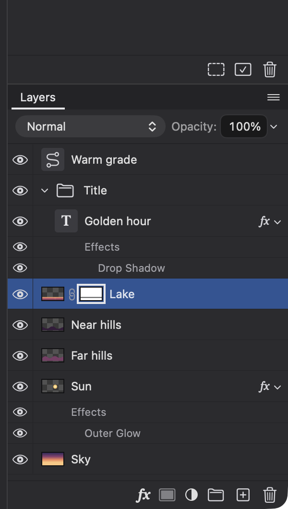
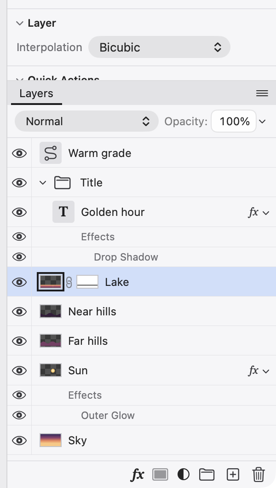

## Description

<!-- SECTION:DESCRIPTION:BEGIN -->
The Layers panel uses two-line rows, a labeled Blend row with a slider, "Folder" for groups and its own footer order. Switchers look for a blend menu and an Opacity field on top, one-line rows with layer and mask thumbnails, an Effects row under styled layers, and the footer in the usual order.
<!-- SECTION:DESCRIPTION:END -->

## Acceptance Criteria
<!-- AC:BEGIN -->
- [x] #1 The top row holds the blend mode menu and the Opacity field
- [x] #2 Rows are one line: eye, thumbnail, link, mask thumbnail, name and an fx badge; clicking the layer or the mask thumbnail chooses which one edits target
- [x] #3 Styled layers list an Effects row and one row per effect, each with its own eye
- [x] #4 Groups are called groups everywhere in the interface (was "folder")
- [x] #5 The footer reads, left to right: Add a layer style (a menu with Blending Options… and each effect in docs/DESIGN.md's order), Add layer mask, New fill or adjustment layer, New group, New layer, Delete
- [x] #6 Drag and drop, renaming, clipping and multi-selection tests still pass
<!-- AC:END -->

## Definition of Done
<!-- DOD:BEGIN -->
- [x] #1 docs/DESIGN.md matches what shipped
<!-- DOD:END -->

## Implementation Plan

<!-- SECTION:PLAN:BEGIN -->
1. LayersPanel: drop the panel's own title row (the dock tab names it); top row = blend mode pop-up (wide) + "Opacity:" label (scrubbable) + percent field with a chevron that pops up a slider (LayerAppearanceControls).
2. Footer, right-aligned as in the mockup: Add a layer style (fx menu: Blending Options… │ effects in layerStyleOrder), Add layer mask, New fill or adjustment layer (menu in DESIGN's adjustment order with separators, brings Properties forward), New group (addGroup), New layer, Delete; 15 pt icons, help tags, accessibility labels.
3. NativeLayerList rows: one-line 32 pt rows; eye column 26 pt with a separator; indent by depth; groups show a disclosure triangle and folder icon; layers a canvas-shaped thumbnail, adjustment layers their Adjustments-panel symbol on a control plate, type layers a serif T; link glyph and mask thumbnail; name (12 pt); fx badge with a triangle for styled layers. Targeted thumbnail outlined 2 pt in the text role (mockup), mask shown alone in the accent. Row selection drawn with ColorRole.selection (custom NSTableRowView, top line only).
4. Styled layers: an "Effects" sub-row (eye toggles all effects as one undo step; double-click opens Layer Style) and one 22 pt row per effect in layerStyleOrder, each with its eye; the fx badge's triangle collapses them (session.collapsedEffectLayerIDs).
5. "Folder" → "group" in interface strings outside the menu bar (panel, context menu, help tags, accessibility, default group names, undo names, alerts, PSD notes, automation errors and catalog descriptions). Menu bar items and their saved-shortcut titles stay for TASK-62.
6. Tests: mask/layer targeting by thumbnail, effect-row and Effects-row eyes, fx collapse, row heights; run drag/drop, rename, clipping, multi-selection suites; full swift test.
7. DESIGN.md Layers section updated; light/dark screenshots in backlog/assets/task-61/.
<!-- SECTION:PLAN:END -->

## Implementation Notes

<!-- SECTION:NOTES:BEGIN -->
Implemented (commits 28e3c75, 3c0c94f):
- Top row: blend pop-up (flexes to the row's width) + "Opacity:" (scrubbable) + percent field with a chevron that pops up a slider. The panel's own title row and layer count are gone (the dock tab names it).
- Rows: one line, 32 pt; 26 pt eye column with a separator; 14 pt per group level (+14 clipped); group triangle + folder, or 24 pt canvas-shaped thumbnail; adjustment layers show their Adjustments-panel symbol and type layers a serif T on a control plate; link + mask thumbnail; name 12 pt; fx badge with triangle. Selection drawn by LayerRowView in ColorRole.selection (top line only, text not emphasized). The second line (size, "Clipped to…") moved to help tags (thumbnail shows the size; the name the clipping source).
- Effects: "Effects" row (eye toggles all effects, one step: EditorSession.toggleAllEffects; double-click opens Layer Style on Blending Options) and one 22 pt row per effect in layerStyleOrder with its eye; fx triangle folds them (EditorSession.collapsedEffectLayerIDs, view state, not saved).
- Footer (PropertiesFooter, right-aligned as in the mockup): fx menu, Add layer mask, New fill or adjustment layer (DESIGN's order with separators; brings Properties forward), New group, New layer, Delete.
Decisions:
- Target outline: 2 pt in the text role, 1 pt off the picture (the mockup's --text; reads white in dark, near-black in light, where white would vanish on the light selection). A mask shown alone keeps a distinct outline, now the accent (was text vs accent). Outline only on pictures and layers with a mask (not a bare group/adjustment/type plate), as the mockup.
- New group creates an empty group (addGroup), as its name and Photoshop's button say; Group Layers ⌘G still groups the selection.
- "fx" in the footer is drawn as italic serif text: the SF Symbol fx renders as capitals "FX".
- Clipping strip shrank from 10 to 8 pt to fit 32 pt rows.
- Folder → group: panel strings, row menu (Move Out of Group), default names (Group N), undo name New Group, brush alerts, PSD import note, automation error and catalog descriptions, Keyboard Shortcuts help text. Left for TASK-62: the menu bar's "Move Out of Folder" item (LaminaMain.swift) and its saved-shortcut title in KeyboardShortcuts.swift. README/web wording and demo-project's comment left for TASK-66.
Verification: swift build; swift test (762 + 47 + 22 tests pass), incl. new LayersPanelTests (thumbnail targeting, effect and Effects eyes, fx fold, group naming, adjustment menu order) and LayerTests (drag/drop, rename, clipping, multi-selection, context menus), CursorTests, GroupingSelectionTests. Visual check of Lamina Dev with the demo project in dark (mask targeted) and light (layer targeted): backlog/assets/task-61/layers-dark.png, layers-light.png. Dev appearance default restored.

Screenshots:

<!-- SECTION:NOTES:END -->

## Final Summary

<!-- SECTION:FINAL_SUMMARY:BEGIN -->
Rebuilt the Layers panel in the familiar anatomy (decision-9, docs/DESIGN.md ▸ Layers): blend mode pop-up and Opacity field with a slider pop-up on top, no title row; one-line 32 pt rows with eye column, group triangle and folder or layer thumbnail (adjustment symbol / serif T plates), link, mask thumbnail, name and fx badge; clicking either thumbnail picks the edit target (outlined in the text role); styled layers list an Effects row and one row per effect, each with an eye, folded by the fx badge; footer reads Add a layer style, Add layer mask, New fill or adjustment layer, New group, New layer, Delete; "folder" became "group" in names, alerts and help outside the menu bar (TASK-62 owns that). Verified with swift test (all pass, new LayersPanelTests) and light/dark captures of Lamina Dev.
<!-- SECTION:FINAL_SUMMARY:END -->
