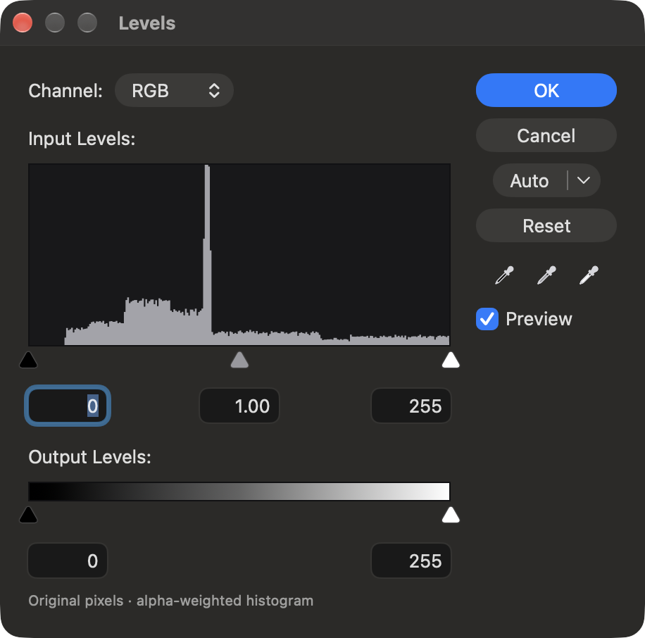
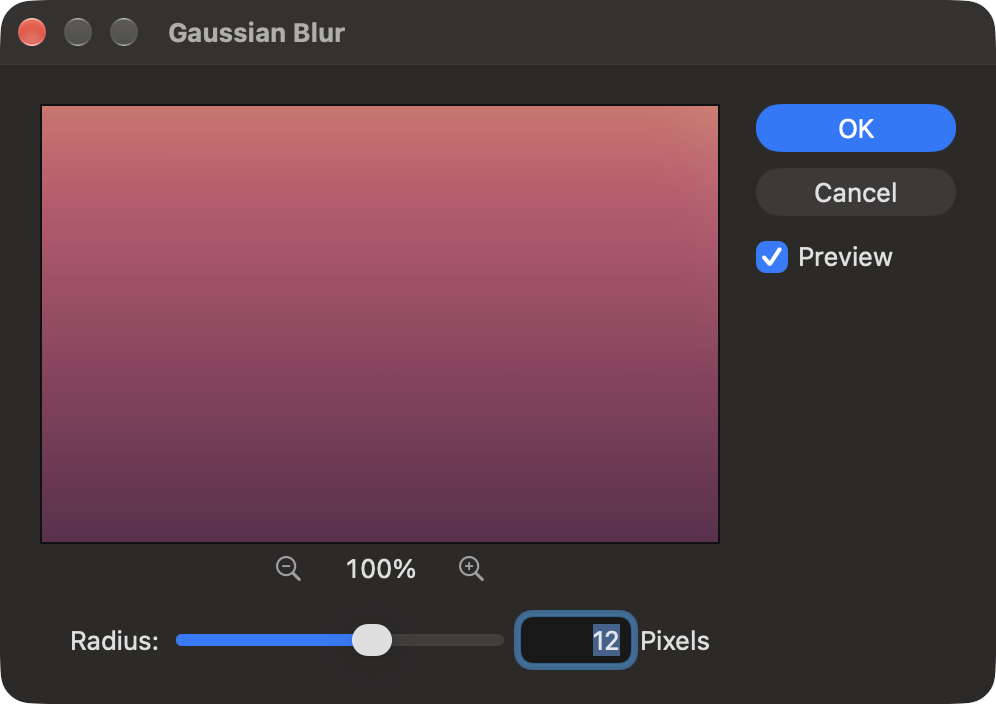
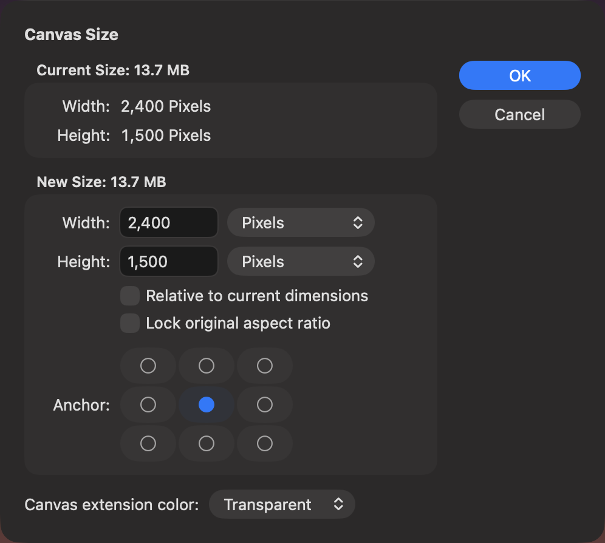
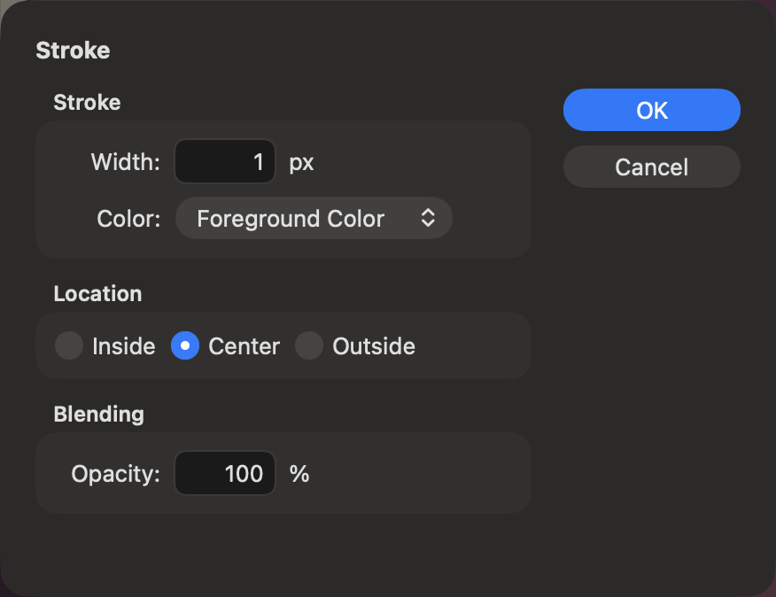
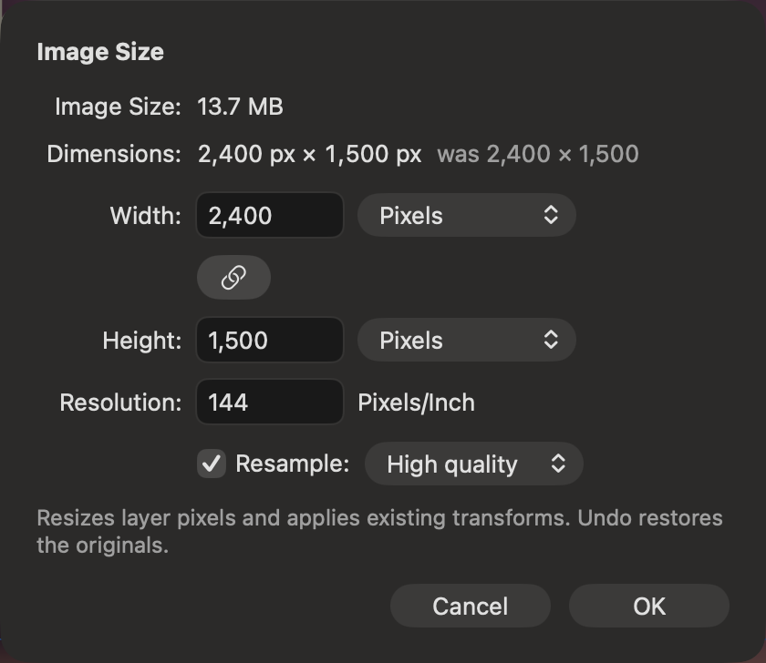

## Description

<!-- SECTION:DESCRIPTION:BEGIN -->
Lamina's dialogs are floating panels with their own layouts and OK and Cancel at the bottom. Switchers expect settings on the left and OK, Cancel, extra buttons and Preview stacked on the right, and filters in one pattern: a preview with zoom, then the settings.
<!-- SECTION:DESCRIPTION:END -->

## Acceptance Criteria
<!-- AC:BEGIN -->
- [x] #1 Adjustment, filter, selection, Stroke, Fill, Trim, Canvas Size, Load Selection and Color Range dialogs put OK, Cancel, extra buttons and the Preview checkbox in a right-hand column, as docs/DESIGN.md shows
- [x] #2 Image Size, New Document and Export As keep Cancel and the default button at the bottom right
- [x] #3 Every filter dialog uses the same frame: a preview with zoom out, percentage and zoom in, then the settings
- [x] #4 Labels, units and field order follow docs/DESIGN.md, with Lamina-only settings after the familiar ones
- [x] #5 Return, Escape and the live canvas preview behave as today, and the existing dialog tests pass
<!-- AC:END -->

## Definition of Done
<!-- DOD:BEGIN -->
- [x] #1 docs/DESIGN.md matches what shipped
<!-- DOD:END -->

## Implementation Plan

<!-- SECTION:PLAN:BEGIN -->
1. Shared layout in UI/DialogLayout.swift: DialogLayout (settings left, 100 pt button column right: OK default/Return, Cancel/Escape, extra buttons, Preview checkbox, status line) with a .bottom placement (Cancel then default button at the bottom right) for Image Size; DialogLabel/dialog rows with colon labels; reusable by TASK-62 (Fill, Load Selection).
2. FilterPreview (UI/FilterPreview.swift): crop of the filter edit's own preview image (the filtered layer the canvas shows), zoom out / percentage / zoom in, drag to pan, hold to see the original; keep rendering the dialog preview while the canvas Preview is off (canvas gate previewImage(for:) unchanged).
3. FilterSheet: filters (not Image adjustments, not Camera Raw) get the preview frame then the settings; every non-Camera Raw kind uses DialogLayout; Curves gets Output:/Input: fields; Camera Raw keeps its docked layout with Cancel and OK at the bottom right and an edge border on its histogram well.
4. Levels, Hue/Saturation, Color Range, Expand/Contract/Feather, Stroke, Trim, Canvas Size in DialogLayout with mockup labels, groups and button columns; Image Size in the bottom variant. Lamina-only settings after familiar ones.
5. DESIGN.md Dialogs section with component names and sizes; tests (swift build, targeted suites, full swift test); screenshots of Levels, a filter, Canvas Size, Stroke into backlog/assets/task-63.
<!-- SECTION:PLAN:END -->

## Implementation Notes

<!-- SECTION:NOTES:BEGIN -->
Shared layout: DialogLayout in Sources/LaminaApp/UI/DialogLayout.swift (settings, confirm, cancel, optional extras, preview binding, status line, title heading for sheets, defaultTitle, placement .column or .bottom), with DialogButton (column-wide), DialogRow (right-aligned 'Label:' row) and DialogGroup (titled group box). TASK-62 can build Fill and Load Selection on it; TASK-65 on its .bottom placement.

Filter preview: FilterPreview (UI/FilterPreview.swift) crops the FilterEdit's own preview image (what the canvas shows) to a 340 x 220 frame at the chosen zoom (6.25% to 1600% of layer pixels, starting at 100%, centered on the selection or the layer); drag pans, mouse down shows the layer before the filter. No extra render: it reuses the canvas preview, which is at most 2048 px on its longest side, so 100% is enlarged from it on bigger layers. Filters.swift keeps rendering that preview when Preview is off for filters (FilterKind.showsDialogPreview); the canvas still gates on previewImage(for:), so its behavior is unchanged.

Decisions: Image adjustments (Image menu) and adjustment layers being edited have no preview frame (Photoshop's adjustments have none; an adjustment layer's change shows only in the composite). Filter units follow the mockup and Photoshop ('Pixels', 'levels'), selection dialogs say 'pixels'. Expand/Contract/Feather, Stroke width and opacity are fields without sliders, as in the mockup (labels and units still scrub). Levels' Auto is a split button: click runs Contrast, its menu offers Color and Color + neutral midtones; its three eyedroppers moved to the column. Curves' Reset curve moved to the column as Reset; Output:/Input: fields edit the selected point. Image Size's button is OK (was Resize); Lock aspect ratio became a link toggle. Canvas Size's units menu sits beside Width and Height and changes both. ⌥P toggles Preview in every dialog that has one (was Levels only). Color Picker, Grid, PSD conversion and the raw develop sheet are outside AC 1 and keep their layouts.

Verified: swift build; swift test (686 tests, all pass; new FilterTests.dialogPreviewKeepsRenderingWithTheCanvasPreviewOff). Visual check in build/Lamina Dev.app with the demo project (dark appearance): Canvas Size, Stroke and Image Size sheets captured in the background; Levels and Gaussian Blur panels captured by bringing the Dev app forward for a moment (floating panels hide while the app is inactive), Escape closed Levels. Not run: make test-ui (orchestrator runs it).

AC notes: #1 Fill and Load Selection don't exist yet; TASK-62 adds them on DialogLayout (DESIGN.md says so). #2 Image Size moved to the bottom-right row (OK, was Resize); New Document and Export As already end with their default button at the bottom right and were left to TASK-65. #5 Escape was checked live on Levels; Return is the same configuredNativeShortcut(.return) on OK as before; the full unit suite passes (FloatingPanelTests carry .showsWindows and run under make test-ui).
<!-- SECTION:NOTES:END -->

## Final Summary

<!-- SECTION:FINAL_SUMMARY:BEGIN -->
Dialogs now share DialogLayout (UI/DialogLayout.swift): settings on the left and OK, Cancel, extra buttons and Preview in a 100 pt right column, or Cancel and OK at the bottom right (Image Size). Levels, Curves, Hue/Saturation, every filter and image adjustment, Color Range, Expand/Contract/Feather, Stroke, Trim and Canvas Size use it with the mockup's labels, groups and button columns; Lamina-only settings follow the familiar ones. Filter dialogs get FilterPreview, a zoomable, pannable crop of the canvas's own filter preview (no extra rendering; it keeps rendering with Preview off). Camera Raw keeps its docked panel with Cancel and OK at the bottom right and an edge-bordered histogram. DESIGN.md's Dialogs section records the API, sizes and each column. Verified with swift build, swift test (686 pass, one new test) and Dev app screenshots of Levels, Gaussian Blur, Canvas Size, Stroke and Image Size.
<!-- SECTION:FINAL_SUMMARY:END -->
