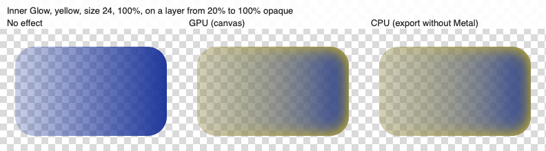
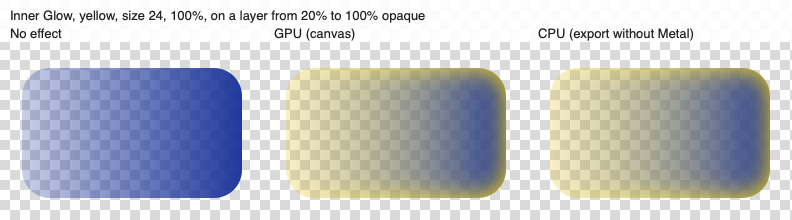
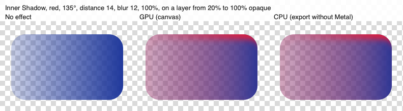
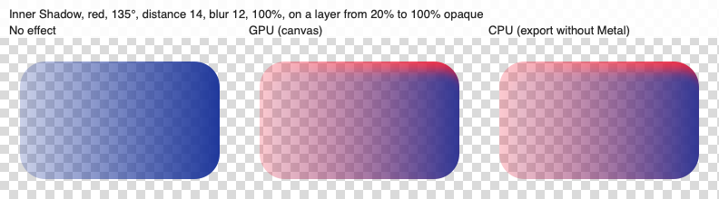

## Description

<!-- SECTION:DESCRIPTION:BEGIN -->
Inner Glow and Inner Shadow are filled over the already-composited pixels and their coverage is multiplied by the layer's shape, so on translucent pixels they only partly recolor, the same flaw TASK-9 fixed for Color Overlay. Upstream fixed both in 9cb57db (CPU in Document/LayerEffects.swift, the brush-stroke surface in Rendering/LayerEffectsSurface.swift, the Metal kernel in Rendering/MetalLayerEffects.swift); Lamina's code still matches upstream's code before that commit, and TASK-9's source-atop and mix() are already there. Upstream added no tests. Port with Co-authored-by: Robbie <1269226+robbietilton@users.noreply.github.com>.
<!-- SECTION:DESCRIPTION:END -->

## Acceptance Criteria
<!-- AC:BEGIN -->
- [x] #1 Inner Glow and Inner Shadow recolor a translucent pixel fully, keeping its alpha, on the GPU canvas, the brush-stroke surface and CPU rendering (export, merge)
- [x] #2 Opaque pixels render as before, and InnerGlowTests' CPU and Metal parity test still passes
- [x] #3 New tests cover translucent pixels for both effects on both paths (gpu: true and false), modeled on ColorOverlayTests
<!-- AC:END -->

## Implementation Plan

<!-- SECTION:PLAN:BEGIN -->
1. Port upstream 9cb57db (paths remapped to Sources/LaminaApp): the CPU renderer recolors the layer's own (masked) pixels source-atop by a color overlay, then the inner glow and the inner shadow, before drawing them over the effects beneath; their coverages drop the multiply by the layer's shape (the alpha is kept by the recolor instead). The brush-stroke surface's CPU fallback recolors its window the same way for the inner glow. The Metal effects_inside kernel returns 1 - moved, and effects_compose mixes the inner glow and inner shadow into the layer's pixels, as it already did for the color overlay, before compositing them.
2. Tests modeled on ColorOverlayTests for both effects on both paths (render's gpu: true and false): translucent pixels keep their alpha and take the color fully, effects beneath stay untinted, opaque pixels as before, GPU/CPU agreement on the translucent masked gradient, and the brush-stroke surface (Metal). Point InnerGlowTests' parity test at the CPU path, which it never reached (render defaulted to the GPU).
3. Before/after captures of both effects on a translucent layer, GPU and CPU.
<!-- SECTION:PLAN:END -->

## Implementation Notes

<!-- SECTION:NOTES:BEGIN -->
Ported upstream 9cb57db (Robbie); all three hunks applied to Lamina's matching code. Document/LayerEffects.swift: the layer's pixels go into their own context, a color overlay, the inner glow and the inner shadow recolor it through the new recolor(_:_:alpha:amount:in:) (source-atop, replacing overlaid(_:with:)), and the result is drawn source-over the shadow, outer glow and outside stroke; innerGlowCoverage and innerCoverage are now 1 - (blurred or moved alpha), the strength before the layer's own alpha. Rendering/LayerEffectsSurface.swift: the CPU fallback recolors its window for the inner glow before drawing it. Rendering/MetalLayerEffects.swift: effects_inside returns 1 - moved; effects_compose mixes the inner glow and inner shadow into the source pixel (mix toward color * alpha by amount) before compositing it, so alpha is the layer's own.

Tests: new InnerShadowTests (translucent recolor keeping alpha, opaque mix by opacity, drop shadow beneath untinted: each with gpu true and false; brush-stroke surface; GPU/CPU match on the translucent masked gradient) and in InnerGlowTests: translucent recolor keeping alpha and drop shadow beneath untinted (gpu true and false), brush-stroke surface, GPU/CPU match, and a CPU check that opaque pixels move toward the glow by exactly its coverage times opacity (the old and new formulas agree there). EffectPixels.swift holds the square, byte reader, translucent gradient and surface helpers shared with ColorOverlayTests, which now uses them instead of private copies. innerGlowCPUAndMetalParity rendered its 'CPU' image with render's default gpu: true, so it compared Metal with Metal; it now passes gpu: false and still passes at its tolerance. GPU and CPU agree within 1 level on the translucent gradient for both effects (tests allow 2). With the source changes reverted, the new translucent tests fail on both paths (the pixels turn more opaque than the layer) and the opaque ones pass, so opaque pixels render as before.
swift test --filter 'InnerGlowTests|InnerShadowTests|ColorOverlayTests|OuterGlowTests|GPUCanvasTests': all passed; full swift test: 822 tests in 116 suites passed (plus 22 and 48 in the other runners).

Not changed: LayerEffectsSurface's CPU fallback (only without Metal) still draws no color overlay or inner shadow, and its BrushRaster.draw of the pixels uses .copy, which clears the shadow, outer glow and outside stroke beneath the window; both as before, and not covered by tests (the surface has no gpu switch). No interface, format or docs change: README, website and DESIGN.md need no update.

Visual: a dark blue rounded rectangle whose alpha ramps from 20% (left) to opaque (right), on a checkerboard, rendered by LayerEffectsRenderer.render with no effect, gpu: true and gpu: false (throwaway test, deleted). Before, the translucent side turns a muddy, more opaque olive (glow) or mauve (shadow); after, it takes the effect's color at its own alpha, and the opaque side is unchanged.

<!-- SECTION:NOTES:END -->

## Final Summary

<!-- SECTION:FINAL_SUMMARY:BEGIN -->
Ported upstream 9cb57db: Inner Glow and Inner Shadow now recolor the layer's own pixels and keep their alpha (source-atop on the CPU, mix() in the Metal compose kernel, and the brush-stroke surface's CPU fallback for the glow), so translucent pixels take them fully and effects beneath stay untinted; opaque pixels are unchanged. New InnerShadowTests and InnerGlowTests cases cover translucent and opaque pixels on both paths, the brush-stroke surface and GPU/CPU agreement (within 1 level); InnerGlowTests' parity test now really runs the CPU path. Full swift test passes (822 tests). Before/after captures attached.
<!-- SECTION:FINAL_SUMMARY:END -->
