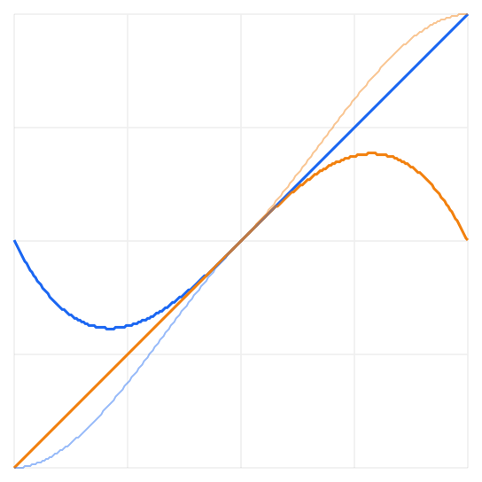
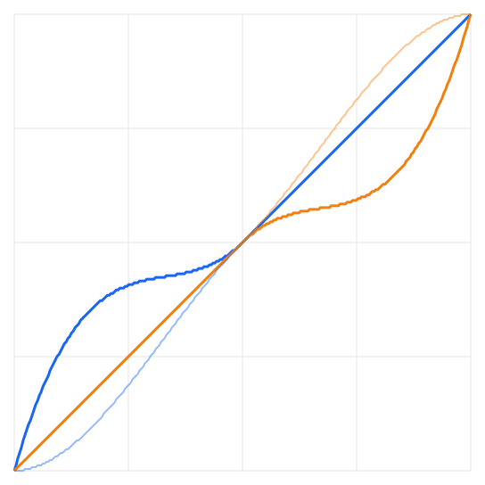
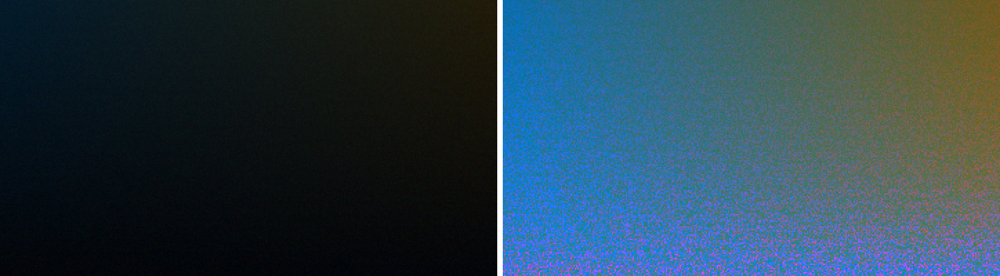
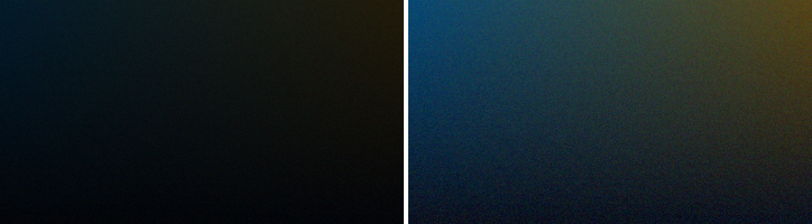
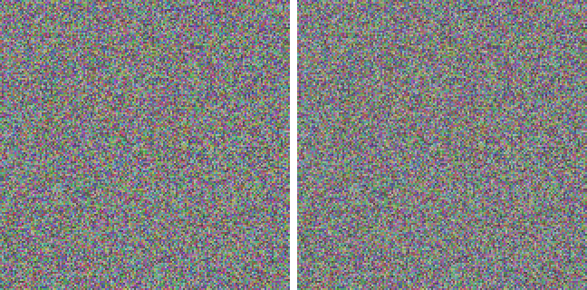
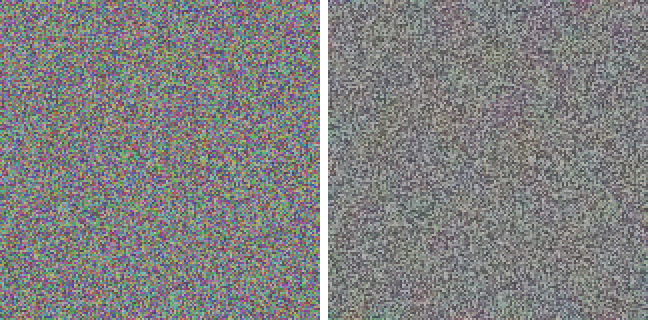

## Description

<!-- SECTION:DESCRIPTION:BEGIN -->
Two Camera Raw kernel fixes from upstream, both in Sources/CPixels/AdjustPixels.c. At high values the Shadows slider lifts the darkest tones above the ones just brighter (tone_shadows is not monotonic: with Shadows at +100 black maps to 0.5 and 0.1 to about 0.36), so dark areas break into blocks of color (upstream issue #236); Highlights pulled down has the mirror problem. Upstream 0b4c56c lifts them on a curve that keeps every tone in order with black staying black. Separately, Color noise reduction blurs an HSL saturation plane, which also shifts brightness; upstream 42a559b smooths color and keeps brightness. Lamina's code matches upstream's before both commits (TASK-10 made the main pass multicore but left these blocks as they were). Port with Co-authored-by: Robbie <1269226+robbietilton@users.noreply.github.com>.
<!-- SECTION:DESCRIPTION:END -->

## Acceptance Criteria
<!-- AC:BEGIN -->
- [x] #1 Shadows and Highlights at any value keep tone order (a monotonic mapping), black stays black and white stays white, as upstream's shadowsAndHighlightsKeepTonesInOrder test shows
- [x] #2 Color noise reduction removes color grain without changing brightness, as upstream's colorNoiseReductionRemovesColorGrainNotBrightness test shows, and clear pixels still don't leak color (colorNoiseReductionIgnoresWhatClearPixelsHeld)
- [x] #3 CameraRawSpeedTests' pixel hashes are re-recorded only for the settings these fixes change (light, the two clipping cases, detail), and the rest still match
<!-- AC:END -->

## Implementation Notes

<!-- SECTION:NOTES:BEGIN -->
Ported upstream 0b4c56c and 42a559b into Sources/CPixels/AdjustPixels.c. tone_shadows and tone_highlights now add a bump u(1 - 2u)² over the dark (or light) half, 2.5 times it when lifting shadows or pulling highlights down and once it the other way, so the mapping always rises and black, middle gray and white stay put (with Shadows +100 black used to map to 0.5, above 0.1's 0.36). Color noise reduction blurs alpha-weighted red and blue differences from the pixel's brightness (radius growing with the amount and Smoothness), puts them back over the brightness unchanged with green solved from it, and Color Detail protects edges where the smoothed color itself changes across a blur's width. adjust_camera_raw_detail was still single-threaded and identical to upstream's base (TASK-10 only made the main pass and effects multicore), so the block went in as upstream wrote it; its blurs use Lamina's multicore box_blur_plane.

Tests: CameraRawTests gains upstream's shadowsAndHighlightsKeepTonesInOrder and colorNoiseReductionRemovesColorGrainNotBrightness; colorNoiseReductionIgnoresWhatClearPixelsHeld still passes (its comment now says color planes). CameraRawSpeedTests.kernelsGiveTheSamePixels failed for exactly light, light + highlight clipping, light + shadow clipping and detail (light sets Highlights -40 / Shadows 35, detail sets Color noise 30); those four hashes were re-recorded and the doc comment says why. effects and effectsOnTinyPictures (no shadows, highlights or color noise) still match unchanged. Camera Raw, filter and adjustment suites pass (84 tests); full swift test: 816 + 48 + 22 tests pass.

Before and after, rendered through CameraRawSettings.apply in a throwaway test:

<!-- SECTION:NOTES:END -->

## Final Summary

<!-- SECTION:FINAL_SUMMARY:BEGIN -->
Camera Raw's Shadows and Highlights now follow curves that never swap tones (black, middle gray and white stay put), so lifted shadows no longer break into blotches (upstream 0b4c56c, issue #236), and Color noise reduction smooths each pixel's color over its area while keeping its brightness (upstream 42a559b). Verified by upstream's two new CameraRawTests, the existing clear-pixel test, CameraRawSpeedTests with only the light, two clipping and detail hashes re-recorded, the full swift test, and before/after renders.
<!-- SECTION:FINAL_SUMMARY:END -->
