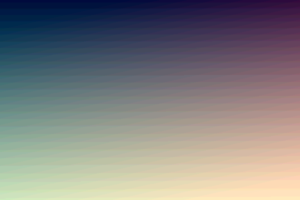
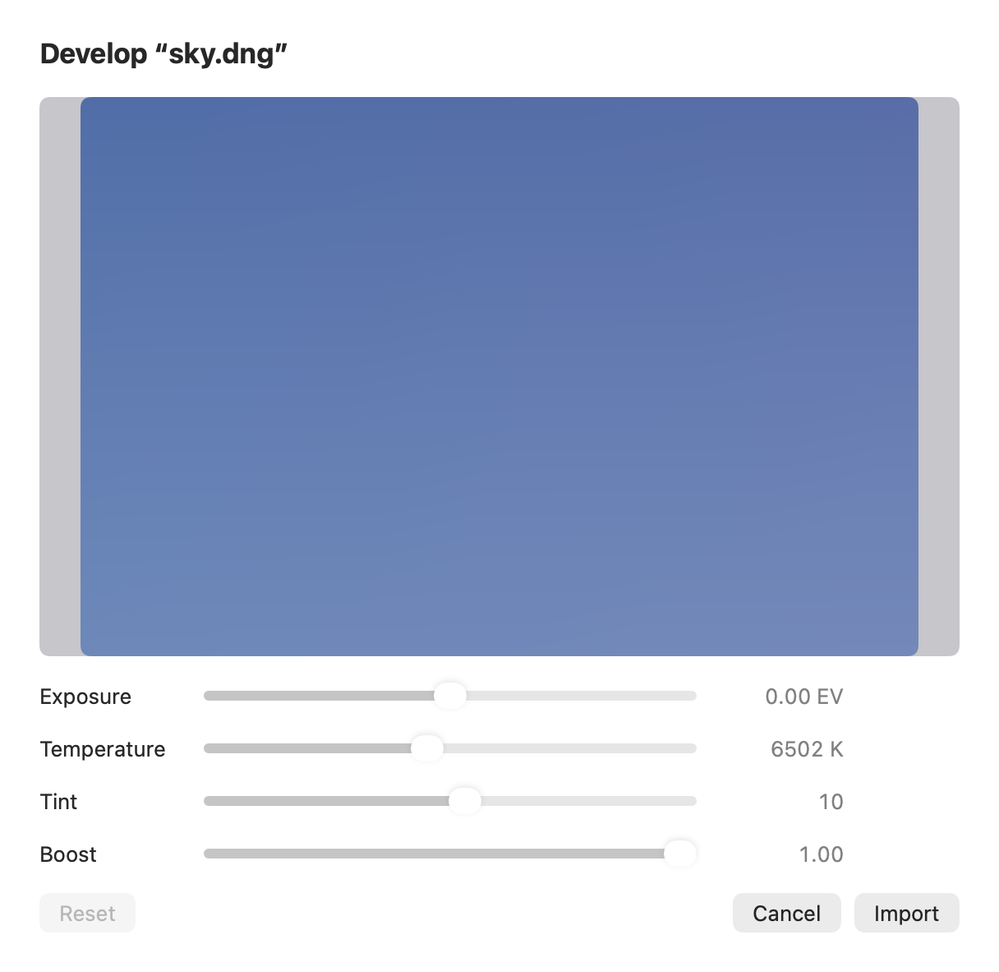
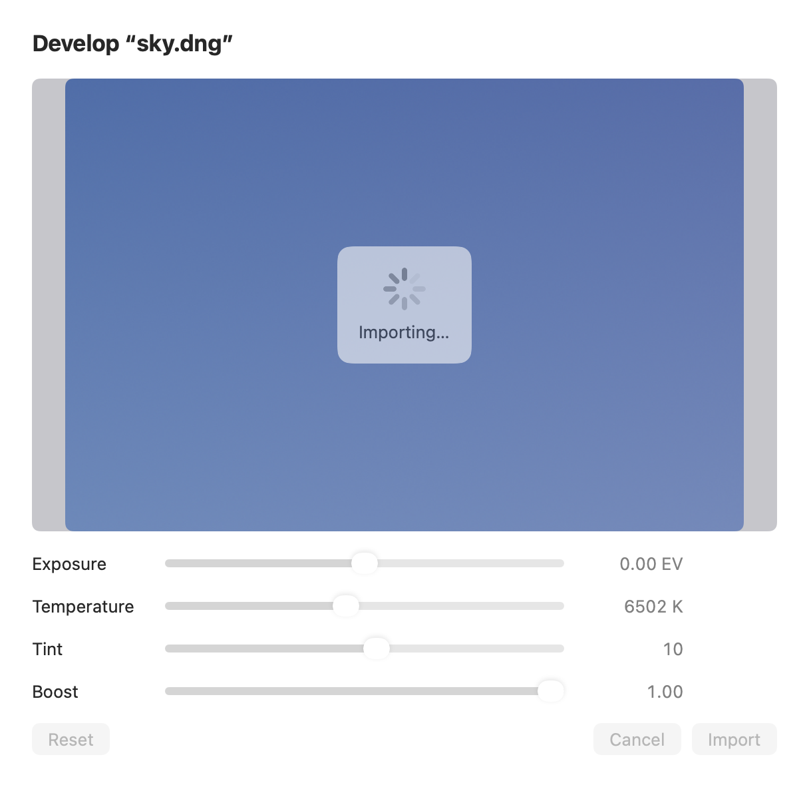

## Description

<!-- SECTION:DESCRIPTION:BEGIN -->
RawImporter renders the developed RAW straight to RGBA8 (default CIContext, createCGImage .RGBA8), so smooth skies and gradients band. Upstream renders at 16 bits and rounds to 8 with fine noise (6345432), does that rounding in C so it takes 0.6 s instead of 15 s in debug builds (196342c, dither_quantize16 in DitherPixels.c), and keeps the RAW develop sheet open with Importing… until the layer is in (0907f51; Lamina's finishRawDevelop closes it at once, leaving no sign of work). 6e6ca38 splits a test expression CI couldn't type-check. Lamina's RawImporter, RawDevelopSheet and DitherPixels.c match upstream's code before these commits. Port with Co-authored-by: Robbie <1269226+robbietilton@users.noreply.github.com>.
<!-- SECTION:DESCRIPTION:END -->

## Acceptance Criteria
<!-- AC:BEGIN -->
- [x] #1 RAW imports (and the develop preview) round 16-bit output to 8 bits with fine noise: a smooth gradient imports without bands, per upstream's RawDitherTests
- [x] #2 The rounding runs in C (CPixels) and imports a 24 MP RAW in about a second in a debug build
- [x] #3 The RAW develop sheet shows Importing… with OK dimmed until the layer is added, and DESIGN.md's Dialogs section describes the sheet
<!-- AC:END -->

## Implementation Notes

<!-- SECTION:NOTES:BEGIN -->
Ported upstream 6345432, 196342c, 0907f51 and 6e6ca38 (Lamina's RawImporter, RawDevelopSheet and DitherPixels.c matched upstream's code before them). RawImporter's CIContext works in half-float extended linear sRGB; render() (the import and the sheet's preview) goes through the new RawImporter.dithered, which renders the frame once as RGBA16 sRGB and rounds it to 8 bits with dither_quantize16, added to Sources/CPixels/DitherPixels.c and its header: two fixed hash-noise draws per channel (about one step, the same every time), clamped to the pixel's alpha, on every core. EditorSession gains rawImporting and endRawDevelop: Import keeps the sheet up while the full frame develops and the import loop closes it (defer) once the layer is in or the develop failed; Cancel closes it at once. RawDevelopSheet shows Importing… with a regular spinner on a regularMaterial panel over the preview, dims its sliders and buttons, and can't be dismissed meanwhile. DESIGN.md's Dialogs section gains a Develop RAW entry.

Tests: RawDitherTests (upstream's two, with 6e6ca38's split expression): a 5-step gradient's dithered row averages stay within 0.25 of the ideal where plain rounding is off by 0.5, and a flat gray dithers within a step, right on average, repeatably, opaque. Camera Raw, filter and adjustment suites pass; full swift test: 816 + 48 + 22 tests pass. A throwaway test (deleted) wrote a minimal uncompressed linear DNG and drove the real path: RawImporter.develop of a 600 × 400 sky, the sheet hosted offscreen, and session.importImages with the sheet answered by finishRawDevelop: rawImporting and showsRawDevelop were true right after Import and both false with the layer in; Cancel closed the sheet at once. A full-frame develop of a 24 MP (6000 × 4000) DNG took 0.23–0.27 s in the debug test build, and rendering 24 MP at 16 bits and rounding it in C 0.15 s. That DNG is linear (no demosaicing); a camera's mosaic RAW adds Core Image's own decode, which this task doesn't change.

Before and after, from the throwaway test (light appearance):

README and website need no change: they already say camera RAW files open with a develop step first, and the sheet only gains its Importing… state.
<!-- SECTION:NOTES:END -->

## Final Summary

<!-- SECTION:FINAL_SUMMARY:BEGIN -->
RAW imports and the develop preview now render at 16 bits and round to 8 with fine fixed noise in C (dither_quantize16), so smooth gradients don't band, and the Develop sheet stays up showing Importing… with its controls dimmed until the layer is in (upstream 6345432, 196342c, 0907f51, 6e6ca38). DESIGN.md's Dialogs section describes the sheet. Verified by upstream's RawDitherTests, the full swift test, an end-to-end check with a generated DNG (sheet state through the real import, 24 MP develop 0.23–0.27 s in a debug build) and before/after captures.
<!-- SECTION:FINAL_SUMMARY:END -->
