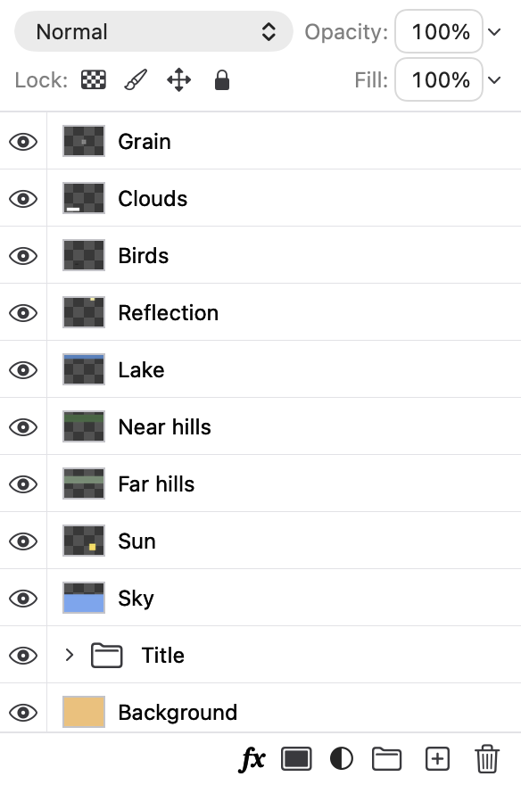
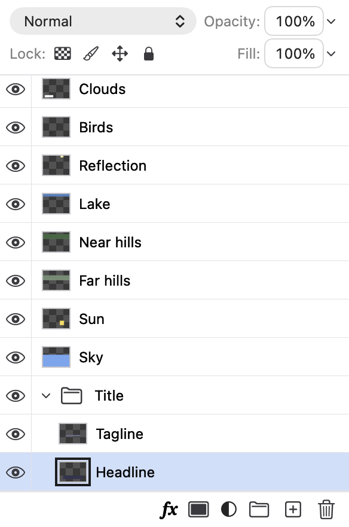

## Description

<!-- SECTION:DESCRIPTION:BEGIN -->
When Auto-Select or any canvas action makes a layer active inside a collapsed group, or below the visible rows, the Layers panel leaves it hidden: selectLayer and selectLayers don't expand the layer's groups, and the list only scrolls to a row for renaming. Photoshop opens the groups and scrolls to the layer. Upstream PR #235 (d2b8aaf, by Lens-lzy) adds revealActiveLayer() (LayerGroups) and has the list scroll the active row into view; b4e147b then dropped its tests. Port with Co-authored-by: Lens-lzy <60784629+Lens-lzy@users.noreply.github.com>.
<!-- SECTION:DESCRIPTION:END -->

## Acceptance Criteria
<!-- AC:BEGIN -->
- [x] #1 A layer made active from the canvas (Auto-Select, a click on its pixels, a lamina command) inside collapsed groups expands those groups and its row scrolls into view
- [x] #2 Selecting from the Layers panel itself doesn't scroll or expand anything it didn't before
- [x] #3 LayersPanelTests cover the expand and the scroll, and DESIGN.md's Layers section says it
<!-- AC:END -->

## Implementation Plan

<!-- SECTION:PLAN:BEGIN -->
1. EditorSession.revealActiveLayer() (LayerGroups.swift) opens the collapsed groups around the active layer; selectLayer and selectLayers call it, as upstream d2b8aaf does. A layer picked in the panel is already showing, so it opens nothing there.
2. NativeLayerList.Coordinator scrolls the active row into view when the active layer changed since its last update and its row was out of sight in the rows as they were shown. Unlike upstream (which always calls scrollRowToVisible on a change), a pick in the list is always in sight, so the list never moves under the pointer, even for a partly hidden row; a later update never undoes a manual scroll.
3. LayersPanelTests: expand + scroll from outside the list (selectLayerTarget as lamina and the canvas do, Command-Shift-click via extendSelection), manual scroll kept, list picks neither scroll nor open groups.
4. DESIGN.md Layers section; before/after screenshots.
<!-- SECTION:PLAN:END -->

## Implementation Notes

<!-- SECTION:NOTES:BEGIN -->
Ported from upstream PR #235 (d2b8aaf, Lens-lzy), adapted to Lamina's rebuilt Layers panel.

- Document/LayerGroups.swift: revealActiveLayer() removes the active layer's ancestors from collapsedGroupIDs (only when one of them is collapsed, so a selection that opens nothing doesn't notify observers); selectLayers calls it. Document/EditorSession.swift: selectLayer calls it. Canvas picks (Auto-Select, Command-click, Command-Shift-click), the Type tool, pasted layers and lamina's select-layer (selectLayerTarget) all go through these.
- UI/NativeLayerList.swift: Coordinator.update remembers the active layer it last showed; when it changes and the row wasn't among the rows in sight before the update (hidden in a folded group, or scrolled away), it calls scrollRowToVisible after the reload. Rows picked in the list (row clicks, thumbnails, effect rows, context menus) are always in sight, so the list doesn't scroll for them, partly hidden rows included; this departs from upstream, which scrolled on every active-layer change.
- Tests (LayersPanelTests): aLayerPickedOutsideTheListOpensItsGroupsAndScrollsIntoView (only the ancestors open, the unrelated folded group stays folded; row selected and fully visible; a manual scroll survives later updates; Command-Shift-click into another folded group opens and scrolls too), pickingInTheListNeitherScrollsItNorOpensGroups (a partly visible row picked through the table's own selection doesn't scroll; a folded group picked in the list stays folded). Removing the scroll call makes the first test fail (checked).
- swift test --filter 'GroupTests|LayersPanelTests|AutomationTests|LayerTests|LayerCommandTests': 77 tests passed.
- DESIGN.md, Dock and panels ▸ Layers: new bullet after the clicks bullet. README and website don't describe how the list follows the selection, so they need no change.

Screenshots: the Layers panel hosted offscreen (NSHostingView in an NSWindow, light appearance, cacheDisplay) with the Title group folded, after selectLayerTarget(Headline), which is what lamina select-layer runs.

Follow-up (second commit): the list's first update comes from makeNSView before SwiftUI sizes it, so a just-made list with the active layer far down scrolled with no viewport and opened at the bottom. The scroll now waits for a list with something in sight; a new list starts at the top. Test: aListUpdatedBeforeItIsLaidOutStartsAtTheTop (fails without the guard). LayersPanelTests: 7 passed.
<!-- SECTION:NOTES:END -->

## Final Summary

<!-- SECTION:FINAL_SUMMARY:BEGIN -->
A layer made active from the canvas, a command or lamina now opens the groups around it (EditorSession.revealActiveLayer, called by selectLayer and selectLayers) and the Layers list scrolls its row into view when it was out of sight; picks in the list itself never scroll it or open groups. Ported from upstream #235 with a stricter scroll rule. Verified with two new LayersPanelTests (and a negative check), the group, layer and automation suites, and offscreen before/after renders of the panel.
<!-- SECTION:FINAL_SUMMARY:END -->
