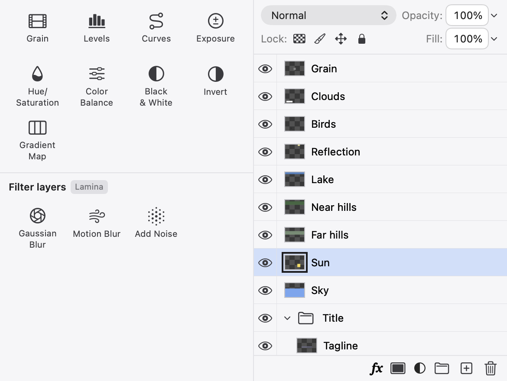
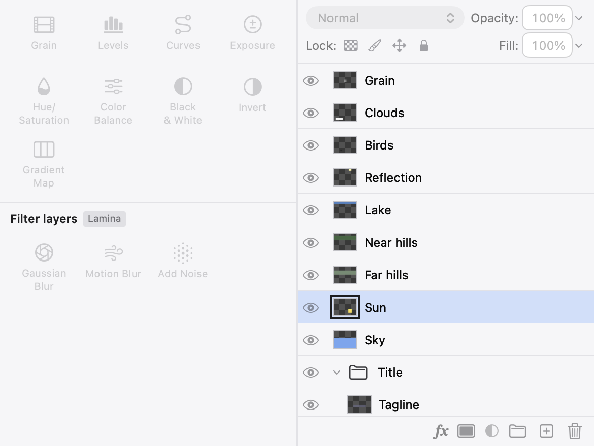

## Description

<!-- SECTION:DESCRIPTION:BEGIN -->
canEditLayers turns false while a brush stroke, warp stroke, pixel move or transform edit is under way, and the Layers footer, eyes, disclosure triangles, top row and the Adjustments grid bind their enabled state to it, so they dim and the list reloads every row at the start and end of every stroke or Move drag. That breaks Lamina's own showsBusy rule (quick edits never flash the interface). Upstream 06313a9 separates how the panel looks from what it allows. Actions must keep guarding on canEditLayers; Lamina's version also has to cover commandDialog and layerStyle, which upstream doesn't have. Adapt with Co-authored-by: Robbie <1269226+robbietilton@users.noreply.github.com>.
<!-- SECTION:DESCRIPTION:END -->

## Acceptance Criteria
<!-- AC:BEGIN -->
- [x] #1 A click, a brush stroke or a Move drag no longer dims the Layers panel or the Adjustments grid, nor reloads the layer rows
- [x] #2 Long work (showsBusy) and open dialogs still dim them, and every action is still refused while layers can't be edited
- [x] #3 A test covers the look staying enabled during a stroke while edits are refused
<!-- AC:END -->

## Implementation Plan

<!-- SECTION:PLAN:BEGIN -->
1. EditorSession.layersLookEditable: how the panels look, dimmed only for lasting states (Lamina's commandDialog and layerStyle included, plus a pending Free Transform or a value the transform fields hold), not for brushStroke, warpStroke, pixelMove, a Move drag's transform or a moment's isProjectBusy. canEditLayers becomes layersLookEditable plus those, so whatever looks dimmed is always refused, and what looks enabled can still be refused for the moment.
2. Look twins for the derived rules the panel binds to: appearanceLooksEditable, opacityLooksEditable, effectsLookEditable, maskLooksEditable, locksLookChangeable; each can* rule becomes canEditLayers && its twin, so both share one definition.
3. Layers footer, mask button, top row (blend mode, Opacity, Fill, Lock buttons), eyes, disclosure triangles, effect eyes and the Adjustments grid bind to the look; their actions keep guarding on the can* rules (the footer's adjustment menu now checks AdjustmentsPanel.canAdd before bringing Properties forward).
4. Test in LayersPanelTests; DESIGN.md (Adjustments, Layers); before/after screenshots.
<!-- SECTION:PLAN:END -->

## Implementation Notes

<!-- SECTION:NOTES:BEGIN -->
Adapted from upstream 06313a9 (Robbie), which added layersLookEditable and bound the Layers footer and list to it.

- Document/EditorSession.swift: layersLookEditable dims for selection amounts, commandDialog (Fill…, Load Selection…, Lock Layers…), Color Range, a type draft, no document, showsBusy, imports, New Document, a rename, a persistent transform (Free Transform, floating pixels, Distort) or one the transform fields hold, crop, gradient, Hue/Saturation, Levels, a filter and the Layer Style dialog (layerStyle). canEditLayers is now layersLookEditable && no brush or warp stroke, pixel move, transform or isProjectBusy: the same rule as before, written so a dimmed control is always one whose action is refused.
- Look twins beside each rule the panel binds to: appearanceLooksEditable (LayerAppearance), opacityLooksEditable, effectsLookEditable (LayerEffects), maskLooksEditable (LayerMask), locksLookChangeable (LayerLocking); canEditAppearance, canEditOpacity, canEditEffects, canEditMask and canChangeLocks are canEditLayers && their twin, so the selection and lock conditions are written once.
- UI: LayersPanel footer (fx, adjustment menu, group, new layer, delete), LayerMaskMenu, LayerAppearanceControls (blend mode, Opacity, Fill, Lock buttons and their tertiaryText dimming), BlendModePicker's NSPopUpButton, NativeLayerList's eyes, disclosure triangles, Effects and effect-row eyes, and the AdjustmentsPanel grid bind to the look. Every action still guards on the can* rules; the footer's adjustment menu now checks AdjustmentsPanel.canAdd before bringing Properties forward, as the grid's add already did. The list's editingEnabled now follows the look, so a stroke or drag no longer reloads every row at its start and end.
- Test (LayersPanelTests.aStrokeOrAMoveDragLeavesThePanelsUndimmedWhileTheirEditsWait): mid-stroke every look predicate stays true while canEditLayers is false, the eye stays enabled and no row reloads (a counting NSTableView); visibility, new layer, group, adjustment, mask, lock, opacity, blend mode, Layer Style and delete are all refused (no undo step, layers unchanged); at the stroke's end only the painted row may reload. A Move-tool transform and a moment's isProjectBusy look the same; showsBusy, a Free Transform, the Lock Layers dialog and Layer Style still dim. Reverting the list to canEditLayers makes it fail on the reloads and the eye (checked).
- Full swift test: 816 tests in 115 suites, 48 and 22 in the other runners, all passed (the busy check polls, as SelectionEditTests does, after a fixed wait flaked under the parallel run).
- DESIGN.md: Adjustments' dimming sentence, and a Layers bullet listing what dims the panel. README and website don't describe when panels dim: no change.
- Not changed: Properties' adjustment controls and footer, and the Layer menu, still bind to canEditLayers (out of this task's scope; menus are drawn when opened, so they don't flash).

Screenshots: the Adjustments grid and the Layers panel hosted offscreen (NSHostingView in an NSWindow, light appearance, cacheDisplay), Sun selected. The Move drag is a non-persistent transform (what a press on the layer with the Move tool starts), which the panels observe, so they redraw by themselves. A brush stroke isn't observed (brushStroke is @ObservationIgnored), so the panels flash only when something else they show redraws them mid-stroke; for that shot they're made to redraw mid-stroke.

<!-- SECTION:NOTES:END -->

## Final Summary

<!-- SECTION:FINAL_SUMMARY:BEGIN -->
The Layers panel and the Adjustments grid no longer dim, or reload every layer row, for a click, a brush stroke, a Move drag, moving pixels or a moment's work: they bind to EditorSession.layersLookEditable and its twins (appearance, opacity, effects, mask, locks), which dim only for lasting states, Lamina's dialogs (commandDialog, Layer Style) included. canEditLayers is rebuilt from the look plus the momentary states and still guards every action. Adapted from upstream 06313a9. Verified with a new LayersPanelTests test (with a negative check), the full swift test run (816 + 48 + 22 passed) and offscreen before/after renders.
<!-- SECTION:FINAL_SUMMARY:END -->
