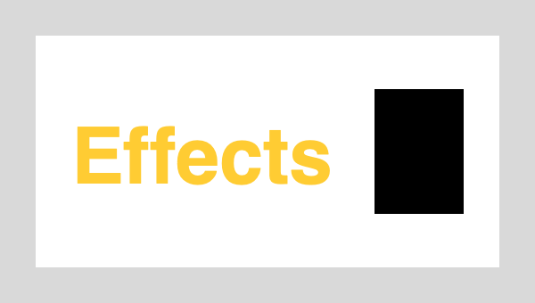
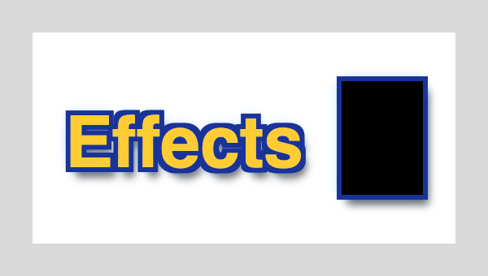
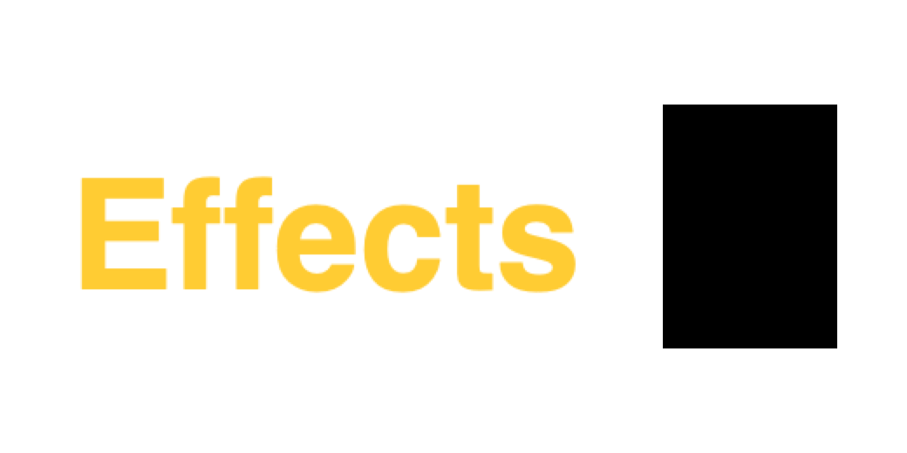
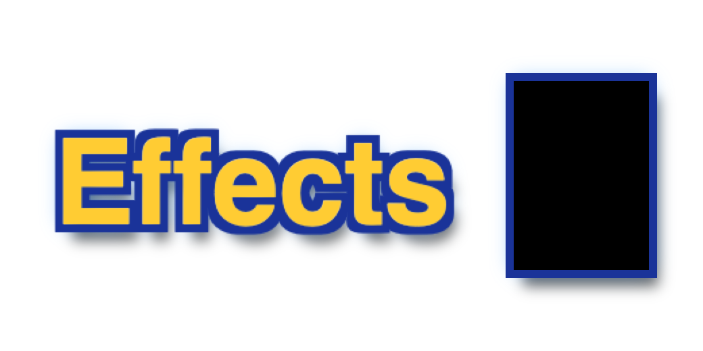

## Description

<!-- SECTION:DESCRIPTION:BEGIN -->
Canvas Size, Image Size, Crop, Trim, Hue/Saturation, Levels, selection edits and floating selections rebuild the layer list from a snapshot and leave out layer effects (and in places shapes and live text): silent data loss, confirmed in IO/ImageResizer.swift and IO/CanvasResizer.swift (upstream issue #180). Upstream PR #181 fixes it with one snapshot-to-layers mapping, LayerEffects.scaled(by:) and tests that fail on main; port it and credit its author. Do this before exposing size commands to agents (TASK-4).
<!-- SECTION:DESCRIPTION:END -->

## Acceptance Criteria
<!-- AC:BEGIN -->
- [x] #1 After Canvas Size, Image Size, Crop, Trim, Hue/Saturation, Levels and the selection and floating-selection edits, every layer keeps its effects, shape and live text, with effect sizes scaled when the image is resized
- [x] #2 One shared mapping turns a project snapshot back into layers, so a new layer property can't be missed in one code path
- [x] #3 Tests cover each operation and fail without the fix
<!-- AC:END -->

## Implementation Plan

<!-- SECTION:PLAN:BEGIN -->
1. Record PR #181's tests (LayerEffectsSurviveTests) first with only LayerEffects.scaled(by:) added, and confirm they fail on the fork's base.
2. Port PR #181: ProjectSnapshot.documentLayers as the one snapshot-to-layers mapping (open, reload, Canvas Size, Image Size, Crop, Trim); CanvasResizer keeps effects; ImageResizer scales effects by sqrt(sx*sy); Hue/Saturation, Levels, Invert and floating-selection commits pass the layer's effects.
3. Run the new suite plus ImageSize, CanvasSize, Crop, ImageTrim, HueSaturation, Levels and SelectionEdit suites.
4. Before/after composite of a text + shape layer with effects after Canvas Size (offscreen render on base and on the branch).
<!-- SECTION:PLAN:END -->

## Implementation Notes

<!-- SECTION:NOTES:BEGIN -->
Ported upstream PR #181 (naco-siren) with paths remapped; every hunk applied cleanly at the fork's base. Filters and brush commits already passed effects, and duplicate/copy keep shape, effects and text, so no other rebuild site needed changes.
Before the fix (only the tests and LayerEffects.scaled(by:) added): swift test --disable-keychain --filter 'LayerEffectsSurviveTests' -> 9 tests, 9 failures (every operation lost the effects or the live text/shape).
After: swift test --disable-keychain --filter 'LayerEffectsSurviveTests|ImageSizeTests|CanvasSizeTests|CropTests|ImageTrimTests|HueSaturationTests|LevelsTests|SelectionEditTests' -> 71 tests in 8 suites passed.
Scope note: Image Size that actually resamples still rasterizes live text and shapes into plain pixels (as upstream's PR documents and as other pixel edits do); their effects are kept and scaled. Keeping text and shapes live through a resample (scale the transform instead of re-rasterizing) would be a follow-up.

Visuals (offscreen: the same throwaway test on a worktree of main and on this branch builds a white background, an 'Effects' text layer and a rectangle shape, both with stroke, drop shadow and outer glow, then applies the edit and exports the composite with ImageExporter):

AC #1 is read as the port intends: effects survive every listed edit (scaled by Image Size); shape and live text survive the edits that don't change pixels (Canvas Size, Crop, Trim, resolution-only Image Size), while Hue/Saturation, Levels, Invert, floating selections and a resampling Image Size turn them into pixels, as every pixel edit does.
<!-- SECTION:NOTES:END -->

## Final Summary

<!-- SECTION:FINAL_SUMMARY:BEGIN -->
Ported upstream PR #181: ProjectSnapshot.documentLayers is now the one snapshot-to-layers mapping (open, reload, Canvas Size, Image Size, Crop, Trim), Canvas Size keeps effects, Image Size scales them (LayerEffects.scaled(by:)), and Hue/Saturation, Levels, Invert and floating-selection commits pass them on. LayerEffectsSurviveTests (9 tests) all failed before the fix and pass after; ImageSize, CanvasSize, Crop, ImageTrim, HueSaturation, Levels and SelectionEdit suites pass (71 tests). Before/after renders of Canvas Size and Image Size attached. A resampling Image Size still rasterizes live text and shapes (documented); keeping them live would be a follow-up.
<!-- SECTION:FINAL_SUMMARY:END -->
