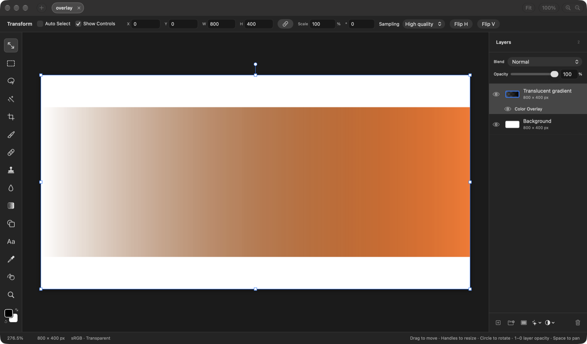
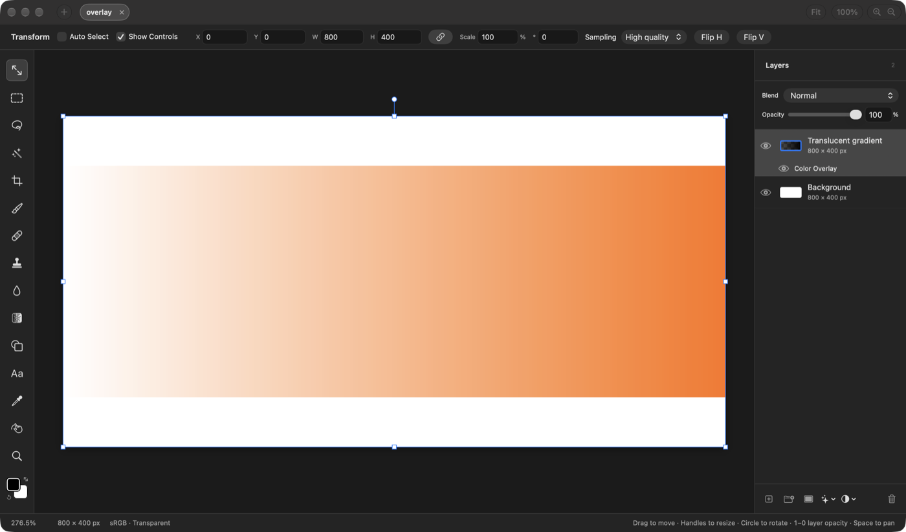

## Description

<!-- SECTION:DESCRIPTION:BEGIN -->
Color Overlay is mixed over the already-composited pixels by their alpha, so translucent pixels are only partly recolored (upstream issue #211; confirmed in Rendering/MetalLayerEffects.swift and Document/LayerEffects.swift). Upstream PR #214 recolors the layer's own pixels instead (source-atop on the CPU, mix() in the Metal kernel); its author couldn't run the tests.
<!-- SECTION:DESCRIPTION:END -->

## Acceptance Criteria
<!-- AC:BEGIN -->
- [x] #1 Color Overlay replaces the color of the layer's own pixels, translucent ones included, on the GPU canvas and in CPU rendering (export, merge)
- [x] #2 A test shows GPU and CPU output match, and PR #214's tests pass
<!-- AC:END -->

## Implementation Plan

<!-- SECTION:PLAN:BEGIN -->
1. Port PR #214: the CPU renderer recolors the layer's own (masked) pixels source-atop before drawing them; the Metal compose kernel mixes the pixel's premultiplied color toward the overlay by its opacity, keeping its alpha.
2. Let LayerEffectsRenderer.render skip Metal (gpu: false) so tests can run the CPU path, which otherwise only runs without Metal.
3. Run PR #214's tests on both paths, and add a GPU-vs-CPU comparison on a translucent gradient seen through a mask, checked pixel by pixel against the source-atop formula.
4. Before/after capture of a Color Overlay on a translucent gradient layer.
<!-- SECTION:PLAN:END -->

## Implementation Notes

<!-- SECTION:NOTES:BEGIN -->
Ported upstream PR #214 (HEOJUNFO); both hunks applied at the fork's base (offset 14 lines). The canvas and export both call MetalLayerEffects when Metal exists, so PR #214's tests only exercised the GPU; render(_:mask:effects:gpu:) now lets tests run the CPU fallback too, and the three PR tests run on both paths.
New gpuAndCPUOverlayMatch (enabled only when Metal exists): 64x48 gradient, clear to opaque, through a vertical mask ramp, overlay (0.2, 0.8, 0.4) at 75%: GPU and CPU agree within 2 levels on every byte, and both match source-atop (color = overlay*opacity*alpha + own*(1-opacity), alpha kept) within 2 levels.
swift test --disable-keychain --filter 'ColorOverlayTests|InnerGlowTests|OuterGlowTests|GPUCanvasTests' -> 41 tests in 4 suites passed.
Not changed: LayerEffectsSurface's CPU fallback (painting a layer with effects without Metal) still draws no color overlay or inner shadow at all, as before; only reached without Metal.

Visual: overlay.comp fixture (800x400, white background, a black band fading from clear to opaque with an orange Color Overlay at 100%), opened at launch in the baseline app and in this branch's make dev build (GPU canvas), window captured:

<!-- SECTION:NOTES:END -->

## Final Summary

<!-- SECTION:FINAL_SUMMARY:BEGIN -->
Ported upstream PR #214: Color Overlay recolors the layer's own pixels and keeps their alpha (source-atop on the CPU, the same mix in the Metal compose kernel). LayerEffectsRenderer.render gained a gpu flag so PR #214's three tests run on both paths, and a new test holds GPU and CPU to within 2 levels of each other and of the source-atop formula on a translucent, masked gradient (ColorOverlay, InnerGlow, OuterGlow, GPUCanvas suites: 41 tests pass). Before/after canvas captures attached.
<!-- SECTION:FINAL_SUMMARY:END -->
