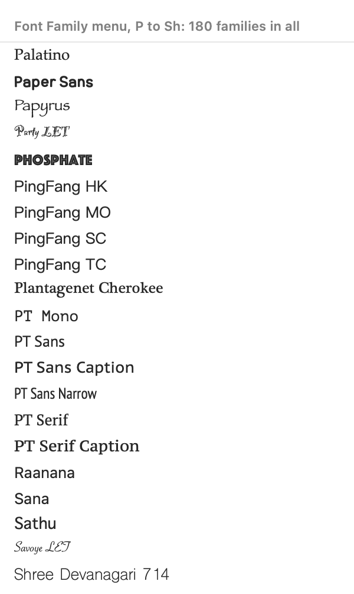
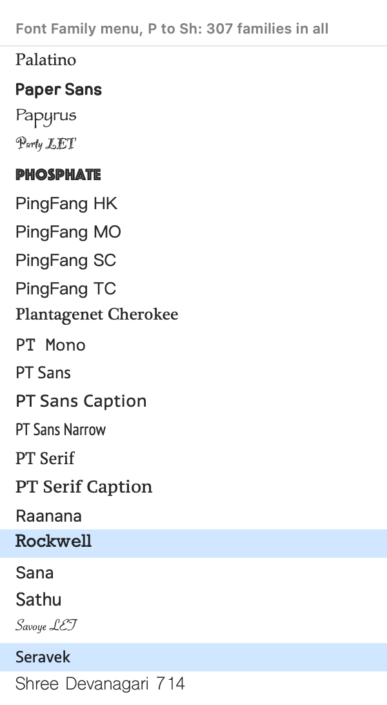

## Description

<!-- SECTION:DESCRIPTION:BEGIN -->
The Type bar's and Properties' family menus list NSFontManager.availableFontFamilies, which leaves out families macOS installs but hides from the font list (on macOS 27: Rockwell, Seravek, Iowan Old Style, Athelas and about a hundred more; checked: availableMembers still returns their faces). Text in such a face, from a Photoshop file for example, can't reach its other styles. Upstream's open PR #207 (commit 1) adds the family in use when it isn't listed; listing every family is better. Research: doc-4.
<!-- SECTION:DESCRIPTION:END -->

## Acceptance Criteria
<!-- AC:BEGIN -->
- [x] #1 The family menus list families macOS hides from availableFontFamilies, so Rockwell, Seravek and the like can be chosen with all their styles
- [x] #2 A test checks a hidden family is offered (skipped where it isn't installed)
<!-- AC:END -->

## Implementation Plan

<!-- SECTION:PLAN:BEGIN -->
1. Find an enumeration that yields the hidden families on this Mac.
2. `FontFaces.families`: every installed family, read once (in the background when a family menu appears), sorted as the system sorts its list.
3. Both family menus (`FontMenuPicker.familyItems`, `FontFamilyPopUp`) and the Type bar's styled names list it; a test with Rockwell; DESIGN.md.
<!-- SECTION:PLAN:END -->

## Implementation Notes

<!-- SECTION:NOTES:BEGIN -->
Checked on this Mac (macOS 27): `availableFontFamilies` lists 180 families, and so do `CTFontManagerCopyAvailableFontFamilyNames`, the families of `availableFonts`, `CTFontManagerCopyAvailablePostScriptNames`, `CTFontManagerCopyAvailableFontURLs`, `NSFontCollection.allFonts` and a CoreText collection with disabled fonts included: none of them yields Rockwell and the rest. Reading the font files in `/System/Library/Fonts` and its `Supplemental` folder (`CTFontManagerCreateFontDescriptorsFromURL`) does: 127 more families (Rockwell, Seravek, Iowan Old Style, Athelas, Superclarendon, Marion, Courier, Times, the STIX and many Noto Sans families) once the system's own period-named ones are left out, every one with faces from `availableMembers(ofFontFamily:)`.

`FontFaces.families` (UI/PropertiesCharacter.swift) is the system's list plus those, each one checked to resolve through CoreText descriptor matching (so a file macOS doesn't make available offers nothing), sorted with `localizedStandardCompare`, which gives the system list's own order. It's a lazily read `nonisolated static let` (about 0.3 s): the Type bar's `StyledName.prepare()` and Properties' `FontFamilyPopUp` start it in the background when they appear. Both family menus list it; their behavior is otherwise unchanged (the Type bar still draws each name in its face, the style menus still come from `availableMembers`). The App Sandbox profile lets the app read `/System` (`application.sb`: `read-only-and-issue-extensions (subpath "/System")`), so the shipped app finds the same families; this wasn't watched in a running sandboxed app. Upstream PR #207 (commit 1) instead adds the family of the face in use; no code was taken from it.

Tests: `FontFamiliesTests` (new): with Rockwell installed, the Type bar's family items and Properties' family pop-up menu both offer Rockwell, its four faces are its styles, and choosing it from Helvetica-Bold gives Rockwell-Bold; the families include the whole system list, no period-named family, no duplicates, the system's order, and every one has styles. FontFamiliesTests, PropertiesTests and TypeToolTests pass.

DESIGN.md: the Type bar paragraph says both family menus list every installed family. No README or website change: the menus look as before, with more families.

Before and after: the family menu's names from Palatino to Shree Devanagari 714, rendered offscreen as the menu draws them (each in its own face, through `StyledName`), light appearance. Before is `availableFontFamilies`, exactly what both menus listed (180 families); after is `FontMenuPicker.familyItems()` (307), with Rockwell and Seravek highlighted.

<!-- SECTION:NOTES:END -->

## Final Summary

<!-- SECTION:FINAL_SUMMARY:BEGIN -->
Both family menus now list every installed family (`FontFaces.families`), including the 127 macOS 27 leaves out of `availableFontFamilies` (Rockwell, Seravek, Iowan Old Style, Athelas…), found by reading the system's font folders and read in the background. Verified by FontFamiliesTests (Rockwell offered in both menus with its four styles) and before/after renders of the family list.
<!-- SECTION:FINAL_SUMMARY:END -->
