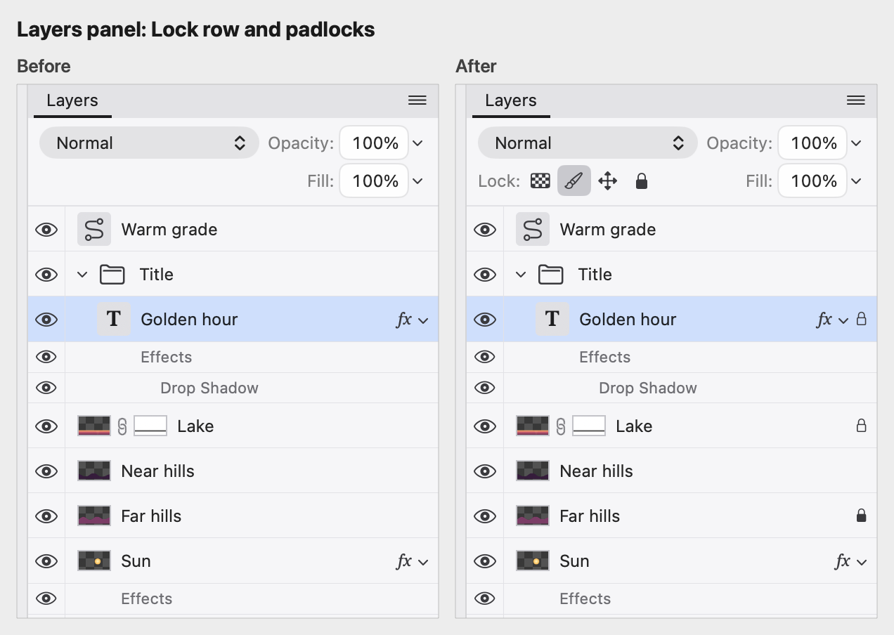
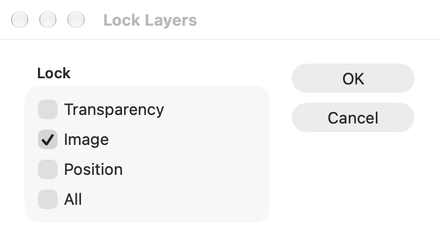
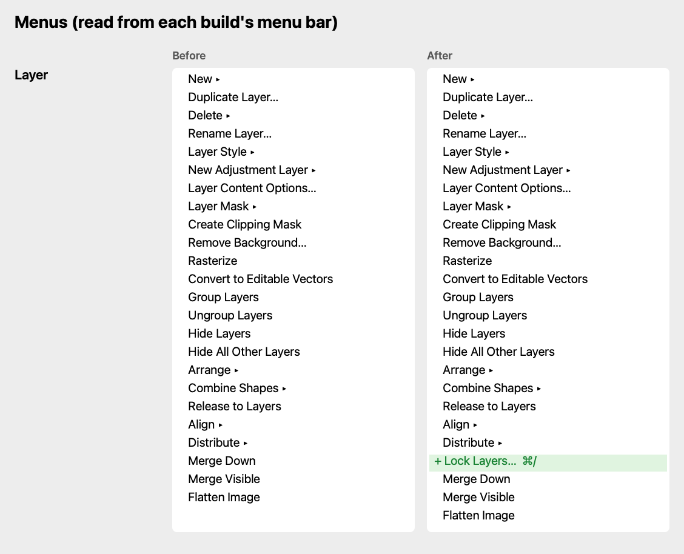

## Description

<!-- SECTION:DESCRIPTION:BEGIN -->
Photoshop's Layers panel has a Lock: row before Fill (Lock transparent pixels, Lock image pixels, Lock position, Prevent auto-nesting into and out of Artboards and Frames, Lock all; Adobe's Lock layers page, updated 2026-10-06), a padlock on locked rows (solid when fully locked, hollow when partly), Layer ▸ Lock Layers… (⌘/) and / to toggle the last lock. Lamina had no locks. Asked for on 2026-10-10: implement the ones that are possible and easy, and show the in-progress message for the rest. Image pixels, position and all are enforced through the edit predicates the menus, tools and lamina share; transparent pixels needs every painting and fill path to keep each pixel's alpha, so it is TASK-93; artboards and frames don't exist in Lamina, so that button is left out. Locks are saved (format version 12).
<!-- SECTION:DESCRIPTION:END -->

## Acceptance Criteria
<!-- AC:BEGIN -->
- [x] #1 The Layers panel shows Lock: before Fill with Lock transparent pixels (in progress), Lock image pixels, Lock position and Lock all; each toggles for the selected layers as one undo step
- [x] #2 Lock image pixels refuses painting, fills, filters, adjustments, clearing and transforming the layer's pixels (its mask stays editable); Lock position refuses moving, nudging, aligning and transforming; Lock all refuses all of that plus mask, opacity, blend mode and effect changes; a group's locks hold for its contents
- [x] #3 Locked rows show a padlock, solid when locked all and hollow otherwise; Layer ▸ Lock Layers… (⌘/) and / work as in Photoshop
- [x] #4 Locks are saved in projects (format 12) and survive size changes and pixel edits; tests cover enforcement, undo and saving
<!-- AC:END -->

## Implementation Plan

<!-- SECTION:PLAN:BEGIN -->
1. LayerLocks in LaminaCore (imagePixels, position, all), an optional `locks` on layer records, format version 12, validation and docs.
2. ImageLayer.locks, carried through saving, loading, size changes and every place that rebuilds a layer after a pixel edit.
3. Enforcement in the shared predicates (canPaint/canEditPixels/canFill, canAdjust, canInvert, canApplyLayerMask, mergePlan, canTransform, canDistort, align and distribute, canEditOpacity/Appearance/Effects, setEffects, style targets, canEditMask, changeAdjustment, text editing, Cut), with a group's locks holding for its contents.
4. UI: the Lock row in Layers (Lock transparent pixels as a TASK-93 placeholder), padlocks on rows, Layer ▸ Lock Layers… (⌘/) with its dialog, / for the last lock; DESIGN.md.
<!-- SECTION:PLAN:END -->

## Implementation Notes

<!-- SECTION:NOTES:BEGIN -->
Locks are checked where the menus, tools and lamina's apply-filter already ask whether an edit can start, so every way in is covered by the same predicates (map of entry points made before wiring). Photoshop keeps visibility, names, stacking, deleting and document-wide changes free under locks, and so does Lamina; type layers stay editable unless locked all. Lock image pixels allows moving and scaling (Lamina's transforms keep the pixels), but refuses Distort, which resamples them, and a ⌘T on a selection of locked pixels no longer falls back to moving the whole layer. Prevent auto-nesting into and out of Artboards and Frames is left out: Lamina has neither. PSD import doesn't read Photoshop's locks yet.

Tests: LayerLockTests (8: toggling and undo, the transparency placeholder and /, image pixels, position, all, group locks, the dialog, saving and surviving a fill) and ProjectModelTests.layerLocksAreVersionTwelveAndWriteOnlyWhatIsOn; full swift test: 811 tests pass. Size changes carry locks through CanvasResizer and ImageResizer by code, not by a test.

Before and after (Dev build, demo project, background capture; the after copy locks Golden hour's image pixels, Lake's position and Far hills all):

<!-- SECTION:NOTES:END -->

## Final Summary

<!-- SECTION:FINAL_SUMMARY:BEGIN -->
Photoshop's layer locks: Lock image pixels, Lock position and Lock all in a Lock row before Fill, padlocks on locked rows, Layer ▸ Lock Layers… (⌘/) and / for the last lock, enforced through the shared edit predicates with group locks holding for their contents, and saved in format version 12. Lock transparent pixels is TASK-93's placeholder. Verified by LayerLockTests, the core format test, the full suite (811 pass) and before/after captures of the Dev build.
<!-- SECTION:FINAL_SUMMARY:END -->
